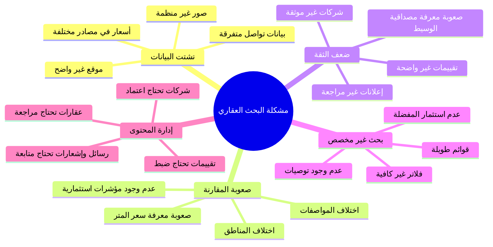
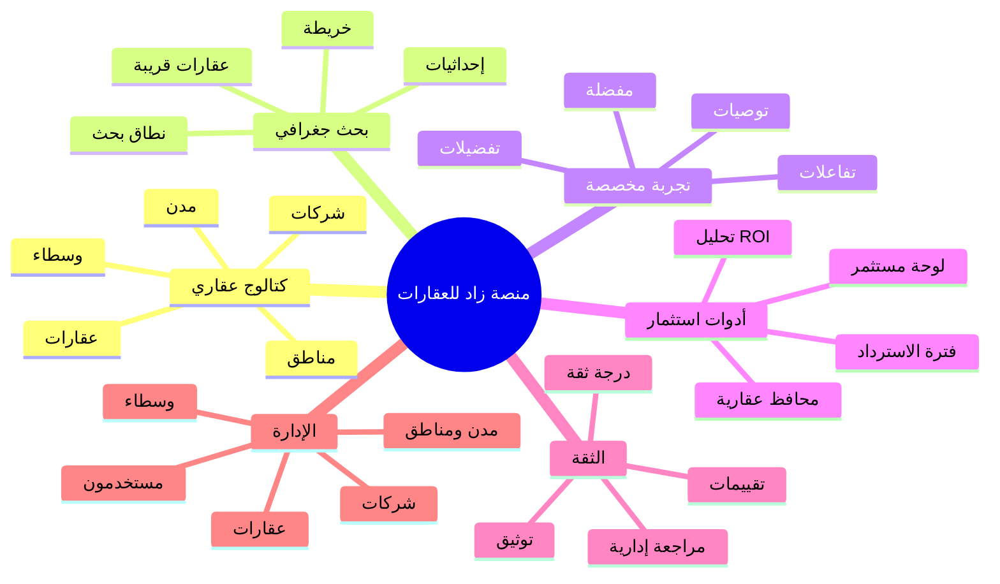

# الفصــل الثاني

# الدراسة المرجعية

## 2.1. الاجتماعات مع الخبراء

في مجال المنصات العقارية، لا يكفي التركيز على عرض العقار فقط، لأن القرار العقاري يرتبط بعدة عناصر مترابطة: موقع العقار، السعر، المساحة، المواصفات، الصور والفيديوهات، الجهة العارضة، درجة الثقة، التقييمات، وإمكانية المقارنة مع عقارات أخرى. لذلك تم تحليل المشروع من زاوية الأطراف التي تتعامل عادةً مع المنصات العقارية، مثل الباحث عن عقار، المشتري، المستثمر، المالك، الوسيط، الشركة العقارية، ومدير النظام.

توضح دراسة سيناريوهات العمل أن الزائر يحتاج إلى تصفح سريع للعقارات والمدن والمناطق دون تعقيد، بينما يحتاج المستخدم المسجل إلى وظائف أكثر تخصيصاً مثل المفضلة، التوصيات، الرسائل، والتفضيلات. أما المستثمر فيحتاج إلى قراءة العقار من زاوية مالية، مثل الدخل السنوي المتوقع، العائد على الاستثمار ROI، فترة الاسترداد، التكاليف السنوية، ونسبة الإشغال. ويحتاج المالك أو الشركة إلى إدارة المحتوى العقاري بطريقة منظمة، بينما يحتاج المدير إلى مراقبة جودة البيانات وحالات النشر والمراجعات.

أظهرت هذه الدراسة أن نجاح المنصة العقارية يعتمد على عدة نقاط أساسية، أهمها: وضوح بيانات العقار، سهولة البحث حسب الموقع، وجود صور ووسائط كافية، القدرة على حفظ العقارات المهمة، وجود قناة تواصل منظمة، توفير تقييمات ودرجة ثقة، وإمكانية إدارة المحتوى من قبل المدير. كما أن المنصة لا يجب أن تتعامل مع كل العقارات بنفس المستوى من الثقة، بل يجب أن تدعم حالات مراجعة واعتماد للعقارات والشركات والتقييمات وطلبات التوثيق.

ومن الناحية التشغيلية، تبين أن النظام يجب أن يدعم أكثر من نموذج استخدام. فهناك مستخدم يريد التصفح فقط، ومستخدم يريد الشراء أو الاستئجار، ومستخدم يتعامل مع العقار كاستثمار، وشركة تدير وسطاء، ومدير يراجع المحتوى. لذلك تم تصميم مشروع **زاد للعقارات** ليغطي هذه الحالات ضمن منصة واحدة تجمع بين الكتالوج العقاري، البحث الجغرافي، التوصيات، التحليل الاستثماري، الرسائل، الثقة، ولوحة الإدارة.

## 2.2. الدراسات المرجعية

### الدراسة المرجعية الأولى: منصات البحث العقاري وتجميع البيانات

تعتمد المنصات العقارية الحديثة على جمع عدد كبير من العقارات داخل واجهة واحدة، مع إمكانية البحث والفلترة حسب الموقع والسعر والنوع والمواصفات. وتبرز أهمية هذه الفكرة لأن المستخدم لا يريد قراءة إعلانات منفصلة، بل يريد مقارنة خيارات متعددة ضمن تجربة واحدة. لذلك كان من الضروري أن يحتوي مشروع زاد على صفحات للعقارات والمدن والمناطق والشركات والوسطاء، مع صفحة تفاصيل لكل عنصر.

تساعد هذه الفكرة على تقليل تشتت المعلومات. فبدلاً من أن يبحث المستخدم عن السعر في إعلان، والصور في صفحة أخرى، ورقم التواصل في رسالة خارجية، يقدم النظام صفحة عقار تحتوي على البيانات الأساسية والوسائط والموقع والجهة المرتبطة. كما يسمح وجود قاعدة بيانات منظمة بربط العقار بالمدينة والمنطقة والمستخدم والوسائط والتقييمات.

### الدراسة المرجعية الثانية: البحث الجغرافي والخرائط

في المجال العقاري يعد الموقع من أهم عوامل القرار. لذلك لا يكفي عرض اسم المدينة أو المنطقة فقط، بل يحتاج المستخدم إلى رؤية العقار على الخريطة، ومعرفة قربه من مناطق أخرى، والبحث ضمن نطاق جغرافي معين. كثير من المنصات العقارية تعتمد على خرائط تفاعلية لأنها تجعل عملية المقارنة أكثر وضوحاً.

في مشروع زاد تم اعتماد الإحداثيات الجغرافية داخل جداول المدن والمناطق والعقارات، مع استخدام Leaflet في الواجهة الأمامية ومسارات خلفية للبحث عن العقارات القريبة أو ضمن نصف قطر معين. هذا التصميم يجعل البحث العقاري أكثر ارتباطاً بالموقع الحقيقي، ويمنح المستخدم طريقة مرئية لاكتشاف العقارات بدلاً من الاعتماد على القوائم فقط.

### الدراسة المرجعية الثالثة: المفضلة والتوصيات الشخصية

عند تصفح عدد كبير من العقارات، يحتاج المستخدم إلى حفظ العقارات التي يهتم بها للرجوع إليها لاحقاً. لذلك تعد المفضلة من الوظائف الأساسية في المنصات العقارية. لكن المفضلة يمكن أن تصبح أكثر فائدة عندما تستخدم كمؤشر على اهتمامات المستخدم لتوليد توصيات مستقبلية.

يدعم المشروع حفظ العقارات والوسطاء في المفضلة، كما يدعم تفضيلات المستخدم مثل المدينة والمنطقة والميزانية ونوع العقار وعدد الغرف والهدف الاستثماري ومستوى المخاطرة. ثم يستخدم النظام هذه البيانات مع تفاعلات المستخدم لإنتاج توصيات عقارية. هذا يحول التصفح من عملية يدوية بالكامل إلى تجربة مخصصة تساعد المستخدم على اكتشاف خيارات أقرب لاحتياجاته.

### الدراسة المرجعية الرابعة: التحليل الاستثماري للعقارات

لا ينظر بعض المستخدمين إلى العقار كسكن فقط، بل كأصل استثماري. لذلك يحتاج المستثمر إلى قراءة مؤشرات مثل الدخل السنوي، المصاريف، الصيانة، الضرائب، نسبة الإشغال، ROI، وفترة استرداد رأس المال. هذه المؤشرات تساعد على مقارنة عقارين قد يبدوان متشابهين من حيث السعر، لكنهما يختلفان من حيث العائد المتوقع.

في مشروع زاد تم إدخال بيانات استثمارية ضمن العقار نفسه، كما تم بناء وحدة تحليلات استثمارية ومحافظ عقارية. يستطيع المستخدم إنشاء تحليل لعقار، مراجعة المؤشرات المالية، ثم إضافته إلى محفظة استثمارية ومتابعة حالته مثل المتابعة أو الاستثمار أو البيع. هذا يجعل المنصة مناسبة للمستخدم العادي والمستثمر في الوقت نفسه.

### الدراسة المرجعية الخامسة: الثقة والتقييمات في المنصات العقارية

من أكبر مشكلات الإعلانات العقارية ضعف الثقة في صحة البيانات أو الجهة العارضة. لذلك تعتمد المنصات الناضجة على إشارات ثقة مثل التقييمات، التوثيق، علامات الاعتماد، أو مراجعة المحتوى. هذه الإشارات لا تمنع كل الأخطاء، لكنها تساعد المستخدم على تقدير مستوى الموثوقية قبل التواصل أو اتخاذ قرار.

يدعم مشروع زاد تقييمات للعقارات والوسطاء والشركات، وطلبات توثيق، ودرجة ثقة للوسطاء والشركات. كما لا تظهر كل المراجعات مباشرة، بل يمكن أن تمر بحالة انتظار ومراجعة من المدير. وتعتمد درجة الثقة على عوامل متعددة مثل التوثيق، العقارات المعتمدة، متوسط التقييم، عدد المراجعات، والنشاط داخل المنصة. بذلك يصبح عنصر الثقة جزءاً من بنية النظام وليس إضافة شكلية.

### الدراسة المرجعية السادسة: الإدارة المركزية وحالات النشر

تحتاج المنصات التي تستقبل محتوى من المستخدمين إلى إدارة مركزية، لأن نشر العقارات والشركات والتقييمات دون مراجعة قد يؤدي إلى بيانات ضعيفة أو مضللة. لذلك من المهم وجود لوحة إدارة تسمح بمراجعة الحالات وتعديل البيانات وحذف المحتوى غير المناسب.

في مشروع زاد توجد لوحة إدارة للمستخدمين والعقارات والشركات والوسطاء والمدن والمناطق والرسائل والإشعارات والثقة. كما توجد حالات واضحة مثل `pending` و`active` و`rejected` للعقارات، وحالات `pending` و`approved` و`rejected` و`suspended` للشركات. هذا يسمح بإدارة دورة حياة المحتوى بدلاً من نشره أو حذفه فقط.

### الدراسة المرجعية السابعة: التنبؤ السعري والذكاء الاصطناعي

بدأت بعض المنصات العقارية الحديثة بإضافة أدوات تقدير القيمة أو البحث الذكي لمساعدة المستخدم على فهم السوق بشكل أفضل. تقدير السعر لا يعد بديلاً عن التقييم العقاري المتخصص، لكنه يقدم مؤشراً أولياً يساعد المستخدم على مقارنة السعر المعروض مع قيمة متوقعة بناءً على بيانات العقار.

في المشروع تم فصل خدمة التنبؤ السعري عن Laravel وجعلها خدمة Flask مستقلة تعتمد على scikit-learn وملفات نموذج محفوظة. يرسل الخادم خصائص العقار إلى الخدمة، ثم يستقبل السعر المتوقع ويحفظ النتيجة في جدول `price_predictions`. هذا التصميم يسمح بتطوير نموذج التسعير لاحقاً دون تغيير بنية الواجهة أو الخادم الأساسي.

## 2.3. الخرائط الذهنية

تمثل الخرائط الذهنية أداة مفيدة لتنظيم أفكار المشروع وتوضيح العلاقة بين المشكلة والحل. في هذا المشروع يمكن تلخيص المشكلة الأساسية بأنها تشتت تجربة البحث العقاري بين الإعلانات، التواصل، الموقع، الثقة، والتحليل المالي. لذلك تم استخدام خريطة للمشكلة وخريطة للحل لتوضيح نطاق المشروع.

### الشكل (2-1): خريطة ذهنية للمشكلة

### الشكل (2-2): خريطة ذهنية للحل

ساعدت هذه الخرائط على توضيح أن الهدف ليس بناء صفحة عرض للعقارات فقط، بل بناء مسار عقاري متكامل يبدأ من الاكتشاف وينتهي بالتواصل أو التحليل أو المتابعة داخل المحفظة. كما توضح الخرائط أن وظائف الثقة والإدارة والتوصيات ليست وظائف ثانوية، بل مرتبطة مباشرة بجودة تجربة المستخدم.

## 2.4. أهمية المشروع

تزداد أهمية المنصات العقارية الرقمية مع ازدياد اعتماد المستخدمين على البحث الإلكتروني قبل اتخاذ قرار الشراء أو الاستئجار أو الاستثمار. فالمستخدم يريد الوصول إلى بيانات واضحة ومقارنة خيارات متعددة، والشركة تريد عرض خدماتها وعقاراتها بطريقة منظمة، والوسيط يريد بناء ملف موثوق، والمدير يحتاج إلى ضبط المحتوى وحماية جودة المنصة.

يأتي مشروع **زاد للعقارات** كحل رقمي يهدف إلى تنظيم هذه العملية ضمن منصة واحدة، من خلال:

- توفير كتالوج عقاري للمدن والمناطق والعقارات والشركات والوسطاء.
- عرض تفاصيل العقار مع الصور والفيديوهات والموقع والمواصفات.
- دعم الخريطة والبحث الجغرافي.
- حفظ العقارات والوسطاء في المفضلة.
- توليد توصيات بناءً على تفضيلات المستخدم وتفاعلاته.
- توفير تحليل استثماري ومحافظ عقارية.
- دعم الرسائل والإشعارات داخل المنصة.
- توفير تقييمات للعقارات والوسطاء والشركات.
- دعم التوثيق واحتساب درجة الثقة.
- توفير لوحة إدارة لمراجعة المحتوى وحالات النشر.
- دعم تقدير سعر العقار عبر خدمة تعلم آلي منفصلة.

وبذلك يمثل المشروع خطوة عملية نحو تحويل البحث العقاري من عملية متفرقة وغير منظمة إلى تجربة رقمية أوضح، تجمع بين المعلومات، الموقع، التحليل، الثقة، والتواصل.

## 2.5. التطبيقات المشابهة

فيما يلي أمثلة على منصات عقارية معروفة. لا تعني المقارنة أن هذه المنصات مطابقة تماماً للمشروع، لكنها تساعد على فهم الاتجاهات العامة في تطبيقات العقارات.

### 2.5.1. Zillow

تعد Zillow من أشهر المنصات العقارية في الولايات المتحدة، وتوفر البحث عن عقارات للبيع أو الإيجار، تقديرات لقيمة المنازل، وأدوات تساعد المستخدم في مراحل الشراء أو الاستئجار والتواصل مع المختصين.

رابط المنصة: https://www.zillow.com/

أوجه الاستفادة المرجعية:

- أهمية وجود كتالوج كبير للعقارات المعروضة للبيع أو الإيجار.
- أهمية حفظ العقارات والبحث والمشاركة داخل التطبيق.
- أهمية تقديم تقدير سعري أو مؤشر قيمة يساعد المستخدم على المقارنة.

### 2.5.2. Bayut

تعد Bayut منصة عقارية معروفة في الإمارات، وتوفر البحث في العقارات السكنية والتجارية للبيع أو الإيجار. كما تستخدم إشارات مثل TruCheck لتمييز بعض الإعلانات الموثوقة والمتاحة.

رابط المنصة: https://www.bayut.com/

أوجه الاستفادة المرجعية:

- أهمية تنظيم العقارات حسب الدولة والمدينة والمنطقة ونوع العقار.
- أهمية علامات الثقة أو الاعتماد في الإعلانات العقارية.
- أهمية دعم العقارات السكنية والتجارية ضمن نفس المنصة.

### 2.5.3. Property Finder

تعد Property Finder منصة عقارية بارزة في منطقة الشرق الأوسط وشمال أفريقيا، وتوفر البحث عن العقارات، الإعلانات، وخدمات موجهة للمستخدمين والوسطاء. كما أعلنت عن ميزة تقدير قيمة المنزل بمؤشرات قيمة مستقبلية، مما ينسجم مع توجه أدوات التقييم العقاري الذكية.

رابط المنصة: https://www.propertyfinder.com/

أوجه الاستفادة المرجعية:

- أهمية وجود أدوات تساعد المستخدم على معرفة ما إذا كان العقار مقيم بشكل مناسب.
- أهمية دعم الوسطاء والشركات وليس المستخدم النهائي فقط.
- أهمية التقارير أو مؤشرات السوق في تحسين قرار الشراء أو الاستثمار.

### 2.5.4. Redfin

تعد Redfin منصة عقارية أمريكية توفر البحث عن المنازل، الشقق، الإيجارات، والتواصل مع وكلاء العقارات. وتتميز بتحديثات سريعة للقوائم في بعض الأسواق، كما توفر تطبيقاً مخصصاً للبحث والمفضلة والتنبيهات.

رابط المنصة: https://www.redfin.com/

أوجه الاستفادة المرجعية:

- أهمية التحديث السريع للقوائم وإشعارات العقارات الجديدة.
- أهمية مشاركة العقارات المحفوظة مع أطراف أخرى.
- أهمية دمج البحث مع خدمات الوكلاء والزيارات والعروض.

## 2.6. جدول المقارنة

الجدول التالي يوضح مقارنة عامة بين مشروع **زاد للعقارات** وبعض التطبيقات المشابهة. المقارنة تهدف إلى إبراز موقع المشروع بين الحلول الأخرى، ولا تعد حكماً نهائياً على المنتجات لأن الميزات قد تختلف حسب الدولة، الخطة، طريقة إعداد الحساب، أو تحديثات المنصة.

| الميزة | زاد للعقارات | Zillow | Bayut | Property Finder | Redfin |
|---|---|---|---|---|---|
| عرض عقارات للبيع أو الإيجار | نعم | نعم | نعم | نعم | نعم |
| تصفح المدن والمناطق | نعم | نعم | نعم | نعم | نعم |
| صفحة تفاصيل عقار | نعم | نعم | نعم | نعم | نعم |
| صور ووسائط للعقار | نعم | نعم | نعم | نعم | نعم |
| البحث على الخريطة | نعم | نعم | نعم | نعم | نعم |
| عقارات قريبة أو ضمن نطاق | نعم | نعم | جزئي | جزئي | نعم |
| مفضلة للعقارات | نعم | نعم | نعم | نعم | نعم |
| مفضلة للوسطاء | نعم | غير أساسية | غير معلن | غير معلن | غير معلن |
| توصيات حسب التفضيلات والتفاعلات | نعم | جزئي | جزئي | جزئي | جزئي |
| إدارة عقارات المستخدم من داخل النظام | نعم | جزئي | موجهة للمعلنين | موجهة للمعلنين | عبر خدمات الوكلاء |
| إدارة شركات ووسطاء | نعم | جزئي | نعم | نعم | نعم |
| رسائل داخلية بين المستخدمين | نعم | جزئي | جزئي | جزئي | جزئي |
| تقييمات للعقارات | نعم | جزئي | جزئي | جزئي | جزئي |
| تقييمات للوسطاء أو الشركات | نعم | نعم | جزئي | جزئي | نعم |
| طلبات توثيق ودرجة ثقة داخلية | نعم | جزئي | نعم، عبر إشارات ثقة | جزئي | جزئي |
| تحليل ROI وفترة الاسترداد | نعم | لا بشكل أساسي | لا بشكل أساسي | جزئي عبر مؤشرات السوق | لا بشكل أساسي |
| محافظ استثمارية داخل النظام | نعم | لا | لا | لا | لا |
| تنبؤ سعري عبر خدمة ML مستقلة | نعم | نعم، Zestimate | غير معلن | نعم، Home Valuation | نعم، تقديرات سوقية |
| لوحة إدارة كاملة للمحتوى | نعم | غير معلن | غير معلن | غير معلن | غير معلن |
| API خلفي مخصص للمشروع | نعم | غير معلن للعامة | غير معلن | غير معلن | غير معلن |
| تطبيق موبايل رسمي | لا | نعم | نعم | نعم | نعم |

الجدول (2-1): مقارنة عامة بين مشروع زاد للعقارات وبعض المنصات العقارية المشابهة.

من خلال المقارنة السابقة يظهر أن مشروع **زاد للعقارات** يركز على الجمع بين وظائف متعددة في نظام واحد: كتالوج عقاري، بحث جغرافي، مفضلة، توصيات، رسائل، تحليل استثماري، محافظ، ثقة، وتنبؤ سعري. وفي المقابل تتميز المنصات العالمية بانتشار أكبر، قواعد بيانات أوسع، تطبيقات موبايل رسمية، وتكاملات سوقية أكثر نضجاً. لذلك يمكن اعتبار المشروع أساساً قوياً قابلاً للتطوير، خصوصاً إذا أضيفت لاحقاً تطبيقات موبايل، تقارير سوق أوسع، تكاملات دفع، وتحسينات أكبر على نموذج التسعير والتوصيات.
