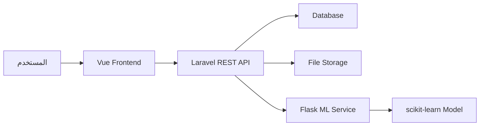

# الفصــل الرابع

# الدراسة التصميمية

## 4.1. مقدمة

تأتي الدراسة التصميمية بعد مرحلة التحليل لتوضيح كيف تم تحويل المتطلبات وحالات الاستخدام إلى بنية تقنية وقاعدة بيانات وواجهات قابلة للتنفيذ. في مشروع **زاد للعقارات** لا يقتصر التصميم على صفحات عرض عقارات فقط، بل يشمل تصميم مسارات التصفح، المصادقة، البحث الجغرافي، التوصيات، الاستثمار، الرسائل، الثقة، التوثيق، الإدارة، وخدمة التنبؤ السعري.

اعتمد التصميم على فصل النظام إلى ثلاث طبقات رئيسية: واجهة أمامية مبنية باستخدام Vue، خادم خلفي مبني باستخدام Laravel، وخدمة تعلم آلي مستقلة مبنية باستخدام Flask. هذا الفصل يسمح بتطوير كل طبقة بشكل مستقل، ويجعل الواجهة مسؤولة عن تجربة المستخدم، والخادم مسؤولاً عن منطق الأعمال والبيانات والصلاحيات، وخدمة Flask مسؤولة عن معالجة نموذج التنبؤ السعري.

كما اعتمد التصميم على تنظيم قاعدة البيانات حول كيانات واضحة: المستخدم، المدينة، المنطقة، الشركة، الوسيط، العقار، الوسائط، المفضلة، الرسائل، الإشعارات، التحليل الاستثماري، المحافظ، التوصيات، التفاعلات، التقييمات، التوثيق، والتنبؤات السعرية. ويظهر هذا التنظيم في ملف ERD المعتمد `project-RealEstate_database/ERD2.dbml`.

## 4.2. مخطط التسلسل "Sequence Diagram"

تم إعداد مخططات التسلسل لتوضيح طريقة انتقال الطلب بين المستخدم والواجهة الأمامية والخادم الخلفي والخدمات الداخلية أو الخارجية. توجد مخططات التسلسل في مجلد `assets/Sequence`، وتغطي أربعة مجالات رئيسية: التوصيات، الاستثمار، الرسائل، والتنبؤ السعري.

### 4.2.1. مخطط تسلسل جلب قائمة التوصيات

يبدأ التسلسل عندما يفتح المستخدم صفحة التوصيات أو يطلب قائمة التوصيات من الواجهة. ترسل الواجهة طلباً إلى المسار المحمي `GET /recommendations`، فيتحقق Laravel من المصادقة عبر Sanctum، ثم يستدعي `RecommendationService`. تقوم الخدمة بتحميل تفضيلات المستخدم، مفضلاته، وسلوكه المسجل. إذا لم توجد إشارات كافية تعيد الخدمة قائمة فارغة مع رسالة توجيهية، أما إذا وجدت إشارات فتقرر هل ستقرأ التوصيات المخزنة أو تعيد توليدها.

عند إعادة التوليد يستدعي النظام `RecommendationGeneratorService` لجلب مجموعة مرشحة من العقارات، ثم يستخدم `RecommendationScoringService` لحساب درجة الملاءمة لكل عقار. بعد ذلك تحفظ النتائج في جدول `recommendations` وتعود للواجهة مع ملخص يوضح أسباب التوصية.

الملف المرجعي: `assets/Sequence/sequence-recommendations.md`

### 4.2.2. مخطط تسلسل تقييم عقار واحد داخل محرك التوصيات

يوضح هذا التسلسل طريقة حساب ملاءمة عقار واحد للمستخدم. يعتمد النظام على مجموعة عوامل مرجحة: مطابقة الميزانية، مطابقة الموقع، مطابقة نوع العقار، قابلية العائد الاستثماري، ومطابقة الهدف الاستثماري. بعد حساب العوامل يتم إضافة نقاط سلوك بسيطة إذا كان المستخدم مهتماً بنوع أو موقع مشابه، ثم يتم بناء أسباب التوصية.

هذا التصميم يجعل التوصيات قابلة للتفسير، لأن النظام لا يعيد رقماً فقط، بل يستطيع توضيح سبب اقتراح العقار مثل قربه من الميزانية أو وقوعه في منطقة مفضلة أو امتلاكه ROI مناسباً.

الملف المرجعي: `assets/Sequence/sequence-recommendations.md`

### 4.2.3. مخطط تسلسل إعادة توليد التوصيات

يبدأ هذا التسلسل عندما يضغط المستخدم على تحديث التوصيات أو يرسل النظام طلباً مع `refresh=1`. يقوم النظام بإلغاء تفعيل التوصيات القديمة، ثم يولد توصيات جديدة بناءً على أحدث تفضيلات ومفضلات وتفاعلات. كما يمكن أن يحدث التجديد تلقائياً عند مرور مدة معينة أو بعد إضافة مفضلة جديدة.

يساعد هذا التصميم على تجنب عرض توصيات قديمة لا تعكس اهتمامات المستخدم الحالية.

### 4.2.4. مخطط تسلسل العقارات المشابهة

يبدأ التسلسل عند طلب عقارات مشابهة لعقار معين. يتحقق النظام أولاً من أن العقار نشط، ثم يجلب عقارات مرشحة غالباً من نفس المدينة أو بخصائص قريبة، ويحسب درجة التشابه. إذا كان المستخدم مسجلاً ولديه تفضيلات، يمكن دمج التشابه العام مع التخصيص الشخصي.

هذه الوظيفة مهمة في صفحة تفاصيل العقار لأنها تساعد المستخدم على الاستمرار في الاستكشاف دون الرجوع إلى قائمة البحث من البداية.

### 4.2.5. مخطط تسلسل إنشاء عقار مع حساب ROI

عند إنشاء عقار جديد أو تحديثه، ترسل الواجهة بيانات العقار إلى Laravel. يتحقق `StoreEstateRequest` أو `UpdateEstateRequest` من المدخلات، ثم يجهز المتحكم البيانات ويرسلها إلى `InvestmentCalculatorService`. تقوم الخدمة بحساب الدخل السنوي المتوقع، ROI، وفترة الاسترداد إذا كانت بيانات الإيجار والسعر والمصاريف كافية، ثم تحفظ النتائج مع بيانات العقار.

بهذا التصميم لا تبقى مؤشرات الاستثمار منفصلة عن العقار، بل يمكن حفظها وعرضها مباشرة ضمن صفحة التفاصيل أو لوحة الإدارة.

الملف المرجعي: `assets/Sequence/sequence-investment.md`

### 4.2.6. مخطط تسلسل حفظ تحليل استثماري

يتيح النظام للمستخدم إنشاء تحليل استثماري مستقل عن بيانات العقار الأصلية. قد يأخذ التحليل بعض القيم من العقار، أو يستخدم قيماً يدخلها المستخدم يدوياً. بعد التحقق من المدخلات، تمر البيانات عبر `InvestmentCalculatorService` ثم تحفظ في جدول `investment_analyses`.

هذا التصميم يسمح للمستثمر بتجربة سيناريوهات مختلفة لنفس العقار، مثل تغيير قيمة الإيجار أو المصاريف أو نسبة الإشغال لمعرفة أثرها على ROI وفترة الاسترداد.

### 4.2.7. مخطط تسلسل لوحة المستثمر

عند فتح لوحة المستثمر، يستدعي النظام `InvestorDashboardService`. تقوم الخدمة بتحميل عقارات المحافظ المرتبطة بالمستخدم، ثم تعيد حساب المؤشرات الاستثمارية بشكل حي، وتجمع ملخصاً يتضمن إجمالي الاستثمارات، متوسط ROI، أفضل عقار، وأسوأ عقار. تعاد النتيجة إلى الواجهة بصيغة JSON لتعرض كلوحة متابعة.

### 4.2.8. مخطط تسلسل إضافة عقار إلى محفظة

يبدأ التسلسل عندما يضيف المستخدم عقاراً إلى محفظة. يتحقق النظام من المصادقة ومن أن العقار نشط، ثم يتحقق من عدم وجود العقار مسبقاً في نفس المحفظة. إذا نجحت الشروط، ينشئ `PortfolioService` سجلاً في `portfolio_properties` بحالة `tracking`.

يمنع هذا التصميم تكرار العقارات داخل نفس المحفظة، كما يمنع إضافة عقارات غير منشورة إلى محفظة استثمارية.

### 4.2.9. مخطط تسلسل إرسال رسالة وإشعار

عند إرسال رسالة، يرسل المستخدم طلباً إلى `POST /messages`. يتحقق النظام من المصادقة وصحة المستقبل ونص الرسالة، ثم ينشئ سجل الرسالة في جدول `messages`. يمكن بعد ذلك إنشاء إشعار للمستقبل حتى يعرف بوجود رسالة جديدة. عند فتح المحادثة، يقوم النظام بتحديد الرسائل الواردة غير المقروءة كمقروءة.

الملف المرجعي: `assets/Sequence/sequence-chat.md`

### 4.2.10. مخطط تسلسل فتح محادثة

يفتح المستخدم محادثة مع مستخدم آخر، فيتحقق النظام من أن المستخدم الحالي طرف في المحادثة، ثم يجلب الرسائل بين الطرفين بترتيب زمني. بعد الجلب يتم تحديث حالة الرسائل الواردة غير المقروءة إلى مقروءة. هذا يجعل حالة القراءة مرتبطة بسلوك المستخدم الفعلي.

### 4.2.11. مخطط تسلسل مراقبة الرسائل من المدير

يدخل المدير إلى مسارات الرسائل الإدارية، ويمر الطلب عبر `auth:sanctum` ووسيط `admin`. يستطيع المدير عرض الرسائل أو المحادثات أو حذف رسالة مخالفة. لا يرسل المدير رسائل من مسار الإدارة، لأن الإرسال مصمم كوظيفة مستخدم عادي.

### 4.2.12. مخطط تسلسل تنبؤ سعر عقار موجود

عند طلب توقع سعر لعقار موجود، يتحقق النظام من المصادقة ومن صلاحية رؤية العقار. بعد ذلك يبني `EstatePricePredictionService` الحمولة المطلوبة من بيانات العقار مثل الموقع والمساحة والطابق وعدد الغرف وحالة التأثيث وسنة البناء، ثم يرسلها عبر `PricePredictionClient` إلى خدمة Flask. تعيد خدمة Flask السعر المتوقع، فيحسب Laravel الفرق بين السعر المتوقع والسعر المعروض، ثم يحفظ التوقع في جدول `price_predictions` عند تفعيل التسجيل.

الملف المرجعي: `assets/Sequence/sequence-ai-pricing.md`

### 4.2.13. مخطط تسلسل التنبؤ المسبق Preview

في هذا المسار لا يشترط وجود عقار محفوظ مسبقاً، بل يرسل المستخدم مدخلات مخصصة إلى `POST /price-predictions/preview`. يتحقق النظام من المدخلات، ثم يرسلها إلى خدمة Flask، ويعيد النتيجة دون أن تكون مرتبطة بالضرورة بسجل عقار. يفيد هذا المسار عند رغبة المستخدم في اختبار سعر عقار قبل حفظه.

### 4.2.14. مخطط تسلسل معالجة Flask داخلياً

تستقبل خدمة Flask طلب `/predict` وتستخرج الخصائص المطلوبة، ثم تحول الموقع إلى قيمة رقمية باستخدام LabelEncoder، وتبني مصفوفة الخصائص بنفس ترتيب التدريب، ثم تستدعي النموذج المحفوظ لإنتاج السعر المتوقع. إذا حدث خطأ في المعالجة تعيد الخدمة رسالة خطأ، ويتعامل Laravel معها كخطأ خدمة خارجية.

## 4.3. مخطط كيانات قاعدة البيانات "ERD"

يعتمد مخطط قاعدة البيانات على الملف `project-RealEstate_database/ERD2.dbml`، وهو موثق على أنه مطابق للمهاجرات وقابل للاستيراد إلى dbdiagram. يضم المخطط جداول التطبيق الأساسية وجداول Laravel المساندة. تم تقسيم الجداول حسب المجال الوظيفي لتسهيل فهم العلاقات.

### 4.3.1. بنية مخطط قواعد البيانات

تتكون قاعدة البيانات من مجموعات رئيسية:

- المصادقة والمستخدمون.
- المواقع الجغرافية.
- الشركات والوسطاء.
- العقارات والوسائط.
- الروابط الاجتماعية.
- المفضلة والرسائل والإشعارات.
- الاستثمار والمحافظ.
- التوصيات والتفضيلات والتفاعلات.
- الثقة والتقييمات والتوثيق.
- جداول Laravel المساندة مثل cache وfailed_jobs.

### 4.3.2. القيم الثابتة "Enums"

لا يعتمد النظام على enum database صريح في كل الحالات، لكنه يستخدم قيماً ثابتة معرفة في `config/realestate.php`. أهم هذه القيم:

| المجال | القيم |
|---|---|
| حالات العقار | `pending`, `active`, `rejected` |
| حالات الشركة | `pending`, `approved`, `rejected`, `suspended` |
| أنواع المستخدمين | `admin`, `agent`, `owner`, `buyer`, `company` |
| حالات المستخدم | `active`, `inactive`, `suspended` |
| حالات عنصر المحفظة | `tracking`, `invested`, `sold` |
| حالات المحفظة | `active`, `archived`, `closed` |
| مستويات المخاطرة | `low`, `moderate`, `high` |
| حالات المراجعة | `pending`, `approved`, `rejected` |
| حالات التوثيق | `pending`, `approved`, `rejected` |

يساعد هذا الأسلوب على ضبط القيم المسموحة مركزياً دون تكرارها داخل المتحكمات والطلبات.

### 4.3.2. الجداول الرئيسية

| المجموعة | الجداول | الهدف التصميمي |
|---|---|---|
| المستخدمون والمصادقة | `users`, `personal_access_tokens`, `password_reset_tokens` | إدارة حسابات المستخدمين، الأدوار، المصادقة، وتوكنات API. |
| المواقع الجغرافية | `cities`, `places` | تنظيم المدن والمناطق وربط العقارات بمواقع واضحة قابلة للبحث والعرض على الخريطة. |
| الشركات والوسطاء | `companies`, `agents` | تخزين بيانات الشركات العقارية والوسطاء وربطهم بالمستخدمين والعقارات. |
| العقارات والوسائط | `estates`, `estate_images`, `estate_videos`, `estate_ads` | حفظ بيانات العقارات الأساسية والوسائط المرتبطة بها مثل الصور والفيديوهات والإعلانات. |
| الروابط الاجتماعية | `social_links` | حفظ روابط التواصل الخاصة بالمستخدمين أو الشركات أو الوسطاء أو العقارات. |
| المفضلة والتفاعل | `favorite_estates`, `favorite_agents`, `user_preferences`, `property_interactions` | حفظ تفضيلات المستخدم، المفضلة، وتفاعلاته مع العقارات لاستخدامها في التوصيات. |
| التوصيات | `recommendations` | تخزين العقارات المقترحة للمستخدمين بناءً على التفضيلات والتفاعلات. |
| الاستثمار والمحافظ | `investment_analyses`, `investment_portfolios`, `portfolio_properties` | دعم التحليل الاستثماري وإنشاء محافظ عقارية وربط العقارات بها. |
| التنبؤ السعري | `price_predictions` | حفظ نتائج توقع أسعار العقارات القادمة من خدمة التعلم الآلي. |
| الرسائل والإشعارات | `messages`, `notifications` | تنظيم التواصل بين المستخدمين وحفظ الإشعارات المرتبطة بالأحداث المهمة. |
| التقييمات والثقة | `property_reviews`, `agent_reviews`, `company_reviews`, `verification_requests` | إدارة مراجعات العقارات والوسطاء والشركات وطلبات التوثيق ورفع مستوى الثقة. |
| الجداول المساندة | `cache`, `cache_locks`, `failed_jobs` | دعم تشغيل Laravel، التخزين المؤقت، ومتابعة المهام أو الأخطاء غير المكتملة. |

### 4.3.4. المواقع الجغرافية

#### cities

يمثل جدول `cities` المدن المتاحة داخل المنصة. يحتوي على اسم المدينة، صورة، وخط العرض وخط الطول. ترتبط المدينة بعدة مناطق، وتستخدم في التصفح والفلترة والبحث الجغرافي.

#### places

يمثل جدول `places` المناطق داخل المدن. يرتبط كل place بمدينة واحدة عبر `cities_id`. كما ترتبط العقارات والشركات بالمناطق، مما يجعل المكان نقطة ربط مهمة بين المحتوى العقاري والموقع الجغرافي.

### 4.3.5. الشركات والوسطاء

#### companies

يمثل جدول `companies` الشركات العقارية. يرتبط كل سجل بمستخدم واحد وبمنطقة واحدة. يحتوي الجدول على اسم الشركة، الموقع الإلكتروني، عدد الموظفين، الوصف، أيام العمل بصيغة JSON، الحالة، صورة الملف، صورة الغلاف، ودرجة الثقة. العلاقة مع المستخدم فريدة، مما يعني أن الحساب الواحد يملك ملف شركة واحداً.

#### agents

يمثل جدول `agents` الوسطاء العقاريين. يرتبط الوسيط بمستخدم وبشركة. يحتوي على صورة الملف، عدد المشاهدات، عدد المشاركات، ودرجة الثقة. يسمح هذا التصميم بعرض الوسيط كملف عام مع إمكانية ربطه بالشركة والتقييمات.

### 4.3.6. العقارات والوسائط

#### estates

جدول `estates` هو الجدول المركزي للعقارات. يحتوي على المستخدم المالك، المنطقة، الإحداثيات، الاسم، الهاتف، المساحة، سعر المتر، السعر الإجمالي، بيانات الإيجار، المصاريف، الضرائب، نسبة الإشغال، الدخل السنوي المتوقع، ROI، فترة الاسترداد، عدد الغرف والمرافق، الحالة، النوع، الوصف، رقم العقار، تاريخ البناء، حالة البناء، المشاهدات والمشاركات.

هذا الجدول يجمع بين بيانات العرض وبيانات الاستثمار، مما يسمح بعرض العقار وتحليله في الوقت نفسه.

#### estate_images

يخزن صور العقار ويرتبط بجدول `estates`. يحتوي على مسار الصورة وحقل `is_primary` لتحديد الصورة الرئيسية.

#### estate_videos

يخزن فيديوهات العقار ويرتبط بالعقار. يسمح بعرض محتوى مرئي إضافي في صفحة التفاصيل.

#### estate_ads

يخزن صور الإعلانات المرتبطة بالعقار، مع حقل `is_main` لتحديد الإعلان الرئيسي.

### 4.3.7. الروابط الاجتماعية

#### social_links

يمثل جدول `social_links` علاقة متعددة الأشكال، حيث يمكن ربط الرابط بمستخدم أو شركة أو وسيط أو عقار. يحتوي على نوع الكيان، معرفه، المنصة، والرابط. كما يحتوي على قيد فريد يمنع تكرار نفس المنصة لنفس الكيان.

هذا التصميم يمنع إنشاء جداول منفصلة للروابط الاجتماعية لكل نوع كيان، ويجعل إضافة روابط لكيانات جديدة مستقبلاً أسهل.

### 4.3.8. المفضلة والرسائل والإشعارات

#### favorite_estates

يربط المستخدم بالعقار المحفوظ في المفضلة. يحتوي على قيد فريد بين `user_id` و`estate_id` لمنع تكرار نفس العقار في مفضلة المستخدم.

#### favorite_agents

يربط المستخدم بالوسيط المحفوظ في المفضلة، ويمنع التكرار بنفس الطريقة.

#### messages

يمثل الرسائل الثنائية بين المستخدمين. يحتوي على المرسل، المستقبل، نص الرسالة، وحالة القراءة. يستخدم هذا الجدول في صندوق الوارد والمحادثات وتحديد الرسائل كمقروءة.

#### notifications

يمثل إشعارات المستخدم. يحتوي على المستخدم، المحتوى، وحالة القراءة. يستخدم لإظهار التنبيهات وعدد غير المقروء.

### 4.3.9. الاستثمار والتنبؤ السعري والمحافظ

#### investment_analyses

يحفظ التحليلات الاستثمارية التي ينشئها المستخدم لعقار معين. يحتوي على سعر العقار، الإيجار الشهري، المصاريف، الصيانة، الضرائب، نسبة الإشغال، الدخل السنوي المتوقع، ROI، وفترة الاسترداد.

#### price_predictions

يحفظ نتائج التنبؤ السعري. يرتبط اختيارياً بالمستخدم والعقار، ويحتوي على خصائص الإدخال بصيغة JSON، السعر المتوقع، السعر المعروض، الفرق، نسبة الفرق، ومؤشر التقييم السعري.

#### investment_portfolios

يمثل محافظ الاستثمار الخاصة بالمستخدم. يحتوي على الاسم، الوصف، الميزانية المستهدفة، مستوى المخاطرة، الحالة، وهل هي المحفظة الافتراضية.

#### portfolio_properties

يمثل العقارات داخل المحافظ. يربط المحفظة بالعقار، ويحتوي على الحالة، قيمة الاستثمار، الملاحظات، تاريخ الاستثمار، وتاريخ البيع. يمنع القيد الفريد إضافة نفس العقار مرتين إلى نفس المحفظة.

### 4.3.10. التوصيات والتفضيلات والتفاعلات

#### user_preferences

يحفظ تفضيلات المستخدم العقارية والاستثمارية. يرتبط بمستخدم واحد بعلاقة فريدة، ويمكن أن يرتبط بمدينة أو منطقة. يحتوي على الميزانية الدنيا والعليا، نوع العقار المفضل، عدد الغرف، وظيفة العقار، هدف الاستثمار، مستوى المخاطرة، والاهتمامات.

#### property_interactions

يحفظ تفاعلات المستخدم مع العقارات، مثل المشاهدة أو السلوك المستخدم في التوصيات. يرتبط بالمستخدم والعقار.

#### recommendations

يحفظ التوصيات المنتجة للمستخدم. يرتبط بالمستخدم والعقار، ويحتوي على درجة المطابقة وأسباب التوصية وحالة النشاط. يسمح ذلك بقراءة توصيات مخزنة بدلاً من إعادة توليدها في كل طلب.

### 4.3.11. الثقة والتقييمات والتوثيق

#### property_reviews

يحفظ تقييمات العقارات. يرتبط بالمستخدم والعقار، ويحتوي على التقييم والتعليق وحالة المراجعة.

#### agent_reviews

يحفظ تقييمات الوسطاء. يرتبط بالمستخدم والوسيط، ويستخدم في عرض تقييمات الوسيط واحتساب الثقة.

#### company_reviews

يحفظ تقييمات الشركات. يرتبط بالمستخدم والشركة، ويساعد في بناء صورة عامة عن مصداقية الشركة.

#### verification_requests

يحفظ طلبات التوثيق. يحتوي على المستخدم، نوع المستند، مسار المستند، الحالة، وملاحظات المراجعة. يستخدمه المدير لقبول أو رفض طلبات التوثيق.

### 4.3.12. جداول Laravel المساندة

#### cache وcache_locks

تستخدم لإدارة التخزين المؤقت والأقفال المتعلقة بالكاش.

#### failed_jobs

يحفظ المهام التي فشلت عند استخدام نظام الطوابير. وجوده مهم لتتبع المشاكل في العمليات الخلفية عند التوسع.

### 4.3.13. ملخص العلاقات بين الجداول

| العلاقة | الوصف |
|---|---|
| المدينة إلى المناطق | المدينة الواحدة تحتوي عدة مناطق. |
| المنطقة إلى العقارات | المنطقة الواحدة تحتوي عدة عقارات. |
| المستخدم إلى العقارات | المستخدم يستطيع امتلاك عدة عقارات. |
| المستخدم إلى الشركة | المستخدم يمكن أن يملك ملف شركة واحداً. |
| الشركة إلى الوسطاء | الشركة تحتوي عدة وسطاء. |
| العقار إلى الصور والفيديوهات والإعلانات | العقار الواحد يحتوي عدة وسائط. |
| المستخدم إلى المفضلة | المستخدم يحفظ عدة عقارات أو وسطاء. |
| المستخدم إلى الرسائل | المستخدم قد يكون مرسلاً أو مستقبلاً. |
| المستخدم إلى التفضيلات | لكل مستخدم تفضيلات واحدة. |
| المستخدم إلى المحافظ | المستخدم يملك عدة محافظ. |
| المحفظة إلى العقارات | المحفظة تحتوي عدة عقارات عبر جدول وسيط. |
| العقار إلى التحليلات | العقار يمكن أن يرتبط بعدة تحليلات. |
| المستخدم إلى التقييمات | المستخدم يكتب تقييمات لكيانات مختلفة. |
| الكيان إلى الروابط الاجتماعية | العلاقة متعددة الأشكال للمستخدم أو الشركة أو الوسيط أو العقار. |

## 4.4. البنية المعمارية للنظام

تعتمد البنية المعمارية على فصل واضح بين الواجهة الأمامية والخادم الخلفي وخدمة الذكاء الاصطناعي. الواجهة لا تتعامل مباشرة مع قاعدة البيانات، بل ترسل طلبات HTTP إلى Laravel. وLaravel لا يشغل نموذج التعلم الآلي داخله، بل يتواصل مع خدمة Flask عبر HTTP.

### 4.4.1. طبقة الواجهة الأمامية

توجد الواجهة في مجلد `project-RealEstate`. تعتمد على Vue وVite وPinia وVue Router. يتم تقسيم الواجهة إلى:

- `views`: صفحات التطبيق مثل العقارات، المدن، المناطق، الشركات، الوسطاء، الملف الشخصي، المفضلة، التوصيات، ولوحات الإدارة.
- `components`: مكونات مشتركة مثل الأزرار والحقول والجداول والتنبيهات والشارات.
- `composables`: منطق قابل لإعادة الاستخدام مثل جلب القوائم أو تفاصيل العقارات أو معالجة الأخطاء.
- `api`: طبقة الاتصال بالخادم الخلفي.
- `router`: تعريف المسارات والحراس.
- `layouts`: تخطيطات الواجهة العامة والمصادقة والإدارة.

### 4.4.2. طبقة الخادم الخلفي

توجد الخلفية في `project-RealEstate_database`. تعتمد على Laravel، وتنقسم إلى:

- `routes/api/v1`: مسارات المستخدمين العامة والمحمية.
- `routes/api/admin`: مسارات الإدارة.
- `Http/Controllers/Api`: المتحكمات.
- `Http/Requests`: التحقق من المدخلات.
- `Models`: نماذج قاعدة البيانات والعلاقات.
- `Services`: منطق الأعمال مثل التوصيات والاستثمار والثقة والبحث الجغرافي.
- `config/realestate.php`: القيم وقواعد العمل المركزية.
- `config/ml.php`: إعدادات خدمة التنبؤ السعري.

### 4.4.3. طبقة خدمة التعلم الآلي

توجد خدمة ML في `project-RealEstate_database/ml/pricing`. تحتوي على `server.py` وملفات النموذج المحفوظة. تستقبل الخدمة طلب `/predict` وتعيد `predicted_price`. لا تعرف هذه الخدمة شيئاً عن جلسات المستخدم أو الصلاحيات، لأن Laravel يتولى ذلك قبل استدعائها.

### 4.4.4. تدفق البيانات العام

يبدأ الطلب من الواجهة، ثم يمر إلى Laravel، ثم إلى قاعدة البيانات أو التخزين أو خدمة Flask حسب الحاجة. تعاد الاستجابة إلى الواجهة بصيغة JSON.

### 4.4.5. تصميم المصادقة والصلاحيات

تستخدم الواجهة حراس المسارات `authGuard` و`adminGuard` و`guestGuard`. أما الخلفية فتستخدم `auth:sanctum` للمسارات الخاصة، ووسيط `admin` لمسارات الإدارة. بذلك يتم تطبيق الحماية من جهتين: منع المستخدم من رؤية صفحات لا تخصه في الواجهة، ومنع الطلب غير المصرح به في الخادم.

### 4.4.6. تصميم إدارة الملفات

تتم إدارة الملفات عبر خدمات رفع الملفات، وتحدد إعدادات `realestate.php` الأحجام والأنواع المسموحة. ترتبط الملفات بسجلات مثل صور العقار أو فيديوهاته أو صور الشركة أو ملفات التوثيق. يعتمد التصميم على حفظ مسار الملف في قاعدة البيانات وليس حفظ الملف نفسه داخل الجدول.

### 4.4.7. تصميم التوصيات

يستخدم النظام محرك توصيات مبني على قواعد وتقييم مرجح. يفصل التصميم بين:

- `RecommendationService`: قراءة التوصيات وتحضير الاستجابة.
- `RecommendationGeneratorService`: توليد توصيات جديدة.
- `RecommendationScoringService`: حساب درجات العقارات.
- `PropertyInteractionService`: تسجيل السلوك الذي يغذي التوصيات.

هذا الفصل يجعل تحسين عامل معين في التوصيات ممكناً دون تغيير واجهات API.

### 4.4.8. تصميم الاستثمار والمحافظ

يعتمد الاستثمار على `InvestmentCalculatorService` كنقطة مركزية لحساب المؤشرات. تستخدمه عمليات إنشاء العقار، التحليلات الاستثمارية، ولوحة المستثمر. أما المحافظ فتدار عبر `PortfolioService` لضبط إضافة العقارات ومنع التكرار والتحقق من انتقال الحالات.

### 4.4.9. تصميم الثقة والمراجعة

يعتمد نظام الثقة على مراجعات منفصلة للعقارات والوسطاء والشركات، إضافة إلى طلبات التوثيق. يقوم المدير بالموافقة أو الرفض، ثم يستخدم `TrustScoreService` لحساب درجة الثقة وفق أوزان موجودة في الإعدادات. يساعد هذا التصميم على فصل كتابة التقييم عن نشره وتأثيره.

### 4.4.10. تصميم التعامل مع خدمة ML

لا تستدعي الواجهة خدمة Flask مباشرة. تمر كل الطلبات عبر Laravel، حيث يتم التحقق من المستخدم والمدخلات، ثم بناء الحمولة المناسبة، ثم إرسال الطلب إلى Flask عبر `PricePredictionClient`. إذا فشلت الخدمة، يعيد Laravel رسالة خطأ مناسبة دون تعطيل بقية النظام.

## 4.5. تصميم الواجهات العامة ولوحات التحكم

تم تقسيم الواجهة إلى ثلاثة تخطيطات رئيسية: `MainLayout` للصفحات العامة والمستخدمين، `AuthLayout` لتسجيل الدخول والتسجيل، و`AdminLayout` للوحة الإدارة. يساعد هذا التقسيم على إبقاء كل مجموعة صفحات متناسقة في التنقل والأسلوب.

### 4.5.1. الواجهة العامة

تشمل الواجهة العامة الصفحة الرئيسية، صفحة العقارات، صفحة تفاصيل العقار، صفحة الخريطة، صفحات المدن والمناطق، وصفحات الشركات والوسطاء. الهدف من هذه الواجهة هو تمكين الزائر من اكتشاف محتوى المنصة قبل تسجيل الدخول.

تعتمد صفحات العرض على مكونات مثل `DirectoryHero`, `DirectoryToolbar`, `PageHeader`, `PageIntro`, `Pagination`, `EmptyState`, و`TrustBadge`. هذه المكونات تساعد على توحيد شكل القوائم والصفحات العامة.

### 4.5.2. واجهات المصادقة

تتضمن واجهات المصادقة صفحة تسجيل الدخول وصفحة إنشاء الحساب. تستخدم هذه الصفحات `AuthLayout` وتعرض نماذج واضحة لإدخال البيانات. بعد تسجيل الدخول، يستخدم النظام حالة المستخدم لتوجيهه إلى الصفحة المناسبة، مع تحويل المدير إلى لوحة الإدارة عند الحاجة.

### 4.5.3. واجهة الملف الشخصي

تسمح صفحة الملف الشخصي للمستخدم بعرض بياناته وتعديلها وإدارة بعض معلوماته المرتبطة بالحساب. كما ترتبط هذه الصفحة بوظائف المستخدم المحمية مثل المفضلة والتوصيات والرسائل عند توفرها في الواجهة.

### 4.5.4. واجهة العقارات

تتكون واجهة العقارات من قائمة العقارات، صفحة الخريطة، وصفحة تفاصيل العقار. تعرض القائمة نتائج قابلة للتصفح، بينما تعرض صفحة الخريطة العقارات حسب الإحداثيات. أما صفحة التفاصيل فتعرض الوسائط والمواصفات والموقع والتقييمات ومؤشرات الاستثمار وإجراءات مثل المفضلة أو التنبؤ السعري للمستخدم المسجل.

### 4.5.5. واجهة المدن والمناطق

تعرض هذه الواجهات المدن والمناطق المتاحة، وتساعد المستخدم على الدخول إلى العقارات حسب الموقع. تعتمد على نفس نمط الدليل العام المستخدم في الشركات والوسطاء.

### 4.5.6. واجهة الشركات

تعرض صفحة الشركات قائمة الشركات وصفحة تفاصيل لكل شركة. تتضمن التفاصيل معلومات الشركة، حالتها العامة عند الظهور، الوسطاء المرتبطين بها، التقييمات، ودرجة الثقة. الهدف هو إعطاء المستخدم صورة عن الجهة العقارية قبل التواصل معها.

### 4.5.7. واجهة الوسطاء

تعرض صفحة الوسطاء قائمة الوسطاء وصفحة ملف الوسيط. يحتوي ملف الوسيط على معلوماته وصورته وارتباطه بالشركة والتقييمات ودرجة الثقة. يستطيع المستخدم المهتم حفظ الوسيط في المفضلة عند تسجيل الدخول.

### 4.5.8. واجهة المفضلة والتوصيات

تخدم هذه الواجهات المستخدم المسجل. صفحة المفضلة تعرض العقارات أو الوسطاء الذين حفظهم المستخدم، بينما صفحة التوصيات تعرض العقارات المقترحة بناءً على تفضيلاته وتفاعلاته. يجب أن تعرض الواجهة حالة فارغة واضحة عندما لا توجد مفضلة أو توصيات بعد.

### 4.5.9. لوحة مدير النظام

تعتمد لوحة الإدارة على `AdminLayout` و`AdminSidebar`. تحتوي على صفحات:

- لوحة الإحصاءات.
- إدارة المستخدمين.
- إدارة العقارات.
- إدارة الشركات.
- إدارة الوسطاء.
- إدارة المدن.
- إدارة المناطق.
- إدارة الثقة والمراجعات.

تستخدم اللوحة مكونات مثل `AdminDataTable`, `AdminPageHeader`, `AdminStatCard`, `AdminStatsSection`, `AdminTrendChart`, `AdminBarChart`, و`StatusBadge`.

### 4.5.10. واجهة إدارة العقارات في الإدارة

تسمح هذه الواجهة للمدير بعرض كل العقارات، فتح تفاصيل العقار، إنشاء أو تعديل العقار، إدارة الصور والفيديوهات والإعلانات، وتغيير الحالة. تستخدم `AdminEstateForm` و`AdminEstateMediaPanel` لتقسيم النموذج والوسائط.

### 4.5.11. واجهة إدارة الشركات والوسطاء في الإدارة

تستخدم إدارة الشركات `AdminCompanyForm` و`AdminCompanySocialPanel`، بينما تستخدم إدارة الوسطاء `AdminAgentForm` و`AdminAgentSocialPanel`. يتيح ذلك للمدير ضبط بيانات الشركات والوسطاء وروابطهم، إضافة إلى حالات الشركات.

### 4.5.12. واجهة إدارة المدن والمناطق

تستخدم إدارة المدن `AdminCityForm`، وتستخدم إدارة المناطق `AdminPlaceForm`. تساعد هذه الواجهات على ضبط الهيكل الجغرافي الذي تعتمد عليه العقارات والشركات والبحث الجغرافي.

### 4.5.13. واجهة الثقة والمراجعة

تعرض صفحة الثقة التقييمات وطلبات التوثيق، وتسمح للمدير باعتمادها أو رفضها أو حذفها. تستخدم `AdminModerationDialog` لعرض تفاصيل المراجعة وتنفيذ القرار. كما تستخدم مكونات الثقة مثل `TrustScorePanel` و`TrustBadge` في الواجهة العامة والإدارية.

### 4.5.14. المكونات المشتركة في التصميم

يعتمد التصميم على مكونات UI موحدة:

| المكون | الاستخدام |
|---|---|
| `AppButton` | الأزرار الأساسية |
| `AppInput` و`AppSelect` و`AppTextarea` | حقول النماذج |
| `AppAutocomplete` | البحث والاختيار المتقدم |
| `FormAlert` و`ErrorAlert` | عرض رسائل النجاح والخطأ |
| `LoadingSpinner` | حالة التحميل |
| `Pagination` | تقسيم الصفحات |
| `StarRating` و`StarRatingInput` | عرض وإدخال التقييم |
| `TableAction` و`TableActionGroup` | إجراءات الجداول |
| `TrustBadge` و`TrustScorePanel` | عرض الثقة |

هذا التصميم يقلل تكرار الكود ويحافظ على اتساق شكل الواجهة.

## 4.6. خلاصة الدراسة التصميمية

توضح الدراسة التصميمية أن مشروع زاد للعقارات بني على تصميم متعدد الطبقات، وقاعدة بيانات منظمة، ومسارات API مقسمة حسب المجال، وخدمات خلفية تعزل منطق الأعمال عن المتحكمات. كما تم تصميم الواجهة الأمامية حول تخطيطات ومكونات قابلة لإعادة الاستخدام، مما يسهل تطوير صفحات عامة ومحمية وإدارية بأسلوب موحد.

يدعم التصميم الحالي أهم احتياجات المنصة: عرض العقارات، البحث الجغرافي، إدارة العقارات والوسائط، الشركات والوسطاء، المفضلة، التوصيات، الاستثمار، الرسائل، الإشعارات، الثقة، التوثيق، الإدارة، والتنبؤ السعري. كما يترك مجالاً واضحاً للتوسع المستقبلي، مثل إضافة تطبيق موبايل، دفع إلكتروني، تقارير سوق أعمق، أو تحسين نموذج التنبؤ والتوصيات.
