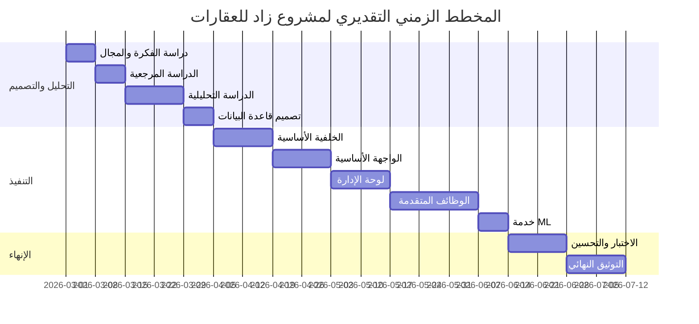

# الفصــل الخامس

# إدارة المشروع

## 5.1. مقدمة

تهدف إدارة مشروع **زاد للعقارات** إلى تنظيم عملية تنفيذ منصة ويب عقارية متعددة الوحدات، بحيث لا يتم التعامل مع المشروع كصفحات عرض فقط، بل كنظام متكامل يتضمن واجهة أمامية، خادم API، قاعدة بيانات، خدمة تعلم آلي، مخططات توثيق، واختبارات. لذلك كان من الضروري تقسيم المشروع إلى مراحل ووحدات واضحة تساعد على متابعة الإنجاز وتقليل المخاطر.

يعتمد المشروع على عدة مجالات وظيفية: المصادقة، الكتالوج العقاري، المدن والمناطق، الشركات، الوسطاء، إدارة العقارات والوسائط، المفضلة، التوصيات، الاستثمار، الرسائل، الإشعارات، الثقة والتوثيق، لوحة الإدارة، والتنبؤ السعري. وكل مجال من هذه المجالات يحتاج إلى تحليل وتصميم وتنفيذ واختبار، لأن أي خلل فيه قد يؤثر على تجربة المستخدم أو جودة البيانات.

كما أن المشروع يجمع بين أكثر من تقنية: Vue في الواجهة، Laravel في الخلفية، MySQL أو SQLite في قاعدة البيانات، وFlask مع scikit-learn في خدمة التسعير الذكي. هذا التنوع يجعل إدارة المشروع مهمة لضبط العلاقات بين الطبقات، ومتابعة التكامل بين الواجهة والخادم، والتأكد من أن كل مسار API يقابله استخدام واضح في الواجهة أو في الاختبارات.

## 5.2. جدوى المشروع

### 5.2.1. الجدوى التقنية

يعد المشروع قابلاً للتنفيذ من الناحية التقنية لأنه يعتمد على تقنيات معروفة ومناسبة لطبيعة النظام. يوفر Laravel بنية قوية لبناء API، المصادقة، التحقق من المدخلات، التعامل مع قاعدة البيانات، وإدارة الملفات. وتوفر Vue وVite بيئة مناسبة لبناء واجهة تفاعلية عربية تتضمن صفحات عامة وصفحات محمية ولوحة إدارة. أما Flask فيسمح بفصل خدمة التنبؤ السعري عن الخادم الأساسي.

تدعم قاعدة البيانات العلاقات المطلوبة بين المستخدمين والعقارات والشركات والوسطاء والتقييمات والتوصيات والمحافظ. كما أن استخدام DBML لتوثيق ERD يساعد على فهم البنية ومراجعتها. وتم تقسيم المسارات الخلفية إلى ملفات حسب المجال، مما يجعل المشروع قابلاً للصيانة والتوسع.

من الناحية التقنية أيضاً، يدعم المشروع الاختبار من خلال PHPUnit ووجود اختبارات Feature وUnit لعدة مجالات مثل الإدارة، الاستثمار، التوصيات، الثقة، الروابط الاجتماعية، والبحث الجغرافي. وهذا يقلل احتمال حدوث أخطاء عند تطوير وظائف جديدة.

كما أن فصل خدمة ML عن Laravel يعد قراراً تقنياً مهماً، لأن نموذج التنبؤ السعري قد يحتاج إلى مكتبات Python لا تناسب بيئة PHP مباشرة. لذلك تم جعل Laravel مسؤولاً عن التحقق والصلاحيات وتنسيق الاستجابة، بينما تختص Flask بتنفيذ الاستنتاج فقط. هذا الفصل يقلل التعقيد ويجعل استبدال النموذج أو إعادة تدريبه مستقبلاً أسهل.

### 5.2.2. الجدوى المالية

لا يتطلب المشروع في مرحلته الحالية خدمات مدفوعة أساسية لكي يعمل محلياً، إذ يمكن تشغيل Laravel وVue وFlask وقاعدة البيانات على بيئة تطوير عادية. كما أن الاعتماد على Leaflet وOpenStreetMap يقلل الحاجة إلى تكاليف خرائط في النسخة الأولية.

أما عند تحويل المشروع إلى منتج فعلي، فيمكن أن تظهر مصادر دخل مستقبلية مثل الإعلانات العقارية المميزة، اشتراكات الشركات، خدمات التوثيق، تقارير السوق، أو خطط مخصصة للوسطاء. كما يمكن توسيع المنصة لاحقاً لتدعم تطبيق موبايل أو خدمات مدفوعة دون تغيير جوهري في بنية API.

وتظهر الجدوى المالية أيضاً في أن النظام يقلل جزءاً من الجهد اليدوي المطلوب لإدارة الإعلانات العقارية. فبدلاً من التواصل مع كل جهة لمعرفة البيانات أو تحديث الحالة، توفر لوحة الإدارة مكاناً مركزياً لمراجعة العقارات والشركات والتقييمات. كما أن أدوات التحليل والتوصيات يمكن أن تزيد قيمة المنصة للمستخدم، مما يجعلها أكثر قابلية للتسويق لاحقاً.

### 5.2.3. الجدوى التنظيمية

من الناحية التنظيمية، يقدم المشروع طريقة واضحة لإدارة المحتوى العقاري. فبدلاً من نشر العقارات والشركات والتقييمات دون رقابة، يستخدم النظام حالات نشر ومراجعة. يستطيع المدير تغيير حالة العقار، اعتماد أو رفض الشركة، مراجعة التقييمات، ومتابعة طلبات التوثيق.

يساعد هذا التنظيم على تحسين جودة البيانات داخل المنصة، ويقلل من الفوضى الناتجة عن إدخال محتوى غير مكتمل أو غير موثوق. كما أن تقسيم الأدوار بين الزائر، المستخدم المسجل، المالك، الشركة، الوسيط، والمدير يجعل الصلاحيات أكثر وضوحاً.

ويظهر الجانب التنظيمي أيضاً في تقسيم المشروع نفسه. فالمسارات الخلفية مقسمة إلى ملفات مثل `estates`, `companies`, `agents`, `recommendations`, `investment-portfolios`, و`trust`. والواجهة مقسمة إلى صفحات عامة وإدارية ومكونات مشتركة. هذا التنظيم يقلل صعوبة تتبع الأخطاء ويجعل كل مجال قابلاً للمراجعة بشكل مستقل.

### 5.2.4. جدوى الموارد البشرية

يمكن تنفيذ المشروع بفريق صغير إذا تم تقسيم العمل بشكل جيد. يحتاج المشروع إلى مهارات في تطوير الواجهة الأمامية، تطوير الخلفية، تصميم قاعدة البيانات، كتابة الاختبارات، تجهيز خدمة ML، وإعداد التوثيق. وبما أن المشروع منظم في مجلدات واضحة، يمكن توزيع العمل بين المطورين دون تداخل كبير.

كما يمكن لطالب أو فريق صغير تنفيذ المشروع تدريجياً، لأن كل وحدة قابلة للعمل بشكل مستقل نسبياً. على سبيل المثال، يمكن تنفيذ الكتالوج العقاري أولاً، ثم المفضلة، ثم التوصيات، ثم الاستثمار، ثم الثقة، ثم خدمة التنبؤ السعري.

### 5.2.5. الجدوى التشغيلية

تشغيلياً، يوفر المشروع وظائف قابلة للاستخدام في بيئة عقارية حقيقية: تصفح العقارات، إدارة الشركات والوسطاء، المفضلة، الرسائل، التقييمات، التوثيق، التحليل الاستثماري، والمحافظ. كما أن وجود لوحة الإدارة يسمح بمتابعة المحتوى وضبط الحالات بدلاً من الاعتماد على تعديل قاعدة البيانات يدوياً.

يدعم المشروع أيضاً فصل خدمة التنبؤ السعري، مما يجعل توقفها لا يعني توقف المنصة بالكامل. فإذا لم تعمل Flask، يمكن أن يستمر المستخدم في التصفح والمفضلة والرسائل والإدارة، بينما تظهر مشكلة فقط في ميزة التنبؤ السعري.

ومن ناحية التشغيل اليومي، يمكن للمدير متابعة أهم الكيانات من لوحة الإدارة: المستخدمون، العقارات، الشركات، الوسطاء، المدن، المناطق، والمراجعات. كما يمكن استخدام الاختبارات كوسيلة تحقق قبل نشر أي تعديل جديد، خصوصاً في المسارات الحساسة مثل الثقة أو الاستثمار أو الإدارة.

## 5.2.6. موارد المشروع

### 5.2.6.1. الموارد البشرية

| الدور | المسؤوليات |
|---|---|
| محلل النظام | تحديد الأدوار، المتطلبات، حالات الاستخدام، والمخططات. |
| مطور خلفية | بناء Laravel API، النماذج، الخدمات، الصلاحيات، والاختبارات. |
| مطور واجهة | بناء صفحات Vue، المكونات، التخطيطات، وربط API. |
| مصمم قاعدة بيانات | تصميم الجداول والعلاقات وتوثيق ERD. |
| مطور ML | تجهيز خدمة Flask والنموذج وواجهة التنبؤ. |
| مختبر | التحقق من الوظائف، الحالات البديلة، وسلامة التكامل. |
| موثق | إعداد الفصول، المخططات، ودليل الاستخدام. |

في سياق مشروع تخرج أو مشروع فردي، قد يقوم الشخص نفسه بأكثر من دور، لكن فصل المسؤوليات يساعد على تنظيم العمل وفهم حجم المشروع.

### 5.2.6.2. العتاد المستخدم

لا يحتاج المشروع إلى عتاد خاص في مرحلة التطوير. يمكن تشغيله على جهاز تطوير عادي يدعم PHP وNode.js وPython وقاعدة بيانات. الموارد المطلوبة تقريبياً:

| المورد | الغرض |
|---|---|
| جهاز حاسب شخصي | تشغيل بيئة التطوير والواجهة والخلفية. |
| ذاكرة مناسبة | تشغيل Laravel وVite وFlask وقاعدة البيانات في وقت واحد. |
| مساحة تخزين | حفظ ملفات المشروع، الصور، الفيديوهات، ملفات النموذج، وقاعدة البيانات. |
| اتصال شبكة محلي | اختبار اتصال الواجهة بالخادم وخدمة Flask. |

عند النشر الفعلي يحتاج المشروع إلى خادم ويب، قاعدة بيانات، مساحة تخزين للوسائط، وإعداد خدمة Flask بشكل مستقر.

### 5.2.6.3. الموارد البرمجية

| المورد | الاستخدام |
|---|---|
| Laravel | بناء API ومنطق الأعمال. |
| Laravel Sanctum | المصادقة بالتوكن. |
| Vue وVite | بناء الواجهة الأمامية. |
| Pinia | إدارة حالة المستخدم في الواجهة. |
| Vue Router | إدارة المسارات والحراس. |
| MySQL أو SQLite | تخزين البيانات. |
| Flask | تشغيل خدمة التنبؤ السعري. |
| scikit-learn وjoblib | تحميل نموذج التوقع وإنتاج السعر. |
| PHPUnit | اختبار الخادم الخلفي. |
| Leaflet | عرض الخرائط. |
| DBML | توثيق مخطط قاعدة البيانات. |
| Markdown | كتابة الفصول والمخططات. |

## 5.2.7. المهام الرئيسية

### 5.2.7.1. الدراسة المرجعية

تضمنت الدراسة المرجعية مقارنة المشروع مع منصات عقارية مشابهة، وتحليل وظائف مثل البحث العقاري، الخريطة، المفضلة، التوصيات، التقييمات، الثقة، والتقدير السعري. ساعدت هذه المرحلة على تحديد موقع المشروع بين الحلول العقارية الأخرى، وعلى اختيار الوظائف التي تناسب نطاق المشروع.

### 5.2.7.2. الدراسة التحليلية

تم في هذه المرحلة تحديد أدوار المستخدمين، المتطلبات الوظيفية وغير الوظيفية، حالات الاستخدام، وسيناريوهات العمل. كما تم تحليل المسارات المهمة مثل تصفح العقارات، إدارة المفضلة، توليد التوصيات، إنشاء عقار، إدارة وسائط العقار، التقييمات، طلب التوثيق، وإدارة المحتوى من لوحة المدير.

### 5.2.7.3. التصميم

شملت مرحلة التصميم بناء ERD، تحديد الجداول والعلاقات، تصميم البنية المعمارية، تصميم مخططات التسلسل والنشاط، وتحديد واجهات المستخدم العامة والإدارية. كما تم تحديد فصل الطبقات بين Vue وLaravel وFlask، وتحديد طريقة انتقال البيانات عبر REST API.

### 5.2.7.4. التنفيذ

شملت مرحلة التنفيذ بناء migrations والنماذج، كتابة المتحكمات والطلبات والخدمات، بناء مسارات API، تنفيذ الواجهة الأمامية، بناء صفحات الإدارة، وربط خدمة ML. وتم تقسيم التنفيذ إلى وحدات مثل العقارات، الشركات، الوسطاء، الاستثمار، التوصيات، الرسائل، الثقة، والإدارة.

### 5.2.7.5. الاختبار

شملت مرحلة الاختبار كتابة اختبارات Feature وUnit للتحقق من وظائف الإدارة، الاستثمار، التوصيات، الثقة، الروابط الاجتماعية، الإشعارات، البحث الجغرافي، والمحافظ. تساعد هذه الاختبارات على التأكد من سلامة الوظائف الأساسية وتقليل الأخطاء عند التعديل.

### 5.2.7.6. التوثيق

شملت مرحلة التوثيق إعداد الفصول، المخططات، ERD، حالات الاستخدام، مخططات التسلسل والنشاط، ودليل الاستخدام. الهدف من التوثيق هو تحويل المشروع من كود فقط إلى نظام يمكن فهمه ومناقشته وتطويره لاحقاً.

## 5.3. الجدول الزمني للمهام

### 5.3.1. مخطط زمني تقديري للمشروع

الجدول التالي يوضح توزيعاً زمنياً تقديرياً لمراحل تنفيذ المشروع. لا يعبر الجدول عن تواريخ فعلية ثابتة، بل عن ترتيب منطقي للإنجاز:

| المرحلة | المدة التقديرية | المخرجات |
|---|---|---|
| دراسة الفكرة والمجال | أسبوع | تحديد مشكلة المشروع والأدوار العامة. |
| الدراسة المرجعية | أسبوع | مقارنة منصات مشابهة وتحديد الوظائف المناسبة. |
| الدراسة التحليلية | أسبوعان | متطلبات، حالات استخدام، مخططات نشاط أولية. |
| تصميم قاعدة البيانات | أسبوع | ERD، DBML، تحديد الجداول والعلاقات. |
| تنفيذ الخلفية الأساسية | أسبوعان | المصادقة، المدن، المناطق، العقارات، الشركات، الوسطاء. |
| تنفيذ الواجهة الأساسية | أسبوعان | الصفحات العامة، التفاصيل، المصادقة، التخطيطات. |
| تنفيذ الإدارة | أسبوعان | لوحة المدير، المستخدمون، العقارات، الشركات، الوسطاء، المواقع. |
| تنفيذ الوظائف المتقدمة | ثلاثة أسابيع | التوصيات، الاستثمار، المحافظ، الرسائل، الثقة، التوثيق. |
| تنفيذ خدمة ML | أسبوع | Flask server، نموذج التنبؤ، ربط Laravel. |
| الاختبار والتحسين | أسبوعان | اختبارات Feature وUnit، معالجة الأخطاء. |
| التوثيق النهائي | أسبوعان | فصول التقرير، المخططات، دليل الاستخدام. |

يمكن تفصيل المخرجات حسب كل مرحلة كما يلي:

| المرحلة | مخرجات تفصيلية |
|---|---|
| دراسة الفكرة | وصف المشكلة، تحديد المستخدمين، تحديد نطاق النسخة الأولى. |
| الدراسة المرجعية | منصات مشابهة، مقارنة ميزات، تحديد الفجوات. |
| التحليل | متطلبات وظيفية، متطلبات غير وظيفية، حالات استخدام، أنشطة. |
| التصميم | ERD، مخططات تسلسل، مخطط معماري، تصور الواجهات. |
| الخلفية الأساسية | جداول، نماذج، مصادقة، API عام ومحمية. |
| الواجهة الأساسية | تخطيطات، صفحات عرض، ربط API، حالات تحميل وأخطاء. |
| الإدارة | جداول إدارية، نماذج، تغيير حالات، مراجعة محتوى. |
| الوظائف المتقدمة | توصيات، استثمار، محافظ، رسائل، ثقة، توثيق. |
| ML | خدمة Flask، ربط HTTP، معالجة أخطاء الخدمة. |
| الاختبار | اختبارات لكل مجال حساس، مراجعة الحالات البديلة. |
| التوثيق | فصول التقرير، الأدلة، المخططات، وصف التنفيذ. |

يمكن تمثيل المخطط الزمني بصيغة Mermaid كما يلي:

## 5.4. مراقبة المشروع

### 5.4.1. توزيع المهام حسب الأدوار

| المجال | المسؤول الأساسي | طريقة المتابعة |
|---|---|---|
| قاعدة البيانات | مطور الخلفية / مصمم DB | مراجعة migrations وERD. |
| API | مطور الخلفية | مراجعة routes والاختبارات. |
| الواجهة العامة | مطور الواجهة | مراجعة صفحات Vue وربط API. |
| لوحة الإدارة | مطور الواجهة والخلفية | مطابقة صفحات الإدارة مع API الإداري. |
| التوصيات | مطور الخلفية | اختبار نتائج التوصية وسيناريوهات عدم وجود إشارات. |
| الاستثمار | مطور الخلفية | اختبار حساب ROI والمحافظ ولوحة المستثمر. |
| الثقة | مطور الخلفية | اختبار اعتماد ورفض التقييمات والتوثيق. |
| ML | مطور ML / الخلفية | اختبار اتصال Laravel بخدمة Flask. |
| التوثيق | موثق المشروع | مطابقة الفصول مع النظام الفعلي. |

هذا التوزيع يساعد على معرفة من يتابع كل جزء، حتى لو كان المنفذ شخصاً واحداً. الهدف هو عدم خلط مسؤولية الواجهة مع مسؤولية قاعدة البيانات أو التوثيق.

### 5.4.2. آلية متابعة الإنجاز

تمت متابعة الإنجاز من خلال عدة مؤشرات:

- وجود migration ونموذج وعلاقات لكل كيان رئيسي.
- وجود route ومتحكم وطلب تحقق للوظائف الأساسية.
- وجود service للمنطق المتكرر أو المعقد.
- وجود صفحة أو مكون واجهة للوظائف التي تظهر للمستخدم.
- وجود اختبار Feature أو Unit للوظائف الحساسة.
- وجود مخطط أو توثيق للعمليات الأساسية.

كما يمكن اعتماد قائمة متابعة عملية:

| البند | معيار الإنجاز |
|---|---|
| المصادقة | تسجيل الدخول والخروج يعملان مع Sanctum. |
| العقارات | يمكن عرض العقارات وإنشاؤها وتعديلها وإدارة وسائطها. |
| الإدارة | يستطيع المدير إدارة المستخدمين والمحتوى الأساسي. |
| التوصيات | يمكن توليد توصيات أو عرض رسالة عند غياب الإشارات. |
| الاستثمار | يتم حساب ROI وفترة الاسترداد بشكل موحد. |
| الرسائل | يمكن إرسال رسالة وفتح محادثة وتحديد الرسائل كمقروءة. |
| الثقة | يمكن إرسال تقييم ومراجعته إدارياً. |
| ML | يمكن طلب توقع السعر أو التعامل مع فشل الخدمة. |
| التوثيق | الفصول والمخططات تعكس النظام الفعلي. |

ولكي تكون المتابعة عملية، يمكن اعتماد دورة مراجعة قصيرة لكل وحدة:

1. مراجعة قاعدة البيانات والعلاقات الخاصة بالوحدة.
2. مراجعة مسارات API الخاصة بها.
3. مراجعة التحقق من المدخلات والصلاحيات.
4. مراجعة الواجهة المرتبطة بالوحدة.
5. تشغيل الاختبارات أو إضافة اختبار عند الحاجة.
6. تحديث التوثيق أو المخطط إذا تغير السلوك.

هذه الدورة مهمة لأن المشروع يحتوي على وحدات مترابطة. فعلى سبيل المثال، تعديل جدول العقارات قد يؤثر على التوصيات والاستثمار والخريطة والتنبؤ السعري، لذلك لا يكفي اختبار صفحة العقارات وحدها.

## 5.5. إدارة المخاطر

### 5.5.1. تحديد مخاطر المشروع

| الخطر | الاحتمال | الأثر | الوصف |
|---|---|---|---|
| توقف خدمة ML | متوسط | متوسط | يؤدي إلى فشل التنبؤ السعري فقط. |
| ضعف جودة بيانات العقارات | مرتفع | مرتفع | يؤثر على ثقة المستخدم والبحث والتوصيات. |
| تعقيد العلاقات بين الأدوار | متوسط | مرتفع | قد يؤدي إلى صلاحيات غير صحيحة. |
| تكرار منطق الاستثمار | متوسط | متوسط | قد يعطي نتائج ROI مختلفة بين العقار والتحليل. |
| رفع ملفات غير مناسبة | متوسط | متوسط | قد يسبب مشاكل تخزين أو أمان. |
| توصيات غير دقيقة | متوسط | متوسط | قد تقلل فائدة صفحة التوصيات. |
| عدم توافق الواجهة مع API | متوسط | مرتفع | يؤدي إلى أخطاء استخدام أو بيانات ناقصة. |
| نقص الاختبارات لبعض المسارات | متوسط | متوسط | يزيد احتمال الأخطاء عند التعديل. |
| تضخم لوحة الإدارة | متوسط | متوسط | قد تصبح الإدارة صعبة إذا لم تنظم الجداول والنماذج. |
| اعتماد بيانات جغرافية ناقصة | متوسط | متوسط | يؤثر على الخريطة والبحث القريب. |
| نمو حجم الوسائط | متوسط | متوسط | كثرة الصور والفيديوهات قد تزيد استهلاك التخزين. |
| تغير متطلبات السوق | متوسط | متوسط | قد تظهر حاجة لميزات غير مخططة مثل دفع أو حجوزات. |
| ضعف قابلية النموذج السعري للتعميم | متوسط | متوسط | النموذج قد لا يعطي نتائج دقيقة لكل المناطق أو الأنواع. |
| أخطاء في حالات النشر | منخفض | مرتفع | نشر عقار أو شركة قبل الاعتماد قد يضعف الثقة. |

### 5.5.2. خطط الاستجابة للمخاطر

| الخطر | خطة الاستجابة |
|---|---|
| توقف خدمة ML | جعل الخدمة منفصلة، تحديد timeout، وإرجاع رسالة خطأ دون تعطيل النظام. |
| ضعف جودة بيانات العقارات | استخدام حالات مراجعة، ولوحة إدارة، وحقول تحقق واضحة. |
| تعقيد العلاقات بين الأدوار | استخدام Sanctum ووسيط admin وسياسات ملكية الموارد. |
| تكرار منطق الاستثمار | جعل `InvestmentCalculatorService` نقطة حساب مركزية. |
| رفع ملفات غير مناسبة | تحديد أنواع وأحجام الملفات في إعدادات مركزية. |
| توصيات غير دقيقة | استخدام تفضيلات ومفضلة وتفاعلات قابلة للتعديل، وإظهار أسباب التوصية. |
| عدم توافق الواجهة مع API | عزل الاتصال في ملفات `src/api` ومراجعة العقود عند التعديل. |
| نقص الاختبارات | إضافة اختبارات للمسارات الحرجة عند كل توسعة. |
| تضخم لوحة الإدارة | استخدام مكونات مشتركة مثل `AdminDataTable` والنماذج المتخصصة. |
| بيانات جغرافية ناقصة | جعل الإحداثيات جزءاً من المدن والمناطق والعقارات وتشجيع إدخالها. |
| نمو حجم الوسائط | استخدام حدود رفع، تنظيم التخزين، وإمكانية نقل الوسائط لاحقاً إلى تخزين خارجي. |
| تغير متطلبات السوق | إبقاء API منظماً وقابلاً للتوسع، وتأجيل الميزات غير الأساسية إلى مراحل لاحقة. |
| ضعف قابلية النموذج السعري للتعميم | اعتبار التوقع مؤشراً مساعداً، وتحسين النموذج عند توفر بيانات أكبر. |
| أخطاء في حالات النشر | اعتماد اختبارات لمسارات الحالة ومراجعة واجهات الإدارة. |

### 5.5.3. أولوية المخاطر

يمكن ترتيب المخاطر حسب الأولوية كما يلي:

| الأولوية | الخطر | سبب الأولوية |
|---|---|---|
| عالية | ضعف جودة بيانات العقارات | يؤثر مباشرة على قيمة المنصة. |
| عالية | صلاحيات غير صحيحة | قد يسمح بتعديل بيانات لا تخص المستخدم. |
| عالية | عدم توافق الواجهة مع API | يمنع المستخدم من إكمال الوظائف. |
| متوسطة | توقف خدمة ML | يؤثر على ميزة واحدة وليس النظام كاملاً. |
| متوسطة | توصيات غير دقيقة | تؤثر على تجربة التخصيص. |
| متوسطة | بيانات جغرافية ناقصة | تؤثر على الخريطة والبحث القريب. |
| منخفضة | تضخم لوحة الإدارة | يمكن تحسينه تدريجياً بالمكونات. |

### 5.5.4. مؤشرات نجاح إدارة المخاطر

يمكن قياس نجاح إدارة المخاطر من خلال مؤشرات عملية:

- عدم توقف المنصة عند تعطل خدمة ML.
- عدم ظهور عقارات غير معتمدة في الواجهة العامة.
- عدم قدرة المستخدم على تعديل عقار لا يملكه.
- منع تكرار العقار داخل نفس المحفظة.
- منع تكرار المفضلة لنفس المستخدم.
- ظهور رسائل تحقق واضحة عند رفع ملف غير مقبول.
- وجود اختبارات تغطي المسارات الإدارية والاستثمارية والثقة.
- قدرة المدير على مراجعة المحتوى دون تدخل مباشر في قاعدة البيانات.

## 5.6. الخلاصة

توضح إدارة المشروع أن منصة زاد للعقارات ليست مشروع واجهة فقط، بل نظام متعدد الطبقات والوظائف. لذلك تم تقسيم العمل إلى دراسة مرجعية، تحليل، تصميم، تنفيذ، اختبار، وتوثيق. كما تم تحديد الموارد البشرية والبرمجية والعتادية، ووضع جدول زمني تقديري، وآلية متابعة، وخطط للتعامل مع المخاطر.

يساعد هذا التنظيم على جعل المشروع قابلاً للفهم والتطوير، ويضمن أن الوحدات الأساسية مثل العقارات، الشركات، الوسطاء، الاستثمار، التوصيات، الثقة، والذكاء الاصطناعي لا تعمل كأجزاء منفصلة، بل كمنظومة واحدة تخدم هدف المنصة العقارية.
