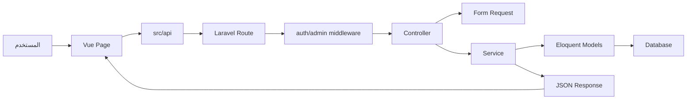

# الفصــل السادس

# التحقيق والتنفيذ

## 6.1. مقدمة

تم تنفيذ مشروع **زاد للعقارات** كتطبيق ويب منفصل الطبقات، بحيث توجد الواجهة الأمامية في مجلد `project-RealEstate`، والخادم الخلفي في مجلد `project-RealEstate_database`، وخدمة التنبؤ السعري في `project-RealEstate_database/ml/pricing`. يعتمد الاتصال بين الواجهة والخادم على REST API بصيغة JSON، بينما يتصل Laravel بخدمة Flask عند الحاجة إلى التنبؤ بسعر العقار.

يعكس التنفيذ التقسيم التحليلي والتصميمي السابق. فكل مجال وظيفي له ملفات واضحة: مسارات، متحكمات، طلبات تحقق، نماذج، خدمات، واختبارات عند الحاجة. كما أن الواجهة الأمامية مقسمة إلى صفحات ومكونات وملفات API وcomposables، مما يجعل الربط بين الشاشة والخادم أكثر وضوحاً.

لا يهدف هذا الفصل إلى إعادة شرح التصميم فقط، بل إلى توضيح كيف تم تنفيذ الوحدات الأساسية فعلياً داخل المشروع: المصادقة، العقارات، المدن والمناطق، الشركات والوسطاء، المفضلة، التوصيات، الاستثمار، الرسائل، الإشعارات، الثقة، الإدارة، التنبؤ السعري، والواجهة الأمامية.

## 6.2. بيئة وتقنيات التنفيذ

تم استخدام مجموعة تقنيات متكاملة تناسب طبيعة المشروع:

| الطبقة | التقنيات |
|---|---|
| الخادم الخلفي | PHP 8.2، Laravel 12، Laravel Sanctum |
| قاعدة البيانات | MySQL أو SQLite في التطوير |
| الواجهة الأمامية | Vue، Vite، Pinia، Vue Router |
| التصميم والواجهة | Bootstrap، Bootstrap Icons، CSS مخصص |
| الخرائط | Leaflet |
| خدمة الذكاء الاصطناعي | Python، Flask، flask-cors، scikit-learn، joblib |
| الاختبار | PHPUnit، Feature Tests، Unit Tests |
| التوثيق | Markdown، Mermaid، DBML |

يعتمد الخادم الخلفي على بنية Laravel المعتادة: `app/Http/Controllers`, `app/Http/Requests`, `app/Models`, `app/Services`, `routes`, و`database/migrations`. أما الواجهة فتستخدم `src/views` للصفحات، و`src/components` للمكونات، و`src/api` للاتصال بالخادم، و`src/router` للمسارات والحراس.

## 6.3. مسار العمل العام في النظام

يبدأ مسار العمل من المستخدم داخل الواجهة الأمامية. عند فتح صفحة مثل قائمة العقارات أو صفحة التوصيات، يحدد Vue Router المكون المطلوب، ثم تستدعي الصفحة ملف API مناسباً من `src/api`. يرسل هذا الملف طلب HTTP إلى Laravel، ثم يمر الطلب عبر المسار المناسب والوسطاء مثل `auth:sanctum` أو `admin`.

بعد ذلك يستقبل المتحكم الطلب، ويستخدم Form Request للتحقق من المدخلات عند الحاجة، ثم يستدعي نموذجاً أو خدمة. إذا كان الطلب بسيطاً، قد يتعامل المتحكم مع النموذج مباشرة. أما إذا كان الطلب يحتوي على منطق أعمال مثل الاستثمار أو التوصيات أو الثقة أو التنبؤ السعري، يتم تحويل المنطق إلى Service مستقل. في النهاية يعيد Laravel استجابة JSON موحدة، وتعرضها الواجهة للمستخدم.

يمكن تلخيص المسار العام كما يلي:

## 6.4. تنفيذ المصادقة والأدوار

تم تنفيذ المصادقة العامة في `routes/api/v1/auth.php`، وتضم مسارات التسجيل، تسجيل الدخول، وتسجيل الخروج. أما مصادقة المدير فتوجد في `routes/api/admin/auth.php`. يعتمد النظام على Laravel Sanctum لإنشاء توكن للمستخدم عند التسجيل أو تسجيل الدخول.

### 6.4.1. تسجيل مستخدم جديد

يستقبل `AuthController::register` طلب التسجيل بعد التحقق منه عبر `RegisterUserRequest`. يتم إنشاء سجل في جدول `users` يحتوي على اسم المستخدم والاسم والبريد وكلمة المرور والهاتف والجنس والنوع والحالة. بعد ذلك تتم مزامنة بعض الروابط الاجتماعية القديمة عند وجودها، ثم ينشئ النظام توكن وصول جديداً ويعيد المستخدم مع التوكن.

هذا التنفيذ يجعل المستخدم قادراً على الدخول مباشرة بعد التسجيل، كما يحافظ على مركزية بيانات الحساب داخل جدول `users`.

### 6.4.2. تسجيل الدخول

يستقبل `AuthController::login` البريد وكلمة المرور، ثم يبحث عن المستخدم بالبريد ويتحقق من كلمة المرور باستخدام `Hash::check`. إذا كانت البيانات غير صحيحة يعيد النظام خطأ 401، وإذا كان الحساب غير نشط يعيد خطأ 403. عند النجاح ينشئ النظام توكن Sanctum ويرجع المستخدم والتوكن ونوعه.

### 6.4.3. تسجيل الخروج

ينفذ `AuthController::logout` حذف التوكن الحالي للمستخدم من جدول `personal_access_tokens`. بهذا تنتهي الجلسة الحالية دون حذف باقي توكنات المستخدم الأخرى إن وجدت.

### 6.4.4. حماية المسارات

المسارات الخاصة بالمستخدمين توضع داخل مجموعة `auth:sanctum`، بينما توضع مسارات المدير داخل مجموعة تستخدم `auth:sanctum` ووسيط `admin`. ويتم تحديد أنواع المديرين من إعدادات `config/realestate.php` عبر `admin_types`.

## 6.5. تنفيذ إدارة الأدوار ولوحات التحكم

يعتمد النظام على قيمة `type` في جدول `users` للتمييز بين أنواع المستخدمين مثل `admin`, `agent`, `owner`, `buyer`, و`company`. لا تعتمد الواجهة فقط على إخفاء الروابط، بل يحمي الخادم مسارات الإدارة بوسيط خاص. لذلك حتى لو حاول مستخدم عادي إرسال طلب مباشر إلى مسار إداري، يجب أن يرفضه الخادم.

في الواجهة تستخدم `router/guards.js` حراساً مثل `authGuard`, `guestGuard`, و`adminGuard`. هذه الحراس توجه المستخدم حسب حالة تسجيل الدخول ونوع التخطيط المطلوب. وتستخدم الواجهة تخطيطات منفصلة:

- `MainLayout` للصفحات العامة والمستخدم المسجل.
- `AuthLayout` لصفحات تسجيل الدخول والتسجيل.
- `AdminLayout` للوحة الإدارة.

## 6.6. تنفيذ إدارة العقارات والوسائط

### 6.6.1. إدارة العقارات

تدار العقارات عبر `EstateController` في الواجهة العامة والمحمية، وعبر `Api/Admin/EstateController` في الإدارة. يحتوي جدول `estates` على بيانات واسعة تشمل الموقع، السعر، المساحة، مواصفات العقار، الحالة، الوصف، مؤشرات الاستثمار، المشاهدات، والمشاركات.

عند إنشاء عقار أو تحديثه، تمر البيانات عبر Requests خاصة مثل `StoreEstateRequest` أو `UpdateEstateRequest`. وتستخدم المتحكمات concern مثل `PersistsEstateFields` لتوحيد طريقة حفظ الحقول. كما يتم استدعاء `InvestmentCalculatorService` لحساب المؤشرات الاستثمارية إذا توفرت بيانات الإيجار والسعر والمصاريف.

### 6.6.2. إدارة صور العقار

تدار الصور عبر `EstateImageController`. يسمح النظام بإضافة صور للعقار، عرضها، حذفها، وتحديد صورة رئيسية من خلال مسار `primary`. ترتبط الصور بجدول `estate_images`، ويحتوي كل سجل على `estate_id`, `image`, و`is_primary`.

### 6.6.3. إدارة فيديوهات العقار

تدار الفيديوهات عبر `EstateVideoController`. يسمح النظام بإضافة فيديوهات للعقار وحذفها. يتم التحقق من الملف وحفظ مساره ثم إنشاء سجل في جدول `estate_videos`.

### 6.6.4. إدارة إعلانات العقار

تدار الإعلانات عبر `EstateAdController`. يمكن إضافة إعلان للعقار، حذفه، أو تحديد إعلان رئيسي. ترتبط الإعلانات بجدول `estate_ads`، وتستخدم `is_main` لتحديد الإعلان الرئيسي.

### 6.6.5. حالات العقار

يستخدم النظام حالات العقار المعرفة في `config/realestate.php`: `pending`, `active`, و`rejected`. يستطيع المدير تغيير حالة العقار من لوحة الإدارة، بينما يستطيع المالك متابعة الحالة ولا يعتمد العقار بنفسه.

## 6.7. تنفيذ المدن والمناطق والبحث الجغرافي

### 6.7.1. المدن والمناطق

تدار المدن عبر `CityController`، وتدار المناطق عبر `PlaceController`. في المسارات العامة يستطيع المستخدم تصفح المدن والمناطق، أما المدير فيستطيع إنشاؤها وتعديلها وحذفها من المسارات الإدارية. ترتبط المنطقة بمدينة، ويرتبط العقار بمنطقة، لذلك تعد هذه الجداول أساس البحث الجغرافي والتنظيم المكاني.

### 6.7.2. البحث الجغرافي

ينفذ `EstateGeoController` وظائف مثل:

- عرض العقارات القريبة.
- عرض العقارات ضمن نصف قطر معين.
- تزويد الواجهة ببيانات الخريطة.

أما `GeoSearchService` فيعالج حسابات المسافة والإحداثيات. يعتمد النظام على خطوط الطول والعرض المخزنة في العقارات والمدن والمناطق، وتستخدم الواجهة Leaflet لعرض النتائج على الخريطة.

## 6.8. تنفيذ الشركات والوسطاء

### 6.8.1. إدارة الشركات

تدار الشركات عبر `CompanyController` للمستخدمين، وعبر `Api/Admin/CompanyController` للمدير. يمكن للشركة إنشاء ملفها وتحديثه أو حذفه. يحتوي ملف الشركة على اسم الشركة، الموقع، المنطقة، الوصف، أيام العمل، عدد الموظفين، الصور، الحالة، ودرجة الثقة.

تستخدم حالة الشركة القيم المعرفة في الإعدادات: `pending`, `approved`, `rejected`, و`suspended`. المدير وحده يستطيع تغيير الحالة من المسار الإداري.

### 6.8.2. إدارة وسطاء الشركة

يمكن للشركة إدارة الوسطاء التابعين لها من خلال مسارات `my/company/agents`. يتم ربط الوسيط بمستخدم وشركة، مما يسمح بظهوره ضمن دليل الوسطاء وضمن صفحة الشركة. أما المدير فيستطيع إدارة الوسطاء عبر API إداري مستقل.

### 6.8.3. روابط الشركة والوسيط

تستخدم الشركات والوسطاء نظام الروابط الاجتماعية، سواء من خلال `CompanySocialLinkController` أو `SocialLinkController`. يسمح هذا بتوحيد منطق روابط التواصل بدلاً من بناء حقول منفصلة لكل منصة داخل جدول الشركة أو الوسيط.

## 6.9. تنفيذ المفضلة والتوصيات

### 6.9.1. المفضلة

تدار مفضلة العقارات عبر `FavoriteEstateController`، ومفضلة الوسطاء عبر `FavoriteAgentController`. تعتمد قاعدة البيانات على جداول `favorite_estates` و`favorite_agents` مع قيد فريد يمنع تكرار نفس العقار أو الوسيط لنفس المستخدم.

إضافة أو حذف مفضلة يمكن أن تصبح إشارة لمحرك التوصيات، لأن المفضلة تعبر عن اهتمام واضح من المستخدم.

### 6.9.2. تفضيلات المستخدم

تدار التفضيلات عبر `UserPreferenceController`. يستطيع المستخدم حفظ تفضيلات مثل المدينة، المنطقة، الميزانية، نوع العقار، عدد الغرف، وظيفة العقار، هدف الاستثمار، مستوى المخاطرة، والاهتمامات. تحفظ هذه البيانات في جدول `user_preferences`.

### 6.9.3. توليد التوصيات

ينفذ `RecommendationController` عرض التوصيات، التوصيات الأعلى، العقارات المشابهة، وإعادة التوليد. يتم توزيع العمل داخلياً بين:

- `RecommendationService`: قراءة وتنظيم التوصيات.
- `RecommendationGeneratorService`: توليد توصيات جديدة.
- `RecommendationScoringService`: حساب درجة كل عقار.

يعتمد الحساب على عوامل مثل الميزانية، الموقع، نوع العقار، العائد الاستثماري، والهدف الاستثماري. وتحفظ النتائج في جدول `recommendations` حتى لا يعاد التوليد في كل طلب.

### 6.9.4. تفاعلات العقارات

تدار تفاعلات المستخدم عبر `PropertyInteractionController` و`PropertyInteractionService`. تستخدم هذه التفاعلات كإشارات إضافية في محرك التوصيات، وتساعد على فهم السلوك الفعلي للمستخدم.

## 6.10. تنفيذ الاستثمار والمحافظ

### 6.10.1. نواة الحساب الاستثماري

توجد نواة الحساب في `InvestmentCalculatorService`. تقرأ الخدمة الإيجار الشهري، نسبة الإشغال، المصاريف السنوية، الصيانة، الضرائب، تكلفة الشراء، ورسوم الخدمات عند توفرها. ثم تحسب:

- الدخل السنوي الإجمالي.
- إجمالي التكاليف.
- صافي الربح.
- الدخل السنوي المتوقع.
- ROI.
- فترة الاسترداد.

وجود هذه الخدمة يمنع تكرار معادلات الاستثمار في أكثر من متحكم.

### 6.10.2. حساب الاستثمار أثناء حفظ العقار

عند إنشاء أو تحديث عقار، يستدعي النظام `applyToEstatePayload`. تقوم هذه الدالة بدمج القيم الجديدة مع القيم الموجودة عند التحديث، ثم تحسب المؤشرات وتحفظها ضمن بيانات العقار. بهذه الطريقة تكون مؤشرات الاستثمار متاحة مباشرة عند عرض العقار.

### 6.10.3. التحليلات الاستثمارية

تدار التحليلات عبر `InvestmentAnalysisController`. يمكن إنشاء تحليل مستقل لعقار وحفظه في جدول `investment_analyses`. يسمح هذا للمستخدم بتجربة سيناريوهات مختلفة دون تغيير بيانات العقار الأصلية.

### 6.10.4. المحافظ الاستثمارية

تدار المحافظ عبر `InvestmentPortfolioController`, `MyPortfolioController`, و`MyPortfolioItemController`. ويستخدم النظام `PortfolioService` لإضافة العقارات إلى المحافظ والتحقق من منع التكرار ومنع إضافة عقار غير نشط. تحفظ المحافظ في `investment_portfolios` وتحفظ عناصرها في `portfolio_properties`.

### 6.10.5. لوحة المستثمر

تدار لوحة المستثمر عبر `InvestorDashboardController` و`InvestorDashboardService`. تجمع الخدمة عقارات المحافظ، تعيد حساب المؤشرات، ثم تعرض ملخصاً مثل إجمالي العقارات، متوسط العائد، أفضل عقار، وأسوأ عقار.

## 6.11. تنفيذ الرسائل والإشعارات

### 6.11.1. الرسائل

يعتمد نظام الرسائل على `MessageController` وجدول `messages`. يستطيع المستخدم:

- عرض الرسائل.
- فتح محادثة مع مستخدم.
- إرسال رسالة.
- عرض رسالة واحدة.
- تحديد رسالة كمقروءة.
- حذف رسالة.

تحتوي الرسالة على المرسل والمستقبل والنص وحالة القراءة. وعند فتح محادثة، يتم تحديد الرسائل الواردة غير المقروءة كمقروءة.

### 6.11.2. مراقبة الرسائل من المدير

يوفر `Api/Admin/MessageController` قدرة للمدير على عرض الرسائل أو حذف المخالف منها. لا تستخدم الإدارة لإرسال رسائل، بل للمراقبة والتنظيم فقط.

### 6.11.3. الإشعارات

تدار الإشعارات عبر `NotificationController` وجدول `notifications`. يستطيع المستخدم عرض إشعاراته، معرفة عدد غير المقروء، تحديد إشعار كمقروء، أو تحديد كل الإشعارات كمقروءة. ويستطيع المدير إرسال أو إدارة إشعارات من لوحة الإدارة.

## 6.12. تنفيذ الثقة والمراجعات والتوثيق

### 6.12.1. مراجعات العقارات

تدار مراجعات العقارات عبر `Trust/PropertyReviewController`. يرسل المستخدم تقييمه وتعليقه، ويحفظ النظام التقييم بحالة مراجعة. يستطيع المستخدم عرض تقييمه أو تعديله أو حذفه ضمن القيود.

### 6.12.2. مراجعات الوسطاء والشركات

تدار مراجعات الوسطاء عبر `AgentReviewController`، ومراجعات الشركات عبر `CompanyReviewController`. تعمل بنفس الفكرة: تقييم يربط المستخدم بالوسيط أو الشركة، ثم يخضع لحالة مراجعة قبل الظهور العام.

### 6.12.3. مراجعة المدير للتقييمات

ينفذ `Api/Admin/TrustModerationController` مراجعة التقييمات وطلبات التوثيق. يستطيع المدير عرض المراجعات المعلقة، فتح التفاصيل، اعتماد التقييم، رفضه، أو حذفه. هذا يمنع ظهور مراجعات غير مناسبة مباشرة في الواجهة العامة.

### 6.12.4. طلبات التوثيق

تدار طلبات التوثيق عبر `VerificationRequestController` للمستخدم، وعبر `TrustModerationController` للمدير. يرسل المستخدم نوع المستند والملف، ثم يراجع المدير الطلب ويقبله أو يرفضه. تحفظ الطلبات في جدول `verification_requests`.

### 6.12.5. درجة الثقة

تحسب درجة الثقة عبر `TrustScoreService`. تعتمد على أوزان معرفة في `config/realestate.php` مثل التوثيق، العقارات المعتمدة، متوسط التقييم، عدد المراجعات، والنشاط داخل المنصة. وتعرض الدرجة من خلال موارد مثل `TrustScoreResource` ومكونات الواجهة مثل `TrustBadge` و`TrustScorePanel`.

## 6.13. تنفيذ التنبؤ السعري وخدمة ML

### 6.13.1. مسارات التنبؤ

تدار طلبات التنبؤ عبر `PricePredictionController`. يوجد مسار لتنبؤ سعر عقار موجود، ومسار `preview` لإرسال مدخلات مخصصة. تمر الطلبات عبر المصادقة والتحقق من المدخلات قبل استدعاء الخدمة.

### 6.13.2. خدمة Laravel للتنبؤ

تستخدم الخلفية `EstatePricePredictionService` لبناء بيانات العقار، و`PricePredictionClient` لإرسال الطلب إلى Flask. يتعامل Laravel مع الأخطاء مثل عدم توفر خدمة Flask أو استجابة غير صالحة، ثم يعيد استجابة مناسبة للمستخدم.

### 6.13.3. خدمة Flask

توجد خدمة Flask في `ml/pricing/server.py`. تستقبل JSON، تستخرج خصائص العقار، تحول الموقع إلى قيمة رقمية، تبني مصفوفة الخصائص، ثم تستخدم النموذج المحفوظ لإنتاج `predicted_price`. تحفظ ملفات النموذج مثل `real_estate_model.pkl` و`label_encoder.pkl` داخل مجلد الخدمة.

### 6.13.4. حفظ نتائج التنبؤ

عند تفعيل `ML_PRICE_PREDICTION_LOG`، يحفظ النظام نتائج التنبؤ في جدول `price_predictions`. يحتوي السجل على المستخدم، العقار إن وجد، خصائص الإدخال، السعر المتوقع، السعر المعروض، الفرق، نسبة الفرق، ومؤشر يوضح هل السعر متوافق مع النموذج أو أعلى أو أقل من التوقع.

## 6.14. تنفيذ الواجهة الأمامية

### 6.14.1. هيكل الواجهة

توجد الواجهة في `project-RealEstate/src`. أهم المجلدات:

- `views`: صفحات التطبيق.
- `components`: المكونات المشتركة.
- `api`: ملفات الاتصال بالخادم.
- `composables`: منطق قابل لإعادة الاستخدام.
- `router`: تعريف المسارات والحراس.
- `layouts`: التخطيطات العامة.
- `stores`: إدارة حالة المصادقة.
- `styles`: ملفات CSS.

### 6.14.2. الصفحات العامة

تتضمن الصفحات العامة: الصفحة الرئيسية، العقارات، تفاصيل العقار، خريطة العقارات، المدن، تفاصيل المدينة، المناطق، تفاصيل المنطقة، الشركات، تفاصيل الشركة، الوسطاء، وتفاصيل الوسيط.

هذه الصفحات تعتمد على ملفات API مثل `estates.js`, `cities.js`, `places.js`, `companies.js`, و`agents.js`.

### 6.14.3. الصفحات المحمية

تتضمن الصفحات المحمية: الملف الشخصي، المفضلة، والتوصيات. تستخدم هذه الصفحات `authGuard` للتأكد من تسجيل الدخول قبل الدخول إليها.

### 6.14.4. صفحات الإدارة

تتضمن الإدارة: لوحة التحكم، المستخدمين، العقارات، الشركات، الوسطاء، المدن، المناطق، والثقة. تعتمد هذه الصفحات على ملفات API داخل `src/api/admin` مثل `dashboard.js`, `users.js`, `estates.js`, `companies.js`, `agents.js`, `locations.js`, و`trust.js`.

### 6.14.5. المكونات المشتركة

تم بناء مكونات مشتركة مثل `AppButton`, `AppInput`, `AppSelect`, `Pagination`, `ErrorAlert`, `LoadingSpinner`, `TrustBadge`, و`StarRating`. كما تم بناء مكونات إدارية مثل `AdminDataTable`, `AdminEstateForm`, `AdminCompanyForm`, `AdminAgentForm`, و`AdminModerationDialog`.

يساعد هذا الأسلوب على تقليل التكرار، لأن نماذج الإدارة والقوائم والجداول تتكرر في أكثر من صفحة.

## 6.15. الخدمات البرمجية الأساسية

| الخدمة | الدور |
|---|---|
| `FileUploadService` | رفع الملفات وتنظيم حفظها. |
| `EstateImageService` | منطق خاص بصور العقارات. |
| `GeoSearchService` | حساب البحث الجغرافي والمسافات. |
| `NotificationService` | إنشاء وإدارة الإشعارات. |
| `SocialLinkService` | إدارة الروابط الاجتماعية ومزامنتها. |
| `PropertyInteractionService` | تسجيل تفاعلات المستخدم مع العقارات. |
| `RecommendationService` | عرض وإدارة التوصيات. |
| `RecommendationGeneratorService` | توليد توصيات جديدة. |
| `RecommendationScoringService` | حساب درجة ملاءمة العقار. |
| `InvestmentCalculatorService` | حساب ROI والدخل وفترة الاسترداد. |
| `InvestorDashboardService` | بناء ملخص المستثمر. |
| `PortfolioService` | إدارة المحافظ وعناصرها. |
| `ReviewService` | إدارة منطق المراجعات. |
| `VerificationRequestService` | إدارة طلبات التوثيق. |
| `TrustScoreService` | حساب درجة الثقة. |
| `EstatePricePredictionService` | تنسيق التنبؤ بسعر العقار. |
| `PricePredictionClient` | الاتصال بخدمة Flask. |
| `MarketTrendsService` | تلخيص اتجاهات السوق من قاعدة البيانات. |
| `StatisticsService` | إحصاءات لوحة الإدارة. |

## 6.16. مقارنة مختصرة بين مسارات التنفيذ

### 6.16.1. مسار الزائر

يدخل الزائر إلى الواجهة العامة، يتصفح العقارات والمدن والمناطق والشركات والوسطاء، ويقرأ التفاصيل والتقييمات المعتمدة. لا يحتاج هذا المسار إلى توكن، لكنه يتعامل فقط مع البيانات العامة والمنشورة.

### 6.16.2. مسار المستخدم المسجل

يسجل المستخدم الدخول، يحصل على توكن، ثم يستخدم المفضلة والتوصيات والرسائل والتحليلات والمحافظ والتقييمات وطلبات التوثيق. هذا المسار يمر عبر `auth:sanctum` ويتطلب تحققاً من ملكية الموارد عند التعديل.

### 6.16.3. مسار المالك أو الشركة

يستخدم المالك مسارات `my/estates` لإدارة عقاراته ووسائطها، بينما تستخدم الشركة مسارات `my/company` لإدارة ملفها ووسطائها وروابطها. هذه المسارات لا تمنح المستخدم صلاحية اعتماد المحتوى، بل تترك الاعتماد للمدير.

### 6.16.4. مسار المدير

يدخل المدير إلى لوحة الإدارة، وتمر طلباته عبر `auth:sanctum` ووسيط `admin`. يستطيع إدارة المستخدمين والعقارات والشركات والوسطاء والمواقع والتقييمات والتوثيق والرسائل والإشعارات. هذا المسار هو المسؤول عن ضبط جودة المنصة.

### 6.16.5. مسار خدمة التنبؤ السعري

يطلب المستخدم توقع السعر من الواجهة، يمر الطلب إلى Laravel، ثم إلى Flask. تعود النتيجة إلى Laravel ليحسب الفرق ويحفظ السجل عند الحاجة. هذا المسار منفصل عن باقي النظام حتى لا يؤدي توقفه إلى تعطيل التصفح أو الإدارة.

## 6.17. خلاصة الفصل

يوضح تنفيذ مشروع زاد للعقارات أن النظام مبني على وحدات واضحة ومترابطة. فكل مجال له مسارات ومتحكمات وخدمات ونماذج خاصة، بينما تعتمد الواجهة على صفحات ومكونات وملفات API منظمة. كما تم فصل خدمة التنبؤ السعري عن Laravel، وفصل منطق الأعمال المعقد داخل Services قابلة للاختبار.

يساعد هذا التنظيم على تطوير المشروع مستقبلاً، سواء بإضافة تطبيق موبايل، تحسين التوصيات، تطوير نموذج التسعير، إضافة دفع إلكتروني، أو توسيع لوحة الإدارة. كما يجعل المشروع قابلاً للفهم من خلال تتبع المسار من الواجهة إلى API ثم إلى الخدمة وقاعدة البيانات.
