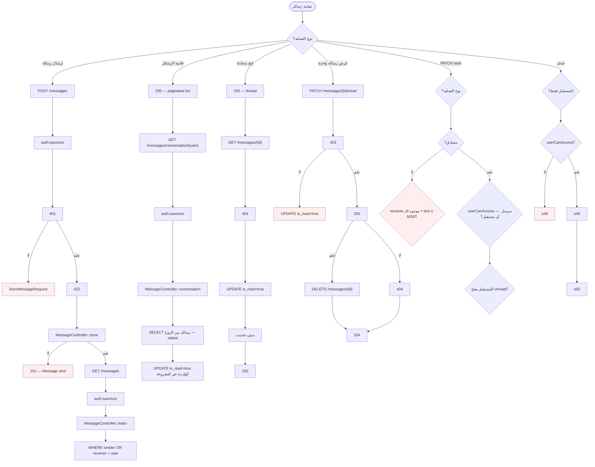
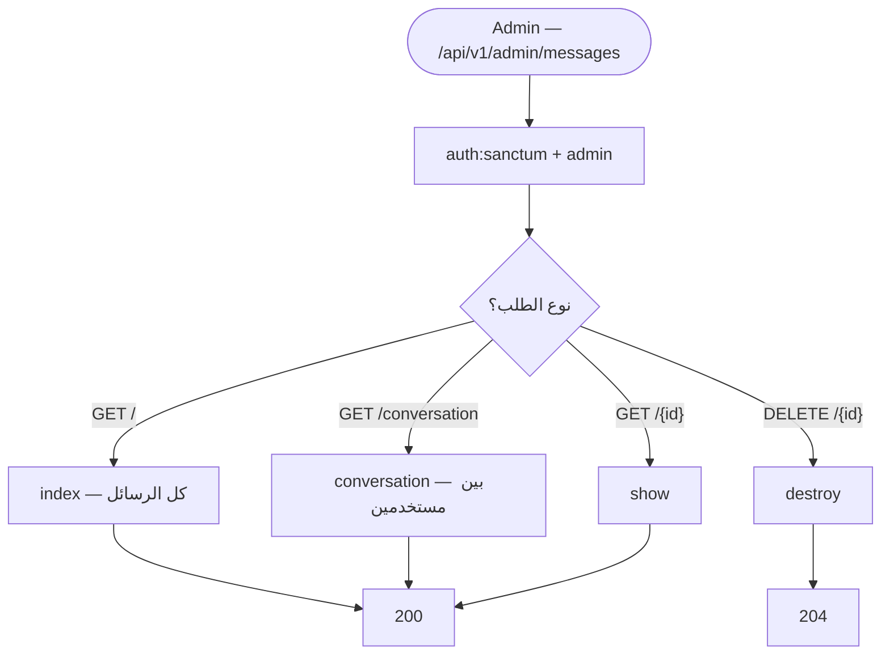

# مخطط النشاط — نظام المحادثة / الرسائل (Chat / Messaging)

> **النطاق:** رسائل مباشرة بين مستخدمين، محادثات ثنائية، إشعارات  
> **التقنية:** REST API — **لا WebSockets** ولا LLM  
> **الملفات الرئيسية:** `MessageController`, `StoreMessageRequest`, Model `messages`, `Notifications`

---

## 1. مخطط النشاط الشامل

---

## 2. مخطط نشاط — لوحة المدير (قراءة/حذف فقط)

> **ملاحظة:** المدير **لا يرسل** رسائل عبر API الإدارة — إرسال فقط عبر `MessageController::store` للمستخدمين.

---

## 3. ما لا يفعله النظام

| الميزة | الحالة |
|--------|--------|
| WebSockets / Pusher | ❌ غير موجود |
| Real-time push | ❌ polling REST فقط |
| إشعار بريد/SMS | ❌ إشعار داخلي `Notifications` فقط |
| محادثة جماعية | ❌ ثنائية فقط |
| ذكاء اصطناعي / chatbot | ❌ غير موجود |
| واجهة Vue للرسائل | ❌ API جاهز — غير موصول بالواجهة |

---

## 4. الملفات والمسارات

| العملية | API | المتحكم |
|---------|-----|---------|
| قائمة | `GET /api/v1/messages` | `MessageController::index` |
| محادثة | `GET /api/v1/messages/conversation/{user}` | `conversation` |
| إرسال | `POST /api/v1/messages` | `store` |
| عرض | `GET /api/v1/messages/{message}` | `show` |
| مقروء | `PATCH /api/v1/messages/{message}/read` | `markAsRead` |
| حذف | `DELETE /api/v1/messages/{message}` | `destroy` |

**التعريف:** `routes/api/v1/authenticated/messages.php`

---

## 5. جدول `messages`

| العمود | الغرض |
|--------|-------|
| `sender_id` | المرسل |
| `receiver_id` | المستقبل |
| `text` | نص الرسالة (max 5000) |
| `is_read` | حالة القراءة |
