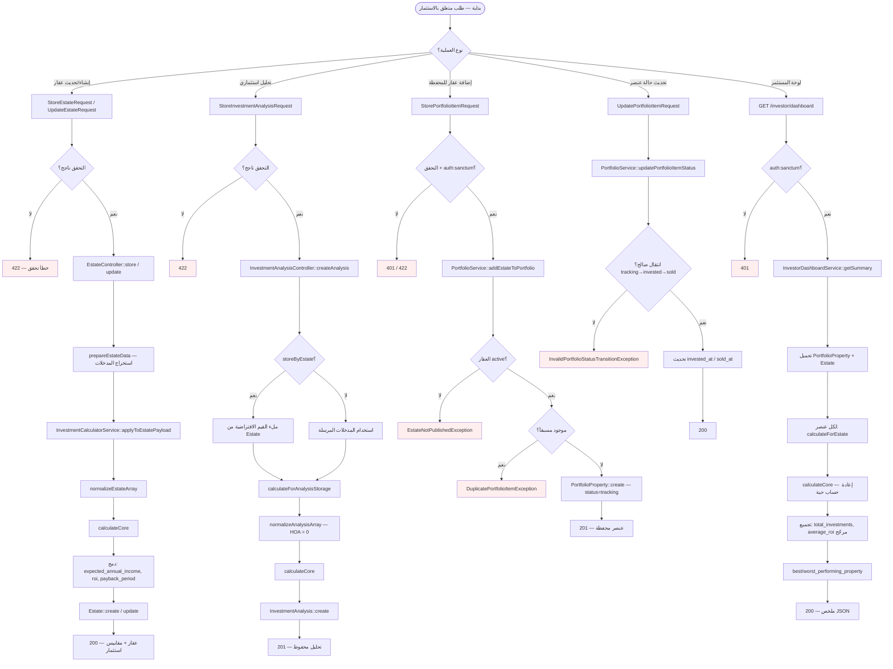
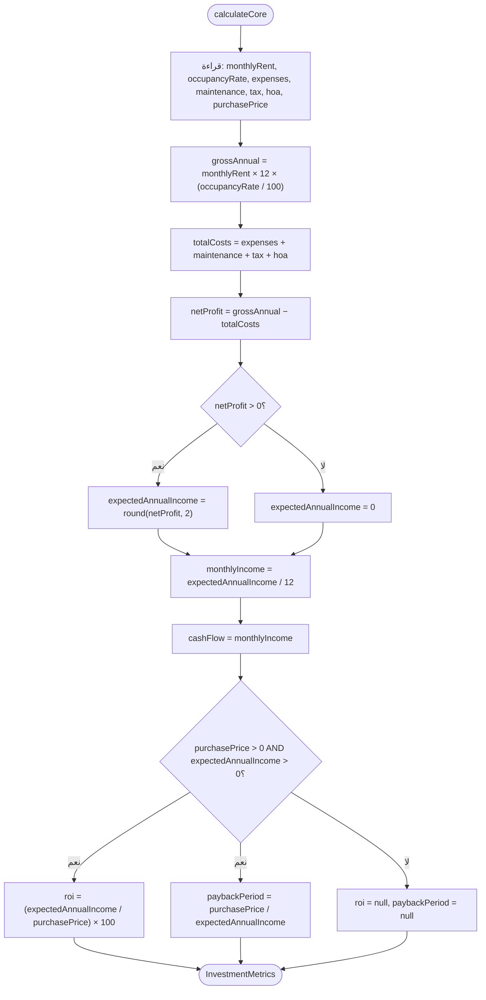

# مخطط النشاط — الاستثمار وكل ما يتعلق به

> **النطاق:** حساب ROI، تحليلات الاستثمار، المحافظ، لوحة المستثمر  
> **المحرك المركزي:** `InvestmentCalculatorService`  
> **الملفات الرئيسية:** `app/Services/Investment/*`, `InvestmentAnalysisController`, `InvestorDashboardController`, `PortfolioService`

---

## 1. مخطط النشاط الشامل

---

## 2. مخطط نشاط — نواة الحساب `calculateCore`

---

## 3. الملفات والمسارات ذات الصلة

| العملية | API | المتحكم | الخدمة |
|---------|-----|---------|--------|
| إنشاء عقار + ROI | `POST /my/estates` | `EstateController::store` | `InvestmentCalculatorService` |
| تحليل استثماري | `POST /investment-analyses` | `InvestmentAnalysisController` | `calculateForAnalysisStorage` |
| محفظة | `POST /investment-portfolios/{id}/properties` | `InvestmentPortfolioController` | `PortfolioService` |
| لوحة المستثمر | `GET /investor/dashboard` | `InvestorDashboardController` | `InvestorDashboardService` |

---

## 4. ملاحظات معمارية

- **مصدر واحد للحقيقة:** جميع حسابات ROI تمر عبر `InvestmentCalculatorService::calculateCore()`.
- **فرق Estate vs Analysis:** التحليل لا يشمل `annual_hoa_or_service`.
- **لوحة المستثمر:** تُعيد الحساب حياً؛ `PortfolioService::getPortfolioSummary()` يقرأ قيم مخزنة.
