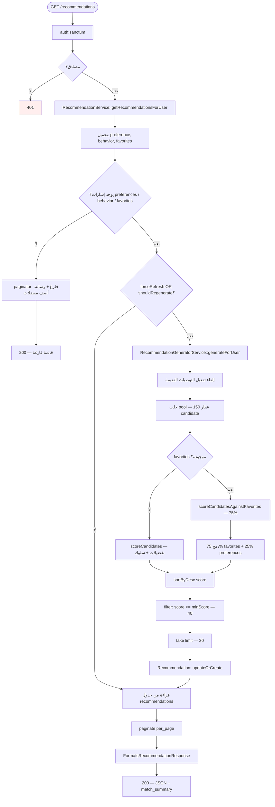
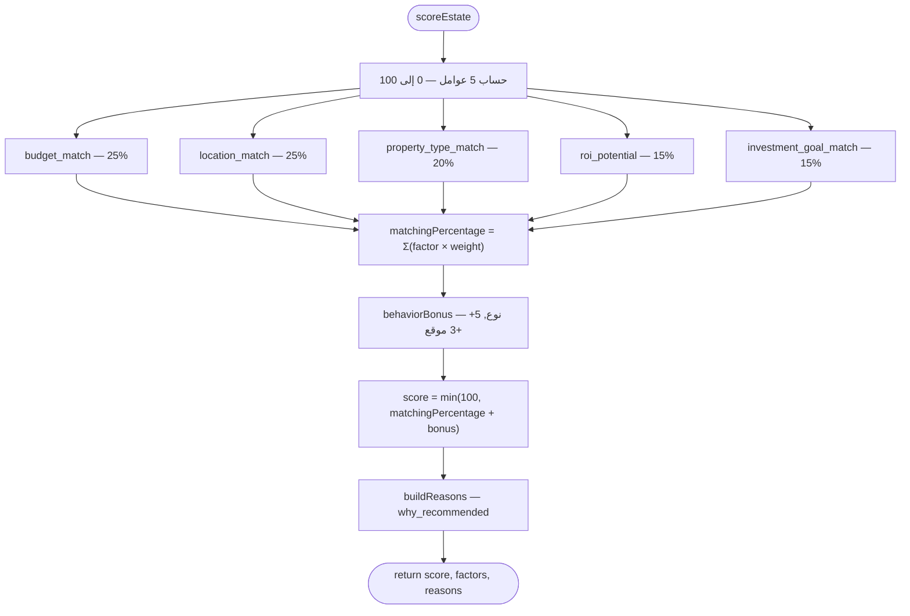
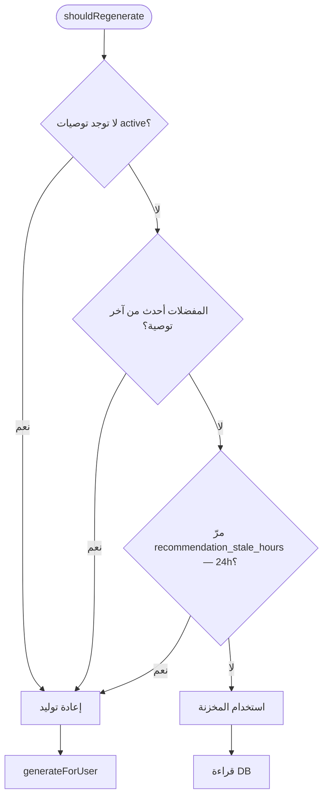

# مخطط النشاط — نظام التوصيات (Suggestions / Recommendations)

> **النطاق:** توصيات مخصصة، عقارات مشابهة، تفضيلات، سلوك، مفضلات  
> **التقنية:** محرك تقييم مرجّح (Heuristics) — **ليس** ML/LLM  
> **الملفات الرئيسية:** `RecommendationService`, `RecommendationGeneratorService`, `RecommendationScoringService`, `PropertyInteractionService`

---

## 1. مخطط النشاط — جلب التوصيات



---

## 2. مخطط نشاط — محرك التقييم `scoreEstate`



---

## 3. مخطط نشاط — عقارات مشابهة

```mermaid
flowchart TD
    SimStart([GET /recommendations/similar-estates/{estate}]) --> Sim1{estate active؟}
    Sim1 -->|لا| Sim404[404]
    Sim1 -->|نعم| Sim2[RecommendationService::getSimilarEstates]
    Sim2 --> Sim3[جلب candidates — نفس المدينة — pool 50]
    Sim3 --> Sim4[لكل candidate: scoreSimilarity]
    Sim4 --> Sim5{favorites أو preferences؟}
    Sim5 -->|نعم| Sim6[scoreAgainstFavorites / scoreEstate]
    Sim5 -->|لا| Sim7[similarity فقط]
    Sim6 --> Sim8["combined = similarity×0.6 + personalized×0.4"]
    Sim7 --> Sim9[similarity فقط]
    Sim8 --> Sim10[sortByDesc — take limit]
    Sim9 --> Sim10
    Sim10 --> Sim200[200 — similar_estates JSON]
```

---

## 4. مخطط نشاط — محفّزات إعادة التوليد



**محفّزات إضافية:**
- `?refresh=1` في GET
- `POST /recommendations/refresh`
- إضافة/حذف مفضلة عبر `FavoriteEstateController`

---

## 5. الملفات والمسارات

| العملية | API | المتحكم |
|---------|-----|---------|
| قائمة التوصيات | `GET /recommendations` | `RecommendationController::index` |
| أعلى N | `GET /recommendations/top` | `RecommendationController::top` |
| إعادة توليد | `POST /recommendations/refresh` | `RecommendationController::refresh` |
| عقارات مشابهة | `GET /recommendations/similar-estates/{estate}` | `similarEstates` |
| تفضيلات | `GET/POST/DELETE /my/preferences` | `UserPreferenceController` |
| تفاعلات | `POST /estates/{id}/interactions` | `PropertyInteractionController` |

---

## 6. إعدادات `config/realestate.php`

| المفتاح | الافتراضي |
|---------|-----------|
| `recommendation_limit` | 30 |
| `recommendation_min_score` | 40 |
| `recommendation_candidate_pool` | 150 |
| `recommendation_stale_hours` | 24 |
| `similar_estates_pool` | 50 |
