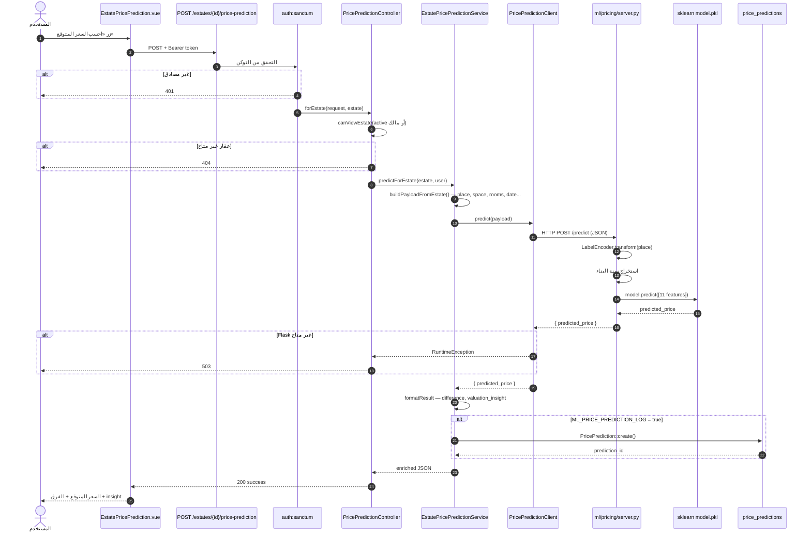
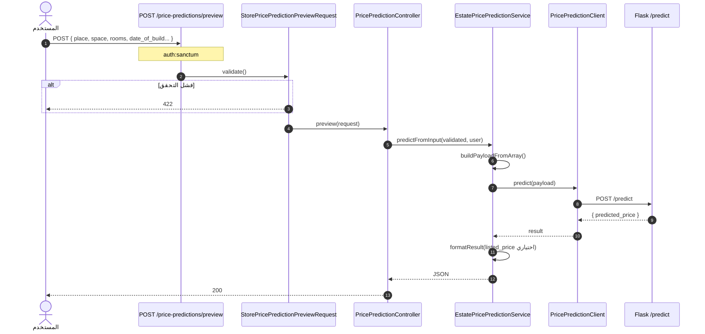
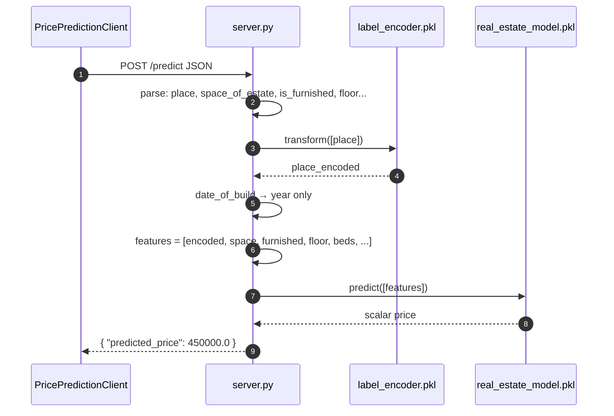
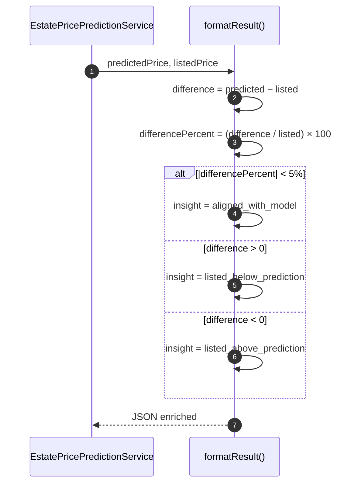

# مخطط التسلسل — نموذج تسعير الذكاء الاصطناعي (ML)

> **النطاق:** تنبؤ سعر العقار عبر Flask + scikit-learn  
> **الملفات:** `PricePredictionController`, `EstatePricePredictionService`, `PricePredictionClient`, `ml/pricing/server.py`

---

## 1. تسلسل — تنبؤ سعر عقار موجود

---

## 2. تسلسل — تنبؤ ad-hoc (Preview)

> **ملاحظة:** لا توجد واجهة Vue موصولة بـ preview حالياً — API فقط.

---

## 3. تسلسل — معالجة Flask داخلياً

---

## 4. تسلسل — insight السعر

---

## 5. الملفات والمسارات

| التسلسل | API | المتحكم |
|---------|-----|---------|
| تنبؤ عقار | `POST /estates/{estate}/price-prediction` | `PricePredictionController::forEstate` |
| preview | `POST /price-predictions/preview` | `PricePredictionController::preview` |
| Flask | `POST http://127.0.0.1:5000/predict` | `server.py::predict()` |

**Config:** `config/ml.php` — `ML_PRICE_PREDICTION_URL`, `ML_PRICE_PREDICTION_LOG`
