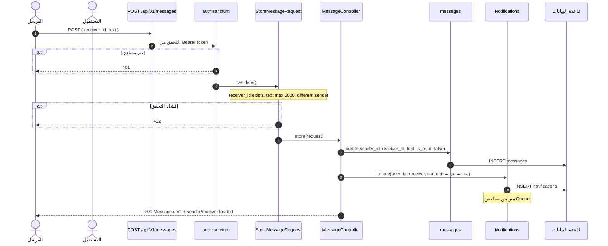
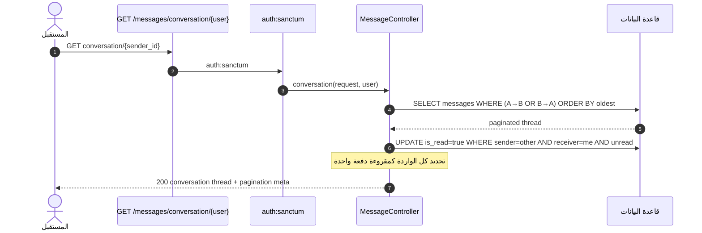
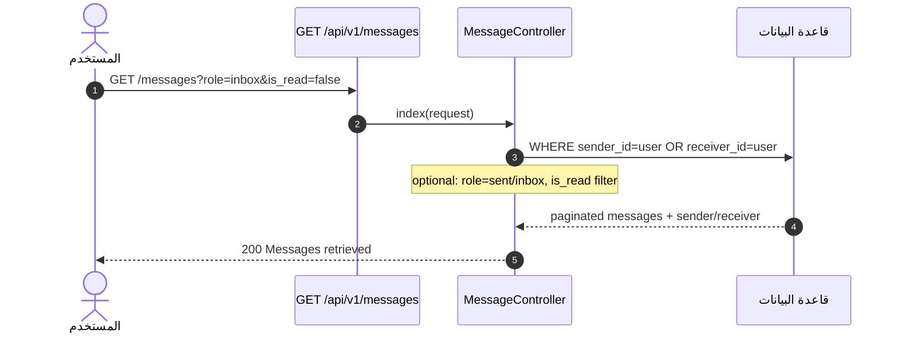
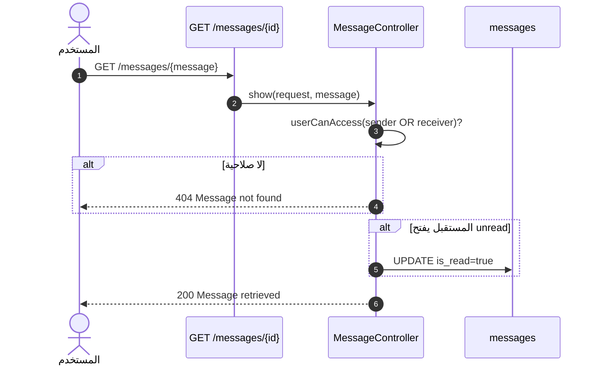
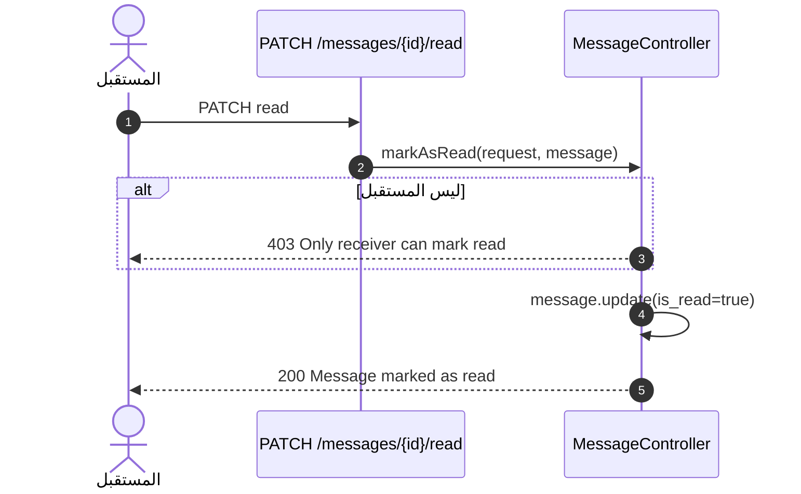
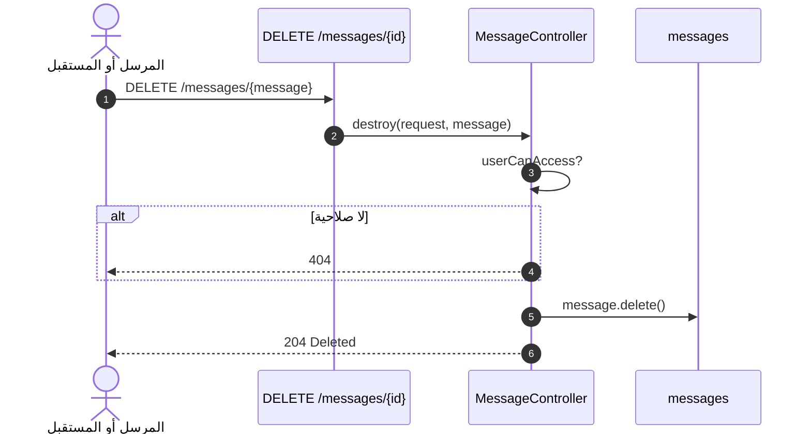
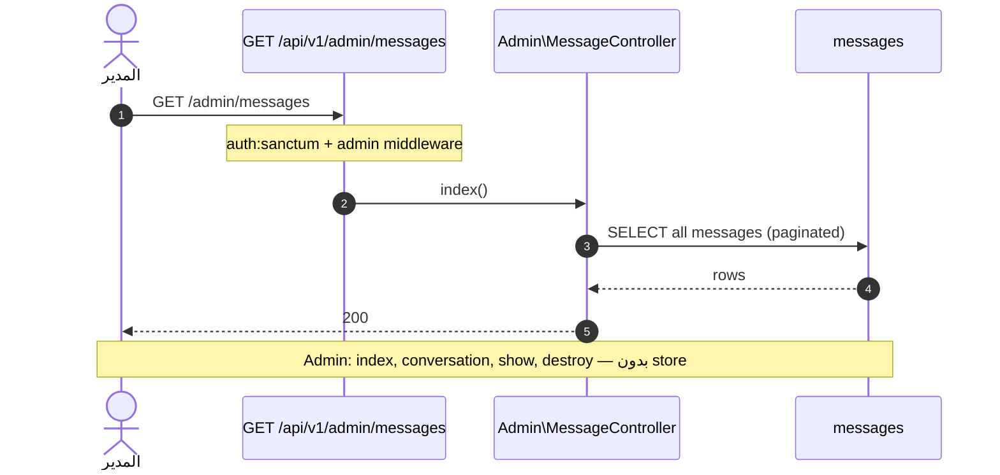

# مخطط التسلسل — نظام المحادثة / الرسائل (Chat / Messaging)

> **النطاق:** إرسال رسالة، فتح محادثة، إشعار المستقبل  
> **الملفات:** `MessageController`, `StoreMessageRequest`, `messages`, `Notifications`  
> **ملاحظة:** REST فقط — لا WebSockets

---

## 1. تسلسل — إرسال رسالة + إشعار

---

## 2. تسلسل — فتح محادثة (وتحديد كمقروء)

---

## 3. تسلسل — صندوق الوارد / المرسل

---

## 4. تسلسل — عرض رسالة واحدة

---

## 5. تسلسل — تحديد كمقروء يدوياً

---

## 6. تسلسل — حذف رسالة

---

## 7. تسلسل — المدير (مراقبة)

---

## 8. ما لا يحدث في هذا النظام

| الميزة | الحالة |
|--------|--------|
| WebSocket push | ❌ |
| Laravel Notification channels (mail/SMS) | ❌ |
| Chatbot / AI | ❌ |
| Vue UI للرسائل | ❌ API جاهز فقط |

---

## 9. الملفات والمسارات

| التسلسل | API | المتحكم |
|---------|-----|---------|
| إرسال | `POST /api/v1/messages` | `MessageController::store` |
| محادثة | `GET /api/v1/messages/conversation/{user}` | `conversation` |
| قائمة | `GET /api/v1/messages` | `index` |
| عرض | `GET /api/v1/messages/{message}` | `show` |
| مقروء | `PATCH /api/v1/messages/{message}/read` | `markAsRead` |
| حذف | `DELETE /api/v1/messages/{message}` | `destroy` |

**التعريف:** `routes/api/v1/authenticated/messages.php`
