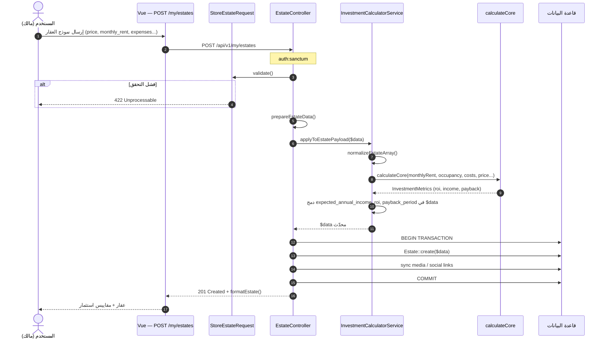
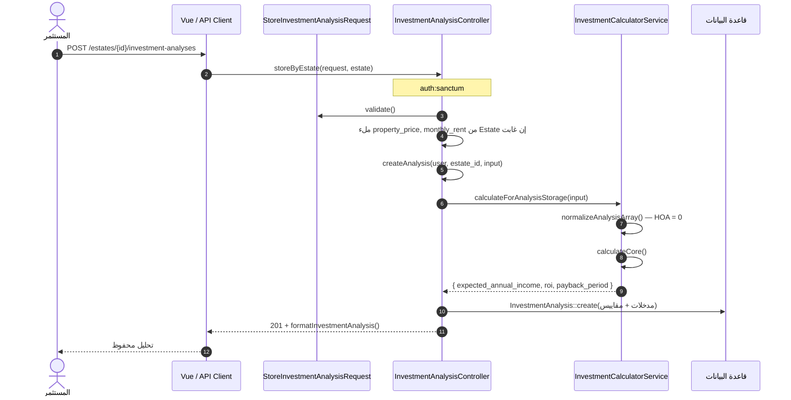
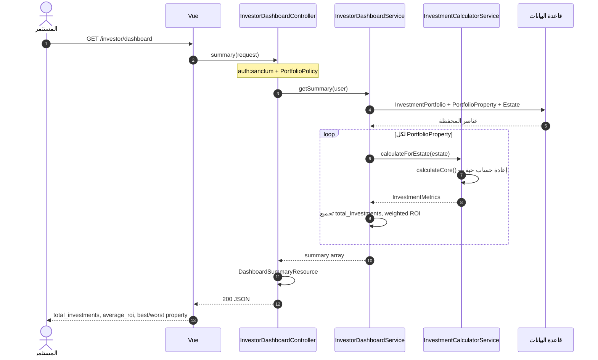
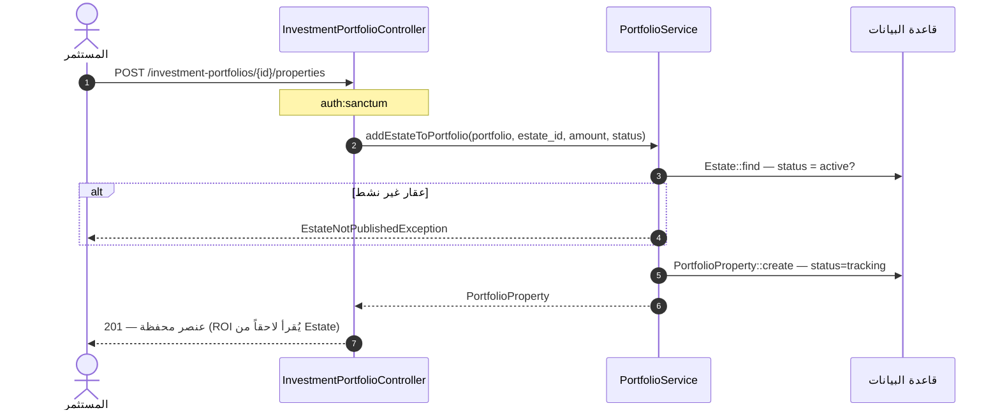

# مخطط التسلسل — الاستثمار وكل ما يتعلق به

> **النطاق:** إنشاء عقار مع ROI، تحليل استثماري، لوحة المستثمر  
> **المحرك:** `InvestmentCalculatorService`

---

## 1. تسلسل — إنشاء عقار مع حساب ROI

---

## 2. تسلسل — حفظ تحليل استثماري

---

## 3. تسلسل — لوحة المستثمر (Dashboard)

---

## 4. تسلسل — إضافة عقار للمحفظة

---

## 5. الملفات المرجعية

| التسلسل | المتحكم | الخدمة |
|---------|---------|--------|
| إنشاء عقار | `EstateController` | `InvestmentCalculatorService` |
| تحليل | `InvestmentAnalysisController` | `calculateForAnalysisStorage` |
| لوحة | `InvestorDashboardController` | `InvestorDashboardService` |
| محفظة | `InvestmentPortfolioController` | `PortfolioService` |
