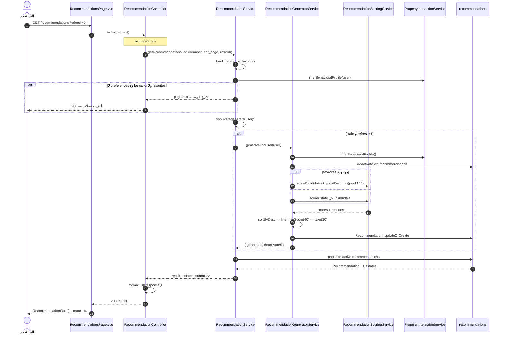
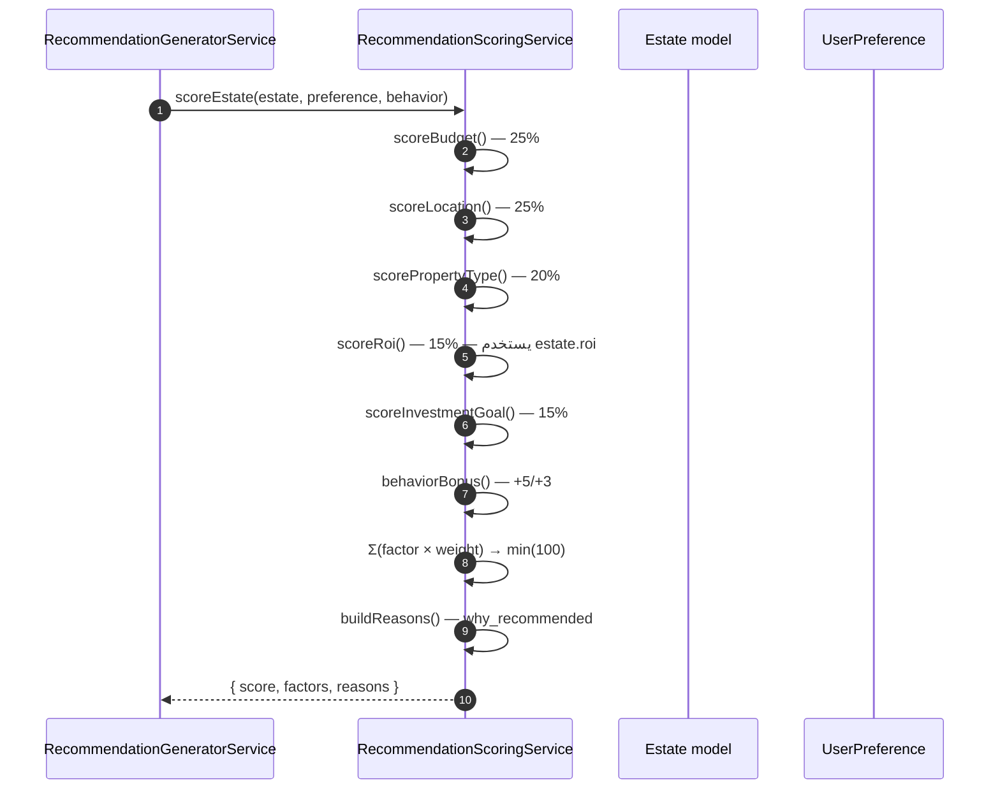
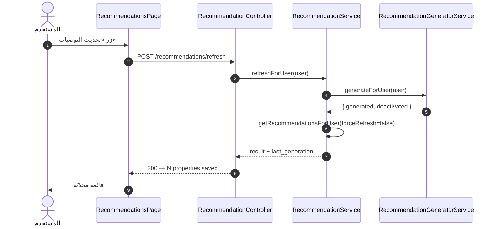
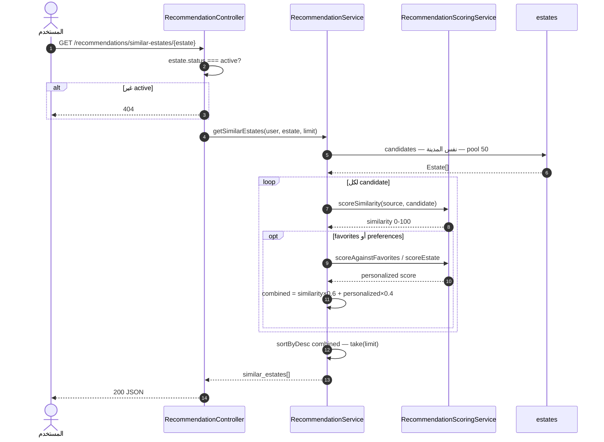
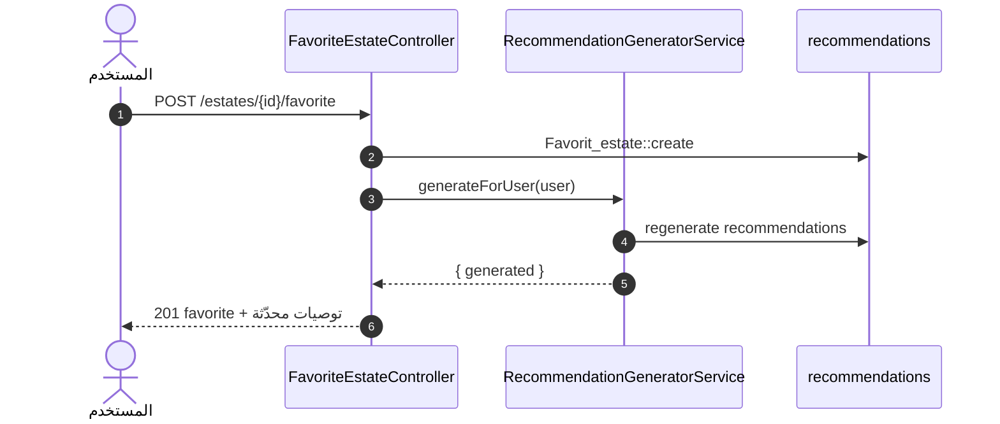

# مخطط التسلسل — نظام التوصيات (Suggestions / Recommendations)

> **النطاق:** جلب توصيات، توليد، تقييم، عقارات مشابهة  
> **الملفات:** `RecommendationController`, `RecommendationService`, `RecommendationGeneratorService`, `RecommendationScoringService`

---

## 1. تسلسل — جلب قائمة التوصيات

---

## 2. تسلسل — تقييم عقار واحد `scoreEstate`

---

## 3. تسلسل — إعادة توليد صريح

---

## 4. تسلسل — عقارات مشابهة

---

## 5. تسلسل — محفّز: إضافة مفضلة

---

## 6. الملفات والمسارات

| التسلسل | API | المتحكم |
|---------|-----|---------|
| قائمة | `GET /recommendations` | `RecommendationController::index` |
| refresh | `POST /recommendations/refresh` | `refresh` |
| مشابه | `GET /recommendations/similar-estates/{estate}` | `similarEstates` |
| top | `GET /recommendations/top` | `top` |

**Vue:** `RecommendationsPage.vue`, `RecommendationCard.vue`, `src/api/recommendations.js`
