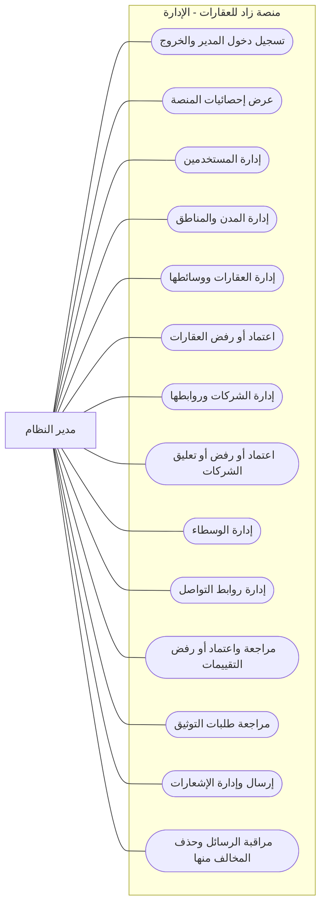

# مخطط حالات الاستخدام - مدير النظام

> مدير النظام يدير بيانات المنصة والمراجعة والاعتمادات.

## ما يستطيع المدير فعله

## الرؤية البسيطة

| المجال | قدرة المدير |
|--------|-------------|
| لوحة التحكم | يرى إحصائيات النظام وحالة المنصة. |
| المستخدمون | ينشئ المستخدمين، يعرضهم، يعدلهم، ويحذفهم حسب القيود. |
| المواقع | يدير المدن والمناطق. |
| العقارات | يدير كل العقارات والوسائط ويغير حالة الاعتماد. |
| الشركات والوسطاء | يدير الشركات والوسطاء وروابط التواصل وحالات الشركات. |
| الثقة | يراجع تقييمات العقارات والوسطاء والشركات، ويراجع طلبات التوثيق. |
| التواصل | يرسل إشعارات، ويراقب الرسائل، ويحذف الرسائل المخالفة. |

## خارج دور المدير كرحلة تجارية

- لا نعرض للمدير محفظة استثمار شخصية كحالة استخدام إدارية.
- لا نخلط بين إدارة المنصة وبين رحلة المشتري أو المالك.
