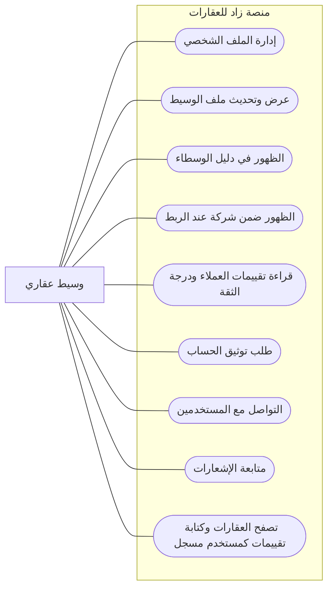

# مخطط حالات الاستخدام - الوسيط العقاري

> الوسيط هو مستخدم لديه ملف وسيط عام يظهر للزوار والمشترين والشركات.

## ما يستطيع الوسيط فعله

## الرؤية البسيطة

| المجال | قدرة الوسيط |
|--------|-------------|
| ملف الوسيط | يرى ملفه ويحدث بياناته وصورته ومعلوماته المهنية. |
| الظهور العام | يظهر في دليل الوسطاء ويظهر ضمن شركة إذا كان مربوطاً بها. |
| الثقة | يتابع تقييمات العملاء ودرجة الثقة ويطلب توثيق الحساب. |
| التواصل | يستخدم الرسائل والإشعارات للتواصل مع العملاء. |
| قدرات مشتركة | يتصفح العقارات ويمكنه استخدام قدرات المستخدم المسجل العامة. |

## خارج دور الوسيط

- لا يعتمد التقييمات أو طلبات التوثيق.
- لا يدير الشركة ووكلاءها إلا إذا كان لديه دور شركة.
- لا يدير بيانات المنصة.
