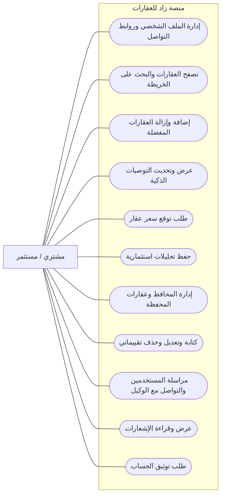

# مخطط حالات الاستخدام - المشتري / المستثمر

> المشتري هو مستخدم مسجل يبحث عن عقار أو فرصة استثمارية.

## ما يستطيع المشتري فعله

## الرؤية البسيطة

| المجال | قدرة المشتري |
|--------|--------------|
| البحث | يتصفح العقارات، يفلتر النتائج، يستخدم الخريطة، ويفتح تفاصيل العقار. |
| القرار | يحفظ العقارات في المفضلة، يرى التوصيات، ويطلب توقع السعر. |
| الاستثمار | ينشئ تحليلات استثمارية، ويدير محافظه والعقارات داخلها. |
| الثقة | يكتب تقييمات للعقارات والوسطاء والشركات، ويعدل تقييماته أو يحذفها. |
| التواصل | يرسل رسائل، يفتح المحادثات، ويتابع الإشعارات. |
| الحساب | يحدث بياناته وروابط التواصل الخاصة به ويطلب التوثيق. |

## خارج دور المشتري

- لا يدير بيانات المنصة.
- لا يعتمد العقارات أو الشركات أو التقييمات.
- لا يدير شركة أو وكلاء شركة.
- لا يدير ملف وسيط إلا إذا كان لديه دور وسيط.
