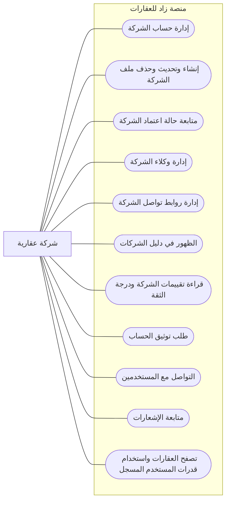

# مخطط حالات الاستخدام - الشركة العقارية

> الشركة هي مستخدم يدير ملف شركة عقارية ووكلاءها وروابط التواصل الخاصة بها.

## ما تستطيع الشركة فعله

## الرؤية البسيطة

| المجال | قدرة الشركة |
|--------|-------------|
| ملف الشركة | تنشئ ملف الشركة وتحدثه أو تحذفه. |
| الاعتماد | تتابع حالة الملف: pending أو approved أو rejected أو suspended. |
| الوكلاء | تضيف وكلاء الشركة وتعدلهم أو تزيلهم. |
| التواصل | تدير روابط التواصل وتتواصل مع المستخدمين عبر الرسائل والإشعارات. |
| الثقة | ترى تقييمات الشركة ودرجة الثقة وتطلب التوثيق. |
| الظهور العام | تظهر في دليل الشركات عند اعتمادها. |

## خارج دور الشركة

- لا تعتمد الشركة نفسها.
- لا تدير كل مستخدمي المنصة.
- لا تعتمد التقييمات أو طلبات التوثيق.
