# مخطط حالات الاستخدام - النظرة العامة

> الهدف: عرض ما يستطيع كل نوع مستخدم فعله داخل منصة زاد للعقارات بشكل بسيط وواضح.
> مصدر التحليل: الواجهة Vue، ومسارات Laravel API، والمتحكمات الفعلية.

## الممثلون

| الممثل | المعنى داخل النظام |
|--------|--------------------|
| زائر | مستخدم غير مسجل يتصفح المحتوى العام |
| مستخدم مسجل | أي مستخدم دخل بحسابه |
| مشتري / مستثمر | يبحث عن عقار، يحفظ المفضلة، ويستخدم الاستثمار والتوصيات |
| مالك عقار | ينشر ويدير عقاراته |
| وسيط عقاري | يدير حضوره كوسيط ويتفاعل مع العملاء |
| شركة عقارية | تدير ملف الشركة ووكلاءها |
| مدير النظام | يدير بيانات المنصة والاعتمادات والمراجعة |

## المخطط العام

```mermaid
flowchart TB
    Visitor["زائر"]
    User["مستخدم مسجل"]
    Buyer["مشتري / مستثمر"]
    Owner["مالك عقار"]
    Agent["وسيط عقاري"]
    Company["شركة عقارية"]
    Admin["مدير النظام"]

    subgraph System["منصة زاد للعقارات"]
        direction TB

        subgraph Public["الاستخدام العام"]
            PublicBrowse(["تصفح العقارات والمدن والمناطق"])
            PublicDirectory(["عرض الوسطاء والشركات والتقييمات"])
            PublicAuth(["تسجيل حساب / تسجيل الدخول"])
        end

        subgraph Registered["المستخدم المسجل"]
            UserProfile(["إدارة الملف الشخصي"])
            UserFavorites(["إدارة العقارات المفضلة"])
            UserReviews(["كتابة وإدارة التقييمات"])
            UserMessages(["إرسال الرسائل واستقبال الإشعارات"])
        end

        subgraph BuyerGroup["المشتري / المستثمر"]
            BuyerSmart(["التوصيات الذكية وتوقع السعر"])
            BuyerInvestment(["إدارة التحليلات والمحافظ الاستثمارية"])
        end

        subgraph OwnerGroup["مالك العقار"]
            OwnerEstate(["إدارة عقاراتي ووسائطها"])
            OwnerStatus(["متابعة اعتماد العقارات"])
        end

        subgraph AgentGroup["الوسيط العقاري"]
            AgentProfile(["إدارة ملف الوسيط"])
        end

        subgraph CompanyGroup["الشركة العقارية"]
            CompanyProfile(["إدارة الشركة والوكلاء"])
            CompanyStatus(["متابعة اعتماد الشركة"])
        end

        subgraph AdminGroup["الإدارة"]
            AdminOps(["إدارة المنصة والاعتمادات"])
            AdminTrust(["مراجعة التقييمات والتوثيق"])
        end
    end

    Visitor --- PublicBrowse
    Visitor --- PublicDirectory
    Visitor --- PublicAuth

    User --- UserProfile
    User --- UserFavorites
    User --- UserReviews
    User --- UserMessages

    Buyer --- BuyerSmart
    Buyer --- BuyerInvestment

    Owner --- OwnerEstate
    Owner --- OwnerStatus

    Agent --- AgentProfile

    Company --- CompanyProfile
    Company --- CompanyStatus

    Admin --- AdminOps
    Admin --- AdminTrust
```

## الرؤية المختصرة لكل دور

| الدور | ما يستطيع فعله ببساطة |
|------|------------------------|
| الزائر | يتصفح العقارات، الخريطة، المدن، المناطق، الوسطاء، الشركات، والتقييمات العامة، ثم يسجل أو يدخل. |
| المشتري / المستثمر | يحفظ العقارات، يحصل على توصيات، يطلب توقع سعر، يكتب تقييمات، ويتابع محافظ وتحليلات استثمارية. |
| مالك العقار | يضيف عقاراته، يعدلها، يدير صورها وفيديوهاتها وإعلاناتها، ويتابع حالة اعتمادها. |
| الوسيط | يحدث ملفه العام كوسيط، يظهر في دليل الوسطاء، يتابع التقييمات ودرجة الثقة، ويتواصل مع المستخدمين. |
| الشركة | تدير ملف الشركة، وكلاء الشركة، وروابط التواصل، وتتابع حالة الاعتماد والتقييمات. |
| المدير | يدير المستخدمين، العقارات، الشركات، الوسطاء، المدن، المناطق، الروابط، الإشعارات، الرسائل، التقييمات، وطلبات التوثيق. |

## قواعد تبسيط المخطط

- نعرض أهداف المستخدم، وليس أسماء الجداول أو المتحكمات أو تفاصيل endpoints.
- لا نضع خطوات داخلية مثل حساب ROI أو تعيين صورة رئيسية كحالة استخدام مستقلة في النظرة العامة.
- كل عملية CRUD كبيرة تظهر كعبارة واحدة مثل: "إدارة المدن" أو "إدارة عقاراتي".
- تفاصيل الاعتماد والمراجعة تخص المدير، وليست قدرة للمالك أو الشركة.
