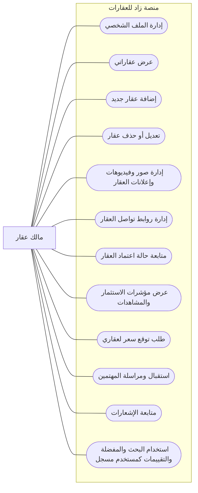

# مخطط حالات الاستخدام - مالك العقار

> مالك العقار هو المستخدم الذي ينشر عقاراته ويتابع ظهورها بعد اعتماد الإدارة.

## ما يستطيع مالك العقار فعله

## الرؤية البسيطة

| المجال | قدرة مالك العقار |
|--------|------------------|
| عقاراتي | يضيف عقاراً، يعدله، يحذفه، ويرى جميع عقاراته بكل الحالات. |
| الوسائط | يدير الصور والفيديوهات والإعلانات وروابط التواصل الخاصة بالعقار. |
| الاعتماد | يتابع هل العقار pending أو active أو rejected. |
| الأداء | يرى بيانات تساعده مثل المشاهدات والمشاركات ومؤشرات الاستثمار. |
| التواصل | يستقبل رسائل المهتمين ويتابع الإشعارات. |
| قدرات مشتركة | يستطيع التصفح والمفضلة والتقييم كأي مستخدم مسجل. |

## خارج دور مالك العقار

- لا يعتمد عقاره بنفسه.
- لا يدير المدن أو المناطق أو المستخدمين.
- لا يدير شركة أو وكلاء شركة إلا إذا كان لديه دور شركة.
