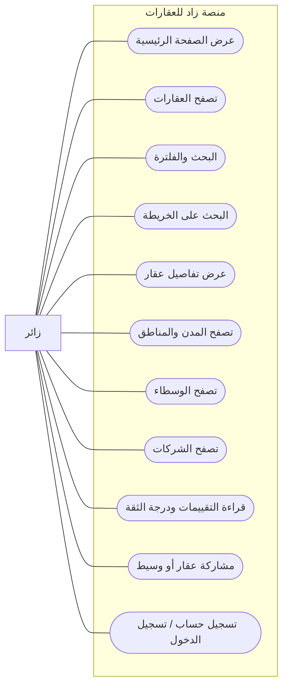

# مخطط حالات الاستخدام - الزائر

> الزائر هو أي شخص يستخدم المنصة بدون تسجيل دخول.

## ما يستطيع الزائر فعله

## الرؤية البسيطة

| المجال | قدرة الزائر |
|--------|-------------|
| العقارات | يرى العقارات المنشورة فقط، يبحث، يفلتر، يفتح التفاصيل، ويستخدم الخريطة. |
| المواقع | يرى المدن والمناطق المتاحة. |
| الوسطاء والشركات | يرى ملفاتهم العامة، وكلاء الشركة، والتقييمات المعتمدة. |
| المشاركة | يسجل مشاركة عقار أو وسيط. |
| الحساب | يستطيع إنشاء حساب أو تسجيل الدخول. |

## ما لا يستطيع الزائر فعله

- لا يستطيع حفظ عقار في المفضلة.
- لا يستطيع كتابة تقييم.
- لا يستطيع إرسال رسائل داخلية.
- لا يستطيع إنشاء عقار أو شركة أو ملف وسيط.
- لا يستطيع استخدام التوصيات أو المحافظ الاستثمارية أو توقع السعر.
