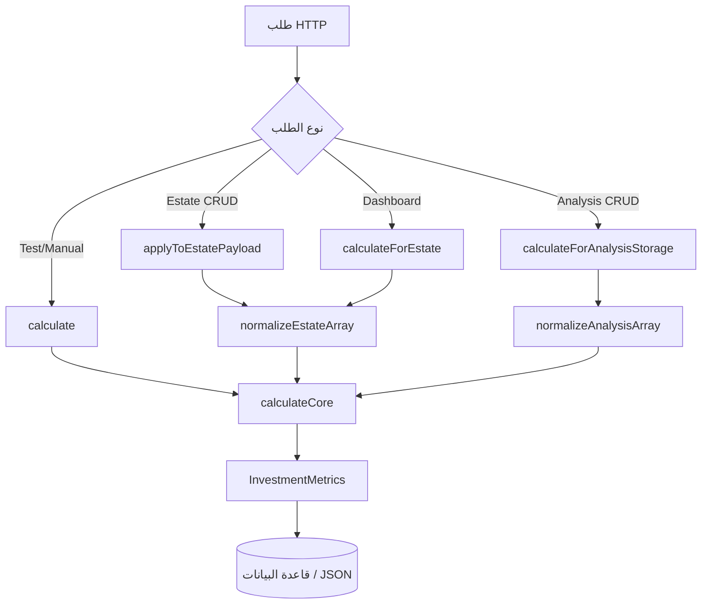

# شرح شامل: InvestmentCalculatorService والاستثمار والخوارزميات والذكاء الاصطناعي

> **المشروع:** `project-RealEstate_database` (Laravel API)  
> **الملف المركزي:** `app/Services/Investment/InvestmentCalculatorService.php`  
> **الغرض:** توثيق تقني كامل لكيفية عمل محرك حساب الاستثمار، تدفق التطبيق، جميع الخوارزميات، وميزات الذكاء الاصطناعي.

---

## جدول المحتويات

1. [ما هو InvestmentCalculatorService؟](#1-ما-هو-investmentcalculatorservice)
2. [كيف يعمل في الكود — شرح تفصيلي](#2-كيف-يعمل-في-الكود--شرح-تفصيلي)
3. [كيف يعمل التطبيق بالكامل](#3-كيف-يعمل-التطبيق-بالكامل)
4. [حسابات الاستثمار — خطوة بخطوة](#4-حسابات-الاستثمار--خطوة-بخطوة)
5. [جميع الخوارزميات — آلية العمل والغرض](#5-جميع-الخوارزميات--آلية-العمل-والغرض)
6. [الذكاء الاصطناعي في المشروع](#6-الذكاء-الاصطناعي-في-المشروع)
7. [مسارات API والملفات ذات الصلة](#7-مسارات-api-والملفات-ذات-الصلة)

---

## 1. ما هو InvestmentCalculatorService؟

`InvestmentCalculatorService` هو **المحرك المركزي** لحساب مقاييس الاستثمار العقاري في المشروع.  
مساره الكامل:

```
app/Services/Investment/InvestmentCalculatorService.php
```

### 1.1 المسؤوليات

| المسؤولية | الوصف |
|-----------|-------|
| حساب الدخل السنوي المتوقع | `expected_annual_income` |
| حساب العائد على الاستثمار | `roi` (نسبة مئوية) |
| حساب فترة استرداد رأس المال | `payback_period` (بالسنوات) |
| حساب الدخل الشهري | `monthly_income` |
| حساب صافي الربح | `net_profit` |
| حساب التدفق النقدي | `cash_flow` |

### 1.2 المخرجات — كائن `InvestmentMetrics`

الخدمة لا تُرجع مصفوفة خام مباشرة في معظم الحالات، بل كائن DTO:

```
app/Services/Investment/InvestmentMetrics.php
```

```php
readonly class InvestmentMetrics
{
    public float $expectedAnnualIncome;
    public ?float $roi;
    public ?float $paybackPeriod;
    public float $monthlyIncome;
    public float $netProfit;
    public float $cashFlow;
}
```

الدالة `toArray()` تحوّل هذه القيم إلى مفاتيح snake_case للتخزين في قاعدة البيانات أو إرجاعها في JSON.

### 1.3 العلاقة مع `InvestmentCalculator`

```
app/Services/Investment/InvestmentCalculator.php
```

هذه **واجهة قديمة (Deprecated)** تفوّض كل عملياتها إلى `InvestmentCalculatorService`.  
أي كود جديد يجب أن يستخدم `InvestmentCalculatorService` مباشرة.

---

## 2. كيف يعمل في الكود — شرح تفصيلي

### 2.1 البنية الداخلية للخدمة

الخدمة تنقسم إلى **ثلاث طبقات**:

```
┌─────────────────────────────────────────────────────────┐
│  طبقة الدخول (Public API)                               │
│  calculate() | calculateForEstate() | calculateForAnalysis()
│  applyToEstatePayload() | mergeEstateInputs() | mergeAnalysisInputs()
└──────────────────────────┬──────────────────────────────┘
                           │
┌──────────────────────────▼──────────────────────────────┐
│  طبقة التطبيع (Normalization)                           │
│  normalizeEstateArray() | normalizeAnalysisArray()        │
│  — توحيد أسماء الحقول من Estate أو Analysis إلى شكل واحد │
└──────────────────────────┬──────────────────────────────┘
                           │
┌──────────────────────────▼──────────────────────────────┐
│  طبقة الحساب (Core)                                     │
│  calculateCore() — المعادلات الفعلية                    │
└─────────────────────────────────────────────────────────┘
```

### 2.2 ثوابت المدخلات

#### مدخلات العقار (`ESTATE_INPUT_KEYS`)

```php
'price', 'monthly_rent', 'occupancy_rate',
'annual_expenses', 'maintenance_cost',
'annual_property_tax', 'annual_hoa_or_service'
```

#### مدخلات التحليل (`ANALYSIS_INPUT_KEYS`)

```php
'property_price', 'monthly_rent', 'annual_expenses',
'maintenance_cost', 'tax_cost', 'occupancy_rate'
```

> **فرق جوهري:** تحليل الاستثمار **لا يتضمن** رسوم HOA (`annual_hoa_or_service = 0` دائماً).

### 2.3 شرح كل دالة عامة (Public Methods)

#### `calculate(...)` — حساب مباشر بالأرقام

```php
public function calculate(
    float $monthlyRent = 0,
    float $occupancyRate = 100,
    float $annualExpenses = 0,
    float $annualMaintenance = 0,
    float $annualPropertyTax = 0,
    float $purchasePrice = 0,
    float $annualHoaOrService = 0,
): InvestmentMetrics
```

**الغرض:** استدعاء مباشر بقيم رقمية — مفيد في الاختبارات أو الحسابات اليدوية.  
**التدفق:** تمرير القيم → `calculateCore()` → `InvestmentMetrics`.

---

#### `calculateForEstate(Estate $estate)` — حساب من نموذج العقار

```php
public function calculateForEstate(Estate $estate): InvestmentMetrics
{
    return $this->calculateFromEstateArray($estate->only(self::ESTATE_INPUT_KEYS));
}
```

**الغرض:** قراءة حقول الاستثمار من جدول `estates` وحساب المقاييس.  
**يُستخدم في:** `InvestorDashboardService` لإعادة حساب ROI حياً لكل عنصر في المحفظة.

---

#### `calculateFromEstateArray(array $data)` — حساب من مصفوفة

**الغرض:** حساب من بيانات HTTP (قبل الحفظ) أو من patch جزئي.  
**التدفق:** `$data` → `normalizeEstateArray()` → `calculateFromNormalized()` → `calculateCore()`.

---

#### `calculateForAnalysis(array $data)` — حساب سيناريو تحليل

**الغرض:** حساب سيناريو "ماذا لو" للمستثمر (سعر مختلف، إيجار مختلف...).  
**التدفق:** `$data` → `normalizeAnalysisArray()` → `calculateCore()`.

---

#### `calculateForAnalysisStorage(array $data)` — للتخزين في DB

```php
return $this->calculateForAnalysis($data)->toArray();
```

**الغرض:** إرجاع مصفوفة جاهزة للحفظ في `investment_analyses`.  
**يُستخدم في:** `InvestmentAnalysisController::createAnalysis()`.

---

#### `applyToEstatePayload(array &$data, ?Estate $estate)` — دمج في payload العقار

```php
if ($estate !== null) {
    $data = $this->mergeEstateInputs($data, $estate);
}
$metrics = $this->calculateFromEstateArray($data);
$data['expected_annual_income'] = $metrics->expectedAnnualIncome;
$data['roi'] = $metrics->roi;
$data['payback_period'] = $metrics->paybackPeriod;
```

**الغرض:** عند إنشاء/تحديث عقار، يُدمَج الحساب تلقائياً في `$data` قبل `Estate::create/update`.  
**يُستخدم في:** `PersistsEstateFields::applyEstateInvestmentMetrics()`.

> **ملاحظة:** هذه الدالة تحفظ 3 حقول فقط (`expected_annual_income`, `roi`, `payback_period`) وليس `monthly_income` أو `cash_flow`.

---

#### `mergeEstateInputs()` و `mergeAnalysisInputs()` — دمج التحديثات الجزئية

**الغرض:** عند PUT (تحديث جزئي)، أي حقل غير مُرسَل يُؤخَذ من السجل القديم.  
**مثال:** المستخدم يُحدّث `monthly_rent` فقط → باقي الحقول تُقرأ من `InvestmentAnalysis` الموجود.

### 2.4 طبقة التطبيع (Normalization)

#### `normalizeEstateArray()` — تحويل حقول Estate

| الحقل الموحّد | مصدر البيانات |
|--------------|---------------|
| `monthlyRent` | `monthly_rent` أو `estimated_monthly_rent` |
| `occupancyRate` | `occupancy_rate` (افتراضي 100) |
| `annualExpenses` | `annual_expenses` |
| `annualMaintenance` | `maintenance_cost` أو `average_maintenance_cost` |
| `annualPropertyTax` | `annual_property_tax` |
| `purchasePrice` | `price` |
| `annualHoaOrService` | `annual_hoa_or_service` |

#### `normalizeAnalysisArray()` — تحويل حقول Analysis

| الحقل الموحّد | مصدر البيانات |
|--------------|---------------|
| `monthlyRent` | `monthly_rent` |
| `occupancyRate` | `occupancy_rate` (افتراضي 100) |
| `annualExpenses` | `annual_expenses` |
| `annualMaintenance` | `maintenance_cost` |
| `annualPropertyTax` | `tax_cost` |
| `purchasePrice` | `property_price` |
| `annualHoaOrService` | **0.0 دائماً** |

**لماذا التطبيع؟**  
مصدران مختلفان (Estate و Analysis) يستخدمان أسماء حقول مختلفة لنفس المفهوم (`price` vs `property_price`, `annual_property_tax` vs `tax_cost`). التطبيع يضمن أن `calculateCore()` تستقبل دائماً نفس الشكل.

### 2.5 نواة الحساب — `calculateCore()`

هذه هي **القلب الفعلي** للخدمة. جميع المسارات تنتهي هنا:

```php
private function calculateCore(
    float $monthlyRent,
    float $occupancyRate,
    float $annualExpenses,
    float $annualMaintenance,
    float $annualPropertyTax,
    float $purchasePrice,
    float $annualHoaOrService,
): InvestmentMetrics
```

(التفاصيل الكاملة في [القسم 4](#4-حسابات-الاستثمار--خطوة-بخطوة))

---

## 3. كيف يعمل التطبيق بالكامل

### 3.1 المعمارية العامة

```
العميل (Vue / Postman)
        │
        ▼
  /api/v1/*  (auth:sanctum)
        │
        ▼
   Controller
        │
        ├── FormRequest (التحقق)
        │
        ▼
   Service Layer
        │
        ├── InvestmentCalculatorService  ← حساب ROI
        ├── InvestorDashboardService   ← تجميع المحافظ
        ├── PortfolioService           ← إدارة المحافظ
        ├── RecommendationScoringService ← توصيات
        └── EstatePricePredictionService ← ML
        │
        ▼
   Eloquent Model → MySQL
        │
        ▼
   JSON Response
```

### 3.2 أربعة مسارات تستخدم InvestmentCalculatorService

#### المسار 1 — إنشاء/تحديث عقار

```
POST/PUT /api/v1/estates/{id}
    │
    ▼
EstateController::store() / update()
    │
    ▼
applyInvestmentMetrics($data)
    │
    ▼
InvestmentCalculatorService::applyToEstatePayload($data)
    │
    ▼
Estate::create/update()
    → يُخزَّن: expected_annual_income, roi, payback_period
```

**الملفات:**
- `app/Http/Controllers/Api/EstateController.php`
- `app/Http/Controllers/Concerns/PersistsEstateFields.php` (للمدير)

---

#### المسار 2 — تحليل استثماري محفوظ

```
POST /api/v1/investment-analyses
POST /api/v1/estates/{estate}/investment-analyses
    │
    ▼
InvestmentAnalysisController::createAnalysis()
    │
    ├── (storeByEstate) يملأ القيم من Estate إن لم تُرسَل
    │
    ▼
InvestmentCalculatorService::calculateForAnalysisStorage($input)
    │
    ▼
InvestmentAnalysis::create()
    → يُخزَّن: المدخلات + expected_annual_income, roi, payback_period
```

**الملف:** `app/Http/Controllers/Api/InvestmentAnalysisController.php`

**تحديث (PUT):**
```
mergeAnalysisInputs($patch, $existingAnalysis)
    → calculateForAnalysisStorage()
    → InvestmentAnalysis::update()
```

---

#### المسار 3 — لوحة المستثمر

```
GET /api/v1/investor/dashboard
    │
    ▼
InvestorDashboardController → InvestorDashboardService::getSummary()
    │
    ▼
لكل PortfolioProperty + Estate:
    InvestmentCalculatorService::calculateForEstate($estate)  ← إعادة حساب حية
    │
    ▼
تجميع: total_investments, average_roi (مرجّح), best/worst property
```

**الملف:** `app/Services/Investment/InvestorDashboardService.php`

---

#### المسار 4 — التوصيات (غير مباشر)

```
Estate.roi (محسوب مسبقاً عبر المسار 1)
    │
    ▼
RecommendationScoringService::scoreRoi($estate)
RecommendationScoringService::scoreInvestmentGoal($estate, $preference)
    │
    ▼
RecommendationGeneratorService → حفظ في جدول recommendations
```

**الملفات:**
- `app/Services/RecommendationScoringService.php`
- `app/Services/RecommendationGeneratorService.php`

### 3.3 مخطط تدفق InvestmentCalculatorService



---

## 4. حسابات الاستثمار — خطوة بخطوة

> **المصدر:** `calculateCore()` — السطور 154–186 في `InvestmentCalculatorService.php`

### 4.1 الخطوة 1 — الإيراد السنوي الإجمالي

```
grossAnnual = monthlyRent × 12 × (occupancyRate / 100)
```

| المتغير | المعنى | مثال |
|---------|--------|------|
| `monthlyRent` | الإيجار الشهري | 2000 |
| `occupancyRate` | نسبة الإشغال % | 100 |
| `grossAnnual` | إجمالي الإيراد السنوي | 24,000 |

**الغرض:** حساب ما يُتوقع جمعه سنوياً من الإيجار مع مراعاة فترات الشغور.

---

### 4.2 الخطوة 2 — إجمالي التكاليف السنوية

```
totalAnnualCosts = annualExpenses + annualMaintenance + annualPropertyTax + annualHoaOrService
```

| البند | الحقل | مثال |
|-------|-------|------|
| مصاريف عامة | `annual_expenses` | 2000 |
| صيانة | `maintenance_cost` | 1000 |
| ضريبة عقارية | `annual_property_tax` | 1000 |
| رسوم HOA/خدمات | `annual_hoa_or_service` | 500 |
| **المجموع** | | **4500** |

---

### 4.3 الخطوة 3 — صافي الربح

```
netProfit = grossAnnual − totalAnnualCosts
```

مثال: `24,000 − 4,500 = 19,500`

---

### 4.4 الخطوة 4 — الدخل السنوي المتوقع

```
expectedAnnualIncome = netProfit > 0 ? round(netProfit, 2) : 0.0
```

**لماذا الصفر وليس سالباً؟**  
إذا تجاوزت التكاليف الإيراد، يُعرض 0 بدلاً من رقم سالب — قرار تصميمي لعدم إرباك المستخدم بقيم سالبة في واجهة الاستثمار.

---

### 4.5 الخطوة 5 — الدخل الشهري والتدفق النقدي

```
monthlyIncome = round(expectedAnnualIncome / 12, 2)
cashFlow      = monthlyIncome
```

مثال: `19,500 / 12 = 1,625`

> **تنبيه:** `cashFlow` هنا = صافي الدخل الشهري من الإيجار. **لا يُخصَم** قرض عقاري أو رهن أو أقساط — النموذج المالي بسيط.

---

### 4.6 الخطوة 6 — ROI وفترة الاسترداد

```
إذا purchasePrice > 0 AND expectedAnnualIncome > 0:
    roi           = round((expectedAnnualIncome / purchasePrice) × 100, 4)
    paybackPeriod = round(purchasePrice / expectedAnnualIncome, 2)
وإلا:
    roi           = null
    paybackPeriod = null
```

| المقياس | الصيغة | مثال (price=300,000, income=19,500) |
|---------|--------|-------------------------------------|
| ROI | `(income / price) × 100` | **6.5%** |
| Payback | `price / income` | **15.38 سنة** |

**نوع ROI:** عائد إيجاري سنوي بسيط (Rental Yield). **ليس** IRR (معدل العائد الداخلي).

---

### 4.7 مثال كامل موثّق (Unit Test)

**المدخلات:**
```
monthlyRent=2000, occupancyRate=100%, annualExpenses=2000,
annualMaintenance=1000, annualPropertyTax=1000,
annualHoaOrService=500, purchasePrice=300000
```

**الحساب:**
```
grossAnnual        = 2000 × 12 × 1.0     = 24,000
totalAnnualCosts   = 2000+1000+1000+500  =  4,500
netProfit          = 24,000 − 4,500       = 19,500
expectedAnnualIncome                       = 19,500
monthlyIncome      = 19,500 / 12          =  1,625
roi                = (19,500/300,000)×100 =  6.5%
paybackPeriod      = 300,000 / 19,500     = 15.38 سنة
```

**ملف الاختبار:** `tests/Unit/Services/Investment/InvestmentCalculatorServiceTest.php`

---

### 4.8 فرق Estate vs Analysis

| | Estate | Analysis |
|---|--------|----------|
| سعر الشراء | `price` | `property_price` |
| الضريبة | `annual_property_tax` | `tax_cost` |
| HOA | ✅ `annual_hoa_or_service` | ❌ دائماً 0 |
| **نتيجة** | قد تكون أقل (تكاليف أكثر) | قد تكون أعلى |

---

### 4.9 تجميعات لوحة المستثمر

**الملف:** `InvestorDashboardService.php`

| المقياس | الصيغة | الشرط |
|---------|--------|-------|
| `total_investments` | Σ `investment_amount` | `status = invested` |
| `expected_annual_income` | Σ `metrics.expectedAnnualIncome` | `status = invested` |
| `average_roi` | Σ(roi × amount) / Σ(amount) | ROI مرجّح بالمبلغ |
| `total_portfolio_value` | Σ `estate.price` | كل العناصر ما عدا `sold` |
| `best/worst property` | max/min `roi` | من إعادة الحساب الحية |

---

### 4.10 مقاييس غير مطبّقة

| المقياس | الحالة |
|---------|--------|
| Cap Rate | ❌ غير موجود |
| IRR / NPV | ❌ غير موجود |
| Cash Flow بعد الرهن | ❌ غير موجود |

---

## 5. جميع الخوارزميات — آلية العمل والغرض

### 5.1 خوارزمية حساب ROI (`calculateCore`)

| | |
|---|---|
| **النوع** | حساب مالي deterministic — O(1) |
| **الملف** | `InvestmentCalculatorService.php` |
| **الغرض** | مصدر واحد للحقيقة (Single Source of Truth) لجميع مقاييس الاستثمار |
| **لماذا** | أي تغيير في الصيغة يحدث في مكان واحد فقط |

---

### 5.2 خوارزمية تطبيع المدخلات (`normalizeEstateArray` / `normalizeAnalysisArray`)

| | |
|---|---|
| **النوع** | Data mapping + default values |
| **الغرض** | توحيد أسماء الحقول من مصادر مختلفة |
| **لماذا** | Estate و Analysis يستخدمان أسماء مختلفة لنفس المفهوم |

---

### 5.3 خوارزمية دمج التحديثات (`mergeEstateInputs` / `mergeAnalysisInputs`)

| | |
|---|---|
| **النوع** | Patch merge |
| **الغرض** | في PUT جزئي، الحقول غير المُرسَلة تُؤخَذ من السجل القديم |
| **لماذا** | يسمح بتحديث حقل واحد دون إعادة إرسال كل البيانات |

---

### 5.4 خوارزمية تجميع لوحة المستثمر (`InvestorDashboardService::getSummary`)

| | |
|---|---|
| **النوع** | Aggregation + Weighted Average |
| **الملف** | `InvestorDashboardService.php` |
| **الخطوات** | 1. جلب PortfolioProperty + Estate → 2. إعادة حساب لكل عنصر → 3. تجميع حسب status → 4. ROI مرجّح |
| **الغرض** | عرض ملخص استثماري شامل للمستخدم |
| **لماذا إعادة الحساب** | ضمان أن اللوحة تعكس أحدث بيانات العقار |

**ROI المرجّح:**
```
averageRoi = Σ(roi × investedAmount) / Σ(investedAmount)
```

---

### 5.5 خوارزmية التقييم المرجّح للتوصيات (`RecommendationScoringService`)

| | |
|---|---|
| **النوع** | Weighted Scoring Engine (0–100) |
| **الملف** | `RecommendationScoringService.php` |

**الأوزان:**

| العامل | الوزن | الدالة |
|--------|-------|--------|
| مطابقة الميزانية | 25% | `scoreBudget()` |
| مطابقة الموقع | 25% | `scoreLocation()` |
| نوع العقار | 20% | `scorePropertyType()` |
| إمكانية ROI | 15% | `scoreRoi()` |
| هدف الاستثمار | 15% | `scoreInvestmentGoal()` |

**الدرجة النهائية:**
```
score = min(100, Σ(factor × weight) + behaviorBonus)
```

**الغرض:** اقتراح عقارات تناسب ملف المستثمر.  
**لماذا weighted:** كل عامل له أهمية مختلفة — الميزانية والموقع الأهم (25% لكل).

#### `scoreRoi()` — مرتبط مباشرة بـ InvestmentCalculatorService

```
normalized = min(100, roi × 8)

حسب risk_level:
  low      → min(normalized, 60)
  high     → min(100, normalized × 1.2)
  moderate → normalized
```

**الغرض:** ROI المحسوب من `InvestmentCalculatorService` يُستخدم هنا لتقييم جاذبية العقار.  
**لماذا × 8:** ROI 12.5% → 100 نقطة (معيار تطبيع).

#### `scoreInvestmentGoal()` — حسب هدف المستخدم

| الهدف | الصيغة |
|-------|--------|
| `rental_income` | `min(100, max(20, roi×10 + (monthly_rent ? 20 : 0)))` |
| `capital_growth` | `(price > 0 && place) ? 80 : 40` |
| `primary_home` | `bedrooms ≥ 2 ? 90 : 55` |
| `flip` | `min(100, max(30, 100 − pricePerMeter/100))` |
| `commercial_use` | `matchesType('commercial') ? 95 : 25` |

---

### 5.6 خوارزمية التشابه (`scoreSimilarity`)

| | |
|---|---|
| **النوع** | Multi-factor average |
| **الغرض** | إيجاد عقارات مشابهة لعقار معيّن |

```
factors = [
  priceRatio × 100,                    // تشابه السعر
  locationScore (100/70/0),            // نفس المنطقة/المدينة
  typeMatch ? 100 : 0,
  kindMatch ? 80 : 0,
  max(0, 100 − bedDiff×25)              // تشابه عدد الغرف
]
similarity = average(factors)
```

---

### 5.7 خوارزmية المقارنة بالمفضلة (`scoreAgainstFavorites`)

```
bestScore = أعلى similarity مع أي مفضلة
avgScore  = متوسط similarities
score     = (bestScore × 0.7) + (avgScore × 0.3)
```

**الغرض:** إذا كان للمستخدم مفضلات، التوصيات تُبنى على تشابهها.  
**لماذا 70/30:** أفضل تطابق يُهمّ أكثر من المتوسط.

---

### 5.8 خوارزmية توليد التوصيات (`RecommendationGeneratorService`)

| | |
|---|---|
| **النوع** | Candidate pool + sort + filter |
| **الخطوات** | 1. pool 150 عقار → 2. scoring → 3. sortByDesc → 4. take(30) → 5. filter(minScore=40) → 6. upsert |
| **الغرض** | تخزين أفضل التوصيات في DB للاسترجاع السريع |
| **لماذا cache** | تجنب إعادة حساب 150 عقار في كل طلب GET |

---

### 5.9 خوارزmية استنتاج السلوك (`PropertyInteractionService::inferBehavioralProfile`)

| | |
|---|---|
| **النوع** | Weighted aggregation |
| **الخطوات** | آخر 200 تفاعل → تجميع مرجّح للمدينة/النوع/السعر → `min_price = avg×0.85`, `max_price = avg×1.15` |
| **الغرض** | ملء فجوة التفضيلات الصريحة بسلوك ضمني |
| **لماذا** | المستخدم قد لا يملأ تفضيلاته لكن يتصفح عقارات معيّنة |

---

### 5.10 خوارزmية تنبؤ السعر — ML Regression

| | |
|---|---|
| **النوع** | scikit-learn Regression |
| **الملف** | `ml/pricing/server.py` |
| **الغرض** | تقدير سعر العقار من خصائصه |

**الميزات (11):**
```
place_encoded, space, is_furnished, floor,
bedrooms, livingrooms, receptions, bathrooms,
kitchens, balconies, build_year
```

**الخطوات:**
```python
place_encoded = label_encoder.transform([place])
build_year = parse(date_of_build).year
features = [place_encoded, space, furnished, floor, beds, ...]
prediction = model.predict([features])
```

**لماذا LabelEncoder:** النموذج يحتاج أرقاماً — أسماء المدن تُحوَّل لرموز.  
**لماذا typo `num_of_receptioins`:** النموذج دُرّب على API بهذا الخطأ — تغييره يكسر التوافق.

---

### 5.11 خوارزmية تحليل الفرق السعري (`formatResult`)

```
difference = predictedPrice − listedPrice
differencePercent = (difference / listedPrice) × 100

|differencePercent| < 5%  → aligned_with_model
difference > 0             → listed_below_prediction  (صفقة محتملة)
difference < 0             → listed_above_prediction  (مبالغ فيه)
```

**الغرض:** ترجمة رقم التنبؤ إلى insight مفهوم للمستخدم.

---

### 5.12 خوارزmية اتجاهات السوق (`MarketTrendsService`)

| | |
|---|---|
| **النوع** | SQL Aggregates — **ليست ML** |
| **الملف** | `app/Services/Ai/MarketTrendsService.php` |
| **الغرض** | إحصائيات: AVG(price), COUNT, AVG(roi), top 10 مناطق |
| **لماذا في namespace Ai** | تجميع بيانات مرتبطة بتنبؤات ML السابقة |

---

## 6. الذكاء الاصطناعي في المشروع

### 6.1 تصنيف صريح — ما هو AI حقيقي وما ليس

| الميزة | AI حقيقي؟ | التقنية | الملف |
|--------|-----------|---------|-------|
| تنبؤ السعر | ✅ نعم | scikit-learn + Flask | `ml/pricing/server.py` |
| التوصيات الذكية | ❌ لا | Weighted heuristics | `RecommendationScoringService.php` |
| عقارات مشابهة | ❌ لا | Similarity scoring | `RecommendationScoringService.php` |
| اتجاهات السوق | ❌ لا | SQL aggregates | `MarketTrendsService.php` |
| حساب ROI | ❌ لا | معادلات مالية | `InvestmentCalculatorService.php` |
| LLM / GPT / ChatGPT | ❌ **غير موجود** | — | — |

> الواجهة تستخدم "ذكاء اصطناعي" للتوصيات وتنبؤ السعر، لكن **فقط تنبؤ السعر** يستدعي نموذج ML.

### 6.2 بنية تنبؤ السعر

```
Vue: EstatePricePrediction.vue
    │
    POST /api/v1/estates/{id}/price-prediction
    │
    ▼
PricePredictionController::forEstate()
    │
    ▼
EstatePricePredictionService::predictForEstate()
    ├── buildPayloadFromEstate()  ← تحويل Estate إلى JSON
    │
    ▼
PricePredictionClient::predict()
    │
    HTTP POST → http://127.0.0.1:5000/predict
    │
    ▼
Flask server.py → model.predict(features)
    │
    ▼
formatResult() → difference, insight, optional DB log
    │
    ▼
JSON Response → Vue
```

**الملفات:**
- `app/Services/Ai/EstatePricePredictionService.php`
- `app/Services/Ai/PricePredictionClient.php`
- `app/Http/Controllers/Api/PricePredictionController.php`
- `ml/pricing/server.py`

### 6.3 Payload المرسل للنموذج

```json
{
  "place": "اسم المدينة",
  "space_of_estate": 120.0,
  "is_furnished": 1,
  "floor": 3.0,
  "num_of_bedrooms": 3.0,
  "num_of_livingrooms": 1.0,
  "num_of_receptioins": 1.0,
  "num_of_bathrooms": 2.0,
  "num_of_kitchens": 1.0,
  "num_of_balconies": 1.0,
  "date_of_build": "2010-05-15"
}
```

### 6.4 الاستجابة المثراة

```json
{
  "predicted_price": 450000.0,
  "listed_price": 420000.0,
  "price_difference": 30000.0,
  "price_difference_percent": 7.14,
  "valuation_insight": "listed_below_prediction",
  "prediction_id": 42
}
```

### 6.5 متغيرات البيئة

| المتغير | الافتراضي | الوظيفة |
|---------|-----------|---------|
| `ML_PRICE_PREDICTION_URL` | `http://127.0.0.1:5000` | عنوان Flask |
| `ML_PRICE_PREDICTION_TIMEOUT` | `10` | مهلة الاستجابة |
| `ML_PRICE_PREDICTION_LOG` | `true` | حفظ في `price_predictions` |
| `ML_PRICE_PREDICTION_LOCATION_FIELD` | `city` | `city` أو `place` |

**Config:** `config/ml.php`

### 6.6 تشغيل خدمة ML

```bash
cd ml/pricing
pip install -r requirements.txt
# ضع real_estate_model.pkl و label_encoder.pkl
python server.py
```

### 6.7 التوصيات — "ذكاء" قائم على القواعد

```
UserPreference + Favorites + BehavioralProfile
    → RecommendationGeneratorService
    → RecommendationScoringService (يستخدم roi من InvestmentCalculatorService)
    → جدول recommendations
    → RecommendationsPage.vue
```

**إعدادات:** `config/realestate.php`
- `RECOMMENDATION_LIMIT` = 30
- `RECOMMENDATION_MIN_SCORE` = 40
- `RECOMMENDATION_STALE_HOURS` = 24

### 6.8 الواجهة الأمامية

| المكوّن | ML؟ | الملف |
|---------|-----|-------|
| `EstatePricePrediction.vue` | ✅ | `project-RealEstate/src/components/estates/` |
| `RecommendationsPage.vue` | ❌ | `project-RealEstate/src/views/recommendations/` |

### 6.9 ما لا يوجد في المشروع

- OpenAI / GPT / ChatGPT
- Anthropic / Claude
- Google Gemini
- Embeddings / Vector search
- Chatbot
- NLP / Prompt templates
- Jobs/Queues للـ AI (كل شيء synchronous)

---

## 7. مسارات API والملفات ذات الصلة

### 7.1 مسارات تستخدم InvestmentCalculatorService

| Method | Route | Controller |
|--------|-------|------------|
| POST/PUT | `/api/v1/estates` | `EstateController` |
| GET/POST/PUT/DELETE | `/api/v1/investment-analyses` | `InvestmentAnalysisController` |
| POST | `/api/v1/estates/{estate}/investment-analyses` | `InvestmentAnalysisController` |
| GET | `/api/v1/investor/dashboard` | `InvestorDashboardController` |

### 7.2 مسارات AI

| Method | Route | ML؟ |
|--------|-------|-----|
| POST | `/api/v1/estates/{estate}/price-prediction` | ✅ |
| POST | `/api/v1/price-predictions/preview` | ✅ |
| GET | `/api/v1/market-analytics/trends` | ❌ |
| GET | `/api/v1/recommendations` | ❌ |

### 7.3 خريطة الملفات الأساسية

```
app/Services/Investment/
├── InvestmentCalculatorService.php   ← المحرك المركزي
├── InvestmentMetrics.php             ← DTO المخرجات
├── InvestmentCalculator.php          ← Deprecated wrapper
└── InvestorDashboardService.php      ← تجميع المحافظ

app/Services/Ai/
├── EstatePricePredictionService.php
├── PricePredictionClient.php
└── MarketTrendsService.php

app/Services/
├── RecommendationScoringService.php
├── RecommendationGeneratorService.php
├── RecommendationService.php
└── PropertyInteractionService.php

ml/pricing/
├── server.py
└── requirements.txt

tests/Unit/Services/Investment/
└── InvestmentCalculatorServiceTest.php
```

### 7.4 ملاحظات للمطورين

1. **ROI ليس IRR** — الصيغة: `(income / price) × 100`
2. **Analysis لا يشمل HOA** — نتائج مختلفة عن Estate لنفس العقار
3. **Dashboard يُعيد الحساب** — `PortfolioService::getPortfolioSummary()` يقرأ قيم مخزنة
4. **Trait غير مستخدم** — `CalculatesEstateInvestmentMetrics` مكرر وغير مربوط
5. **ملفات ML غير موجودة في Git** — `real_estate_model.pkl` مطلوب محلياً

---

*آخر تحديث: يونيو 2026*
