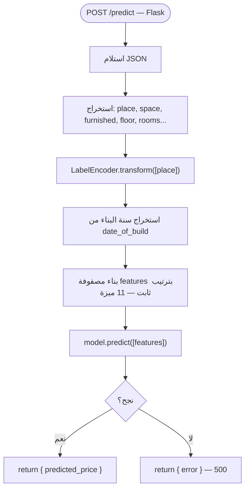
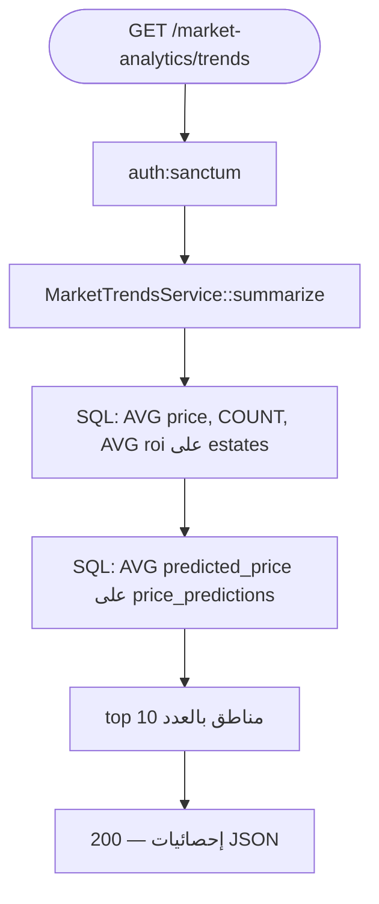

# مخطط النشاط — نموذج تسعير الذكاء الاصطناعي (ML)

> **النطاق:** تنبؤ السعر، خدمة Flask، تسجيل التنبؤات، تحليل الفرق السعري  
> **التقنية:** scikit-learn + Flask (ليس LLM/GPT)  
> **الملفات الرئيسية:** `EstatePricePredictionService`, `PricePredictionClient`, `ml/pricing/server.py`

---

## 1. مخطط النشاط الشامل

```mermaid
flowchart TD
    Start([طلب تنبؤ السعر]) --> Entry{أي نقطة دخول؟}

    %% ── تنبؤ لعقار موجود ──
    Entry -->|POST /estates/{id}/price-prediction| A1[auth:sanctum]
    A1 --> A2{مصادق؟}
    A2 -->|لا| A401[401]
    A2 -->|نعم| A3[PricePredictionController::forEstate]
    A3 --> A4{canViewEstate — active أو مالك؟}
    A4 -->|لا| A404[404]
    A4 -->|نعم| Svc[predictForEstate]

    %% ── تنبؤ ad-hoc ──
    Entry -->|POST /price-predictions/preview| B1[auth:sanctum]
    B1 --> B2{مصادق؟}
    B2 -->|لا| B401[401]
    B2 -->|نعم| B3[StorePricePredictionPreviewRequest]
    B3 --> B4{تحقق ناجح؟}
    B4 -->|لا| B422[422]
    B4 -->|نعم| B5[predictFromInput]
    B5 --> Svc

    %% ── الخدمة ──
    Svc --> Build[buildPayloadFromArray / buildPayloadFromEstate]
    Build --> Place[resolveLocationLabel — city أو place]
    Place --> Payload[JSON: place, space, furnished, rooms, date_of_build...]
    Payload --> Client[PricePredictionClient::predict]

    Client --> HTTP["HTTP POST → ML_PRICE_PREDICTION_URL/predict"]
    HTTP --> Reach{Flask متاح؟}

    Reach -->|لا — ConnectionException| E503a[503 — الخدمة غير متاحة]
    Reach -->|نعم| Status{HTTP ناجح؟}
    Status -->|لا| E503b[503 — خطأ Flask]
    Status -->|نعم| Parse{predicted_price رقم؟}
    Parse -->|لا| E503c[503 — استجابة غير صالحة]
    Parse -->|نعم| Format[formatResult]

    Format --> Diff["difference = predicted − listed"]
    Diff --> Insight{|differencePercent| < 5%؟}
    Insight -->|نعم| I1[aligned_with_model]
    Insight -->|لا — difference > 0| I2[listed_below_prediction]
    Insight -->|لا — difference < 0| I3[listed_above_prediction]

    I1 --> Log{ML_PRICE_PREDICTION_LOG = true؟}
    I2 --> Log
    I3 --> Log
    Log -->|نعم| Save[PricePrediction::create في DB]
    Log -->|لا| Skip[تخطي التسجيل]
    Save --> OK[200 — JSON enriched]
    Skip --> OK

    style A401 fill:#fee
    style A404 fill:#fee
    style B401 fill:#fee
    style B422 fill:#fee
    style E503a fill:#fee
    style E503b fill:#fee
    style E503c fill:#fee
```

---

## 2. مخطط نشاط — استنتاج Flask (server.py)



---

## 3. مخطط نشاط — اتجاهات السوق (SQL فقط — ليس ML)



> **ملاحظة:** `MarketTrendsService` في namespace `Ai` لكنه **لا يستدعي** Flask.

---

## 4. الملفات والمسارات

| العملية | API | المتحكم | الخدمة |
|---------|-----|---------|--------|
| تنبؤ عقار | `POST /estates/{estate}/price-prediction` | `PricePredictionController::forEstate` | `EstatePricePredictionService` |
| تنبؤ مسبق | `POST /price-predictions/preview` | `PricePredictionController::preview` | `predictFromInput` |
| HTTP → ML | — | — | `PricePredictionClient` |
| النموذج | — | — | `ml/pricing/server.py` |
| اتجاهات السوق | `GET /market-analytics/trends` | `MarketAnalyticsController` | `MarketTrendsService` |

---

## 5. متغيرات البيئة

| المتغير | الغرض |
|---------|-------|
| `ML_PRICE_PREDICTION_URL` | عنوان Flask (افتراضي `http://127.0.0.1:5000`) |
| `ML_PRICE_PREDICTION_TIMEOUT` | مهلة الاستجابة |
| `ML_PRICE_PREDICTION_LOG` | حفظ في `price_predictions` |
| `ML_PRICE_PREDICTION_LOCATION_FIELD` | `city` أو `place` |

---

## 6. الواجهة الأمامية

| المكوّن | الملف | السلوك |
|---------|-------|--------|
| زر التنبؤ | `EstatePricePrediction.vue` | يتطلب تسجيل دخول |
| API client | `src/api/pricePredictions.js` | `forEstate(id)` |
