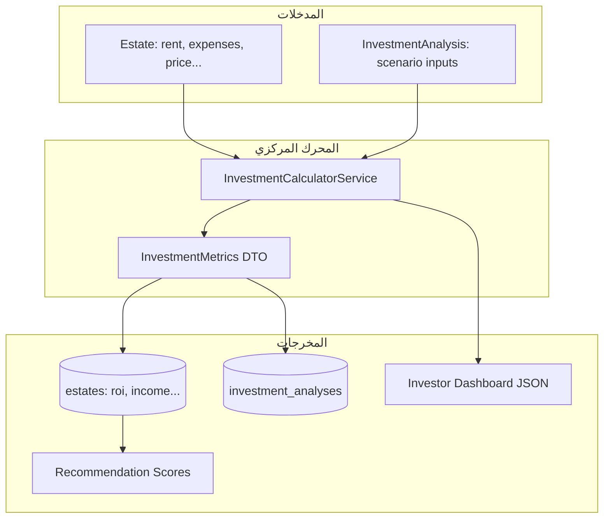
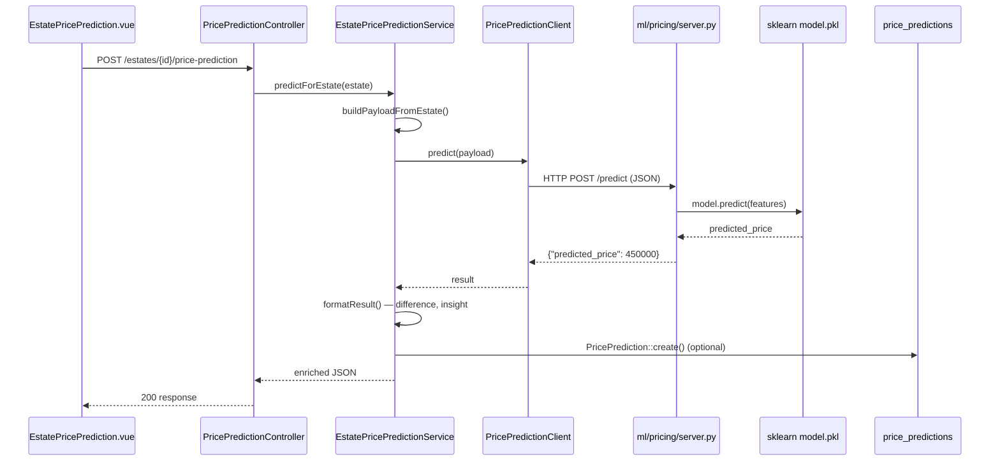
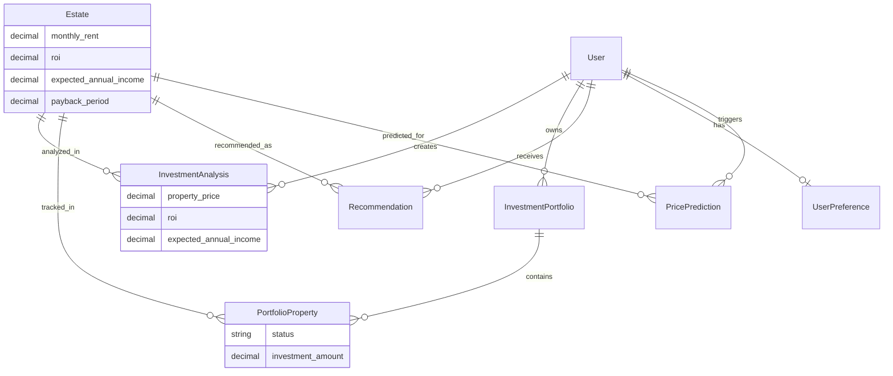

# دليل الاستثمار والخوارزميات والذكاء الاصطناعي

> **المشروع:** `project-RealEstate_database` (Laravel API) + `project-RealEstate` (Vue Frontend)  
> **الغرض:** توثيق شامل لكل ما يتعلق بالاستثمار العقاري، الحسابات المالية، الخوارزميات، وميزات الذكاء الاصطناعي في الكود.

---

## جدول المحتويات

1. [نظرة عامة على معمارية الاستثمار](#1-نظرة-عامة-على-معمارية-الاستثمار)
2. [خريطة الملفات والمواقع في الكود](#2-خريطة-الملفات-والمواقع-في-الكود)
3. [كيف يعمل نظام الاستثمار — تدفق البيانات](#3-كيف-يعمل-نظام-الاستثمار--تدفق-البيانات)
4. [حسابات الاستثمار — الصيغ والمعادلات](#4-حسابات-الاستثمار--الصيغ-والمعادلات)
5. [جميع الخوارزميات في المشروع](#5-جميع-الخوارزميات-في-المشروع)
6. [الذكاء الاصطناعي — ما هو موجود فعلاً](#6-الذكاء-الاصطناعي--ما-هو-موجود-فعلاً)
7. [واجهات API ذات الصلة](#7-واجهات-api-ذات-الصلة)
8. [مخططات قاعدة البيانات](#8-مخططات-قاعدة-البيانات)
9. [ملاحظات تقنية مهمة للمطورين](#9-ملاحظات-تقنية-مهمة-للمطورين)

---

## 1. نظرة عامة على معمارية الاستثمار

ينقسم منطق الاستثمار في المشروع إلى **أربعة مجالات** مستقلة لكنها مترابطة:

| المجال | الوظيفة | المصدر الرئيسي للحساب |
|--------|---------|----------------------|
| **مقاييس العقار (Estate Metrics)** | حساب تلقائي عند إنشاء/تحديث العقار | `InvestmentCalculatorService` |
| **تحليلات الاستثمار (Investment Analyses)** | سيناريوهات محفوظة لكل مستخدم + عقار | `InvestmentCalculatorService` |
| **محافظ المستثمر (Portfolios)** | تتبع العقارات: `tracking` → `invested` → `sold` | `PortfolioService` + `InvestorDashboardService` |
| **التوصيات (Recommendations)** | اقتراح عقارات بناءً على ROI والأهداف | `RecommendationScoringService` |

**المحرك المركزي للحسابات:**  
`app/Services/Investment/InvestmentCalculatorService.php`

هذا هو المصدر الموثوق للصيغ. باقي الملفات إما تستدعيه مباشرة أو تحتوي على نسخ مكررة (انظر القسم 9).



---

## 2. خريطة الملفات والمواقع في الكود

### 2.1 طبقة الحساب والخدمات (Services)

| الملف | المسار الكامل | الدور |
|-------|--------------|-------|
| `InvestmentCalculatorService.php` | `app/Services/Investment/` | **المحرك الرئيسي** — ROI، الدخل، التدفق النقدي |
| `InvestmentMetrics.php` | `app/Services/Investment/` | كائن DTO يحمل 6 مقاييس محسوبة |
| `InvestmentCalculator.php` | `app/Services/Investment/` | واجهة قديمة (Deprecated) تفوّض للخدمة أعلاه |
| `InvestorDashboardService.php` | `app/Services/Investment/` | تجميع إحصائيات المحافظ للوحة المستثمر |
| `PortfolioService.php` | `app/Services/Portfolio/` | قواعد المحافظ، انتقالات الحالة، الملخص |
| `RecommendationScoringService.php` | `app/Services/` | محرك التقييم المرجّح 0–100 للتوصيات |
| `RecommendationGeneratorService.php` | `app/Services/` | توليد وحفظ التوصيات في قاعدة البيانات |
| `RecommendationService.php` | `app/Services/` | تنسيق API التوصيات (pagination, refresh) |
| `PropertyInteractionService.php` | `app/Services/` | تسجيل واستنتاج سلوك المستخدم للتوصيات |

### 2.2 طبقة الذكاء الاصطناعي (Services/Ai)

| الملف | المسار | الدور |
|-------|--------|-------|
| `PricePredictionClient.php` | `app/Services/Ai/` | عميل HTTP يتصل بخادم Flask |
| `EstatePricePredictionService.php` | `app/Services/Ai/` | بناء payload، تنسيق النتيجة، التسجيل |
| `MarketTrendsService.php` | `app/Services/Ai/` | **تحليلات SQL فقط** — لا يستدعي ML |

### 2.3 النماذج (Models)

| النموذج | الجدول | العلاقة بالاستثمار |
|---------|--------|-------------------|
| `Estate.php` | `estates` | يخزّن المدخلات والمقاييس المحسوبة (`roi`, `expected_annual_income`...) |
| `InvestmentAnalysis.php` | `investment_analyses` | سيناريو استثماري محفوظ لكل مستخدم |
| `InvestmentPortfolio.php` | `investment_portfolios` | محفظة استثمارية |
| `PortfolioProperty.php` | `portfolio_properties` | عنصر داخل المحفظة (عقار + حالة + مبلغ) |
| `Portfolio.php` | — | Alias → `InvestmentPortfolio` |
| `PortfolioItem.php` | — | Alias → `PortfolioProperty` |
| `UserPreference.php` | `user_preferences` | `investment_goal`, `risk_level` |
| `Recommendation.php` | `recommendations` | توصيات محفوظة مع درجة التطابق |
| `PricePrediction.php` | `price_predictions` | سجل تنبؤات ML |

### 2.4 المتحكمات (Controllers)

| المتحكم | المسار | Endpoints |
|---------|--------|-----------|
| `InvestmentAnalysisController.php` | `app/Http/Controllers/Api/` | CRUD تحليلات الاستثمار |
| `InvestmentPortfolioController.php` | `app/Http/Controllers/Api/Investor/` | إدارة المحافظ |
| `MyPortfolioItemController.php` | `app/Http/Controllers/Api/Investor/` | CRUD عناصر المحفظة |
| `InvestorDashboardController.php` | `app/Http/Controllers/Api/Investor/` | ملخص لوحة المستثمر |
| `PricePredictionController.php` | `app/Http/Controllers/Api/` | تنبؤ السعر بالML |
| `MarketAnalyticsController.php` | `app/Http/Controllers/Api/` | اتجاهات السوق |
| `RecommendationController.php` | `app/Http/Controllers/Api/` | التوصيات الذكية |
| `UserPreferenceController.php` | `app/Http/Controllers/Api/` | تفضيلات المستخدم |
| `EstateController.php` | `app/Http/Controllers/Api/` | يطبّق مقاييس الاستثمار عند CRUD |
| `Admin/EstateController.php` | `app/Http/Controllers/Api/Admin/` | نفس المنطق للمدير |

### 2.5 Traits و Concerns

| الملف | الدور |
|-------|-------|
| `CalculatesEstateInvestmentMetrics.php` | `app/Traits/` — **نسخة مكررة غير مستخدمة** |
| `PersistsEstateFields.php` | `app/Http/Controllers/Concerns/` — `applyEstateInvestmentMetrics()` للمدير |
| `FormatsInvestmentAnalysisResponse.php` | `app/Traits/` — شكل JSON للتحليلات |
| `FormatsRecommendationResponse.php` | `app/Traits/` — يتضمن `roi`, `expected_annual_income` |

### 2.6 Enums

| Enum | الملف | القيم | الاستخدام |
|------|-------|-------|-----------|
| `InvestmentGoal` | `app/Enums/InvestmentGoal.php` | `primary_home`, `rental_income`, `capital_growth`, `flip`, `commercial_use` | **مستخدم** في التفضيلات والتوصيات |
| `InvestmentType` | `app/Enums/InvestmentType.php` | `residential`, `commercial`, `tourist` | **معرّف لكن غير مستخدم** في الكود |

### 2.7 Policies

| Policy | الملف | القاعدة |
|--------|-------|---------|
| `PortfolioPolicy` | `app/Policies/PortfolioPolicy.php` | المالك فقط يرى/يعدّل/يحذف محفظته |
| `PortfolioItemPolicy` | `app/Policies/PortfolioItemPolicy.php` | المالك فقط لعناصر محفظته |

> **ملاحظة:** لا يوجد `InvestmentAnalysisPolicy` — التحقق من الملكية يتم يدوياً في `InvestmentAnalysisController::ownsAnalysis()`.

### 2.8 Routes

| الملف | المسارات |
|-------|----------|
| `routes/api/v1/authenticated/investment-analyses.php` | `/investment-analyses`, `/my/investment-analyses` |
| `routes/api/v1/authenticated/investment-portfolios.php` | `/investment-portfolios`, `/my/portfolios` |
| `routes/api/v1/authenticated/investor-dashboard.php` | `/investor/dashboard`, `/my/investor-dashboard` |
| `routes/api/v1/authenticated/estates.php` | `POST /estates/{estate}/investment-analyses` |
| `routes/api/v1/authenticated/price-predictions.php` | `POST /price-predictions/preview` |
| `routes/api/v1/authenticated/market-analytics.php` | `GET /market-analytics/trends` |
| `routes/api/v1/authenticated/preferences.php` | `/recommendations/*`, `/my/preferences/*` |

### 2.9 Migrations

| Migration | الجداول |
|-----------|---------|
| `2026_05_10_152000_create_estates_table.php` | أعمدة الاستثمار في `estates` |
| `2026_05_12_180000_create_investment_analyses_table.php` | `investment_analyses` |
| `2026_05_24_100000_create_investment_portfolios_table.php` | `investment_portfolios`, `portfolio_properties` |
| `2026_05_21_140000_create_user_preferences_table.php` | `investment_goal`, `risk_level` |
| `2026_05_21_160000_create_recommendations_table.php` | `recommendations` |
| `2026_05_22_100000_create_price_predictions_table.php` | `price_predictions` |

### 2.10 Factories و Seeders و Tests

| الملف | الغرض |
|-------|-------|
| `database/factories/PortfolioFactory.php` | بيانات تجريبية للمحافظ |
| `database/factories/PortfolioItemFactory.php` | حالات `tracking()`, `invested()`, `sold()` |
| `database/seeders/PortfolioSeeder.php` | محفظة تجريبية + `InvestmentGoal::RentalIncome` |
| `tests/Unit/Services/Investment/InvestmentCalculatorServiceTest.php` | اختبار الصيغ |
| `tests/Unit/Services/Investment/InvestorDashboardServiceTest.php` | اختبار التجميع |
| `tests/Feature/Investment/*.php` | اختبارات API |

### 2.11 الواجهة الأمامية (Vue)

| الملف | المشروع | الوظيفة |
|-------|---------|---------|
| `EstatePricePrediction.vue` | `project-RealEstate/src/components/estates/` | زر "احسب السعر المتوقع" — ML |
| `EstateDetailPage.vue` | `project-RealEstate/src/views/estates/` | يعرض مكوّن التنبؤ |
| `RecommendationsPage.vue` | `project-RealEstate/src/views/recommendations/` | صفحة التوصيات |
| `RecommendationCard.vue` | `project-RealEstate/src/components/cards/` | بطاقة توصية مع نسبة التطابق |
| `pricePredictions.js` | `project-RealEstate/src/api/` | `forEstate()`, `preview()` |
| `recommendations.js` | `project-RealEstate/src/api/` | `list()`, `top()`, `refresh()` |

### 2.12 خدمة ML (Python)

| الملف | المسار | الدور |
|-------|--------|-------|
| `server.py` | `ml/pricing/` | خادم Flask — `POST /predict` |
| `requirements.txt` | `ml/pricing/` | flask, scikit-learn, joblib |
| `real_estate_model.pkl` | `ml/pricing/` | **غير موجود في المستودع** — يُحمَّل عند التشغيل |
| `label_encoder.pkl` | `ml/pricing/` | **غير موجود في المستودع** |

### 2.13 Config

| الملف | المفاتيح ذات الصلة |
|-------|-------------------|
| `config/ml.php` | `price_prediction.url`, `timeout_seconds`, `log_predictions`, `location_field` |
| `config/realestate.php` | `portfolio_item_statuses`, `recommendation_limit`, `recommendation_min_score`, `recommendation_stale_hours` |

---

## 3. كيف يعمل نظام الاستثمار — تدفق البيانات

### 3.1 المسار أ — إنشاء/تحديث عقار (Estate CRUD)

```
طلب HTTP (monthly_rent, occupancy_rate, expenses, tax, HOA, price)
    ↓
EstateController::store/update  أو  Admin\EstateController
    ↓
applyInvestmentMetrics() / applyEstateInvestmentMetrics()
    ↓
InvestmentCalculatorService::applyToEstatePayload()
    ↓
دمج: expected_annual_income, roi, payback_period في $data
    ↓
Estate::create/update → قاعدة البيانات
    ↓
formatEstate() → JSON للعميل
```

**الملفات المعنية:**
- `app/Http/Controllers/Api/EstateController.php` — دالة `applyInvestmentMetrics()` خاصة
- `app/Http/Controllers/Concerns/PersistsEstateFields.php` — `applyEstateInvestmentMetrics()`
- `app/Http/Controllers/Api/Admin/EstateController.php` — يستخدم الـ Concern

### 3.2 المسار ب — تحليل استثماري محفوظ (Investment Analysis)

```
POST /investment-analyses  أو  POST /estates/{estate}/investment-analyses
    ↓
StoreInvestmentAnalysisRequest (التحقق من المدخلات)
    ↓
InvestmentAnalysisController::createAnalysis()
    ↓
(storeByEstate) يملأ القيم الافتراضية من العقار:
  property_price ← estate.price
  monthly_rent ← estate.monthly_rent
  tax_cost ← estate.annual_property_tax
  occupancy_rate ← estate.occupancy_rate (افتراضي 100)
    ↓
InvestmentCalculatorService::calculateForAnalysisStorage()
    ↓
InvestmentAnalysis::create() — حفظ المدخلات + المقاييس المحسوبة
    ↓
formatInvestmentAnalysis() → JSON
```

**التحديث (PUT):**
```
mergeAnalysisInputs(البيانات الجديدة + القديمة)
    ↓
إعادة الحساب
    ↓
InvestmentAnalysis::update()
```

### 3.3 المسار ج — المحفظة ولوحة المستثمر

```
POST portfolio item (estate_id, investment_amount, status)
    ↓
PortfolioService::addEstateToPortfolio()
  — العقار يجب أن يكون active
  — لا تُحسب المقاييس هنا؛ تُقرأ من Estate المرتبط
    ↓
PortfolioProperty::create()

GET /investor/dashboard
    ↓
InvestorDashboardService::getSummary()
    ↓
تحميل كل PortfolioProperty + Estate للمستخدم
    ↓
لكل عنصر: InvestmentCalculatorService::calculateForEstate() — **إعادة حساب حية**
    ↓
تجميع: total_investments, expected_annual_income, average_roi (مرجّح)
    ↓
DashboardSummaryResource → JSON
```

**انتقالات حالة العنصر:**
```
tracking → invested → sold
(لا يمكن الرجوع للخلف — InvalidPortfolioStatusTransitionException)
```

### 3.4 المسار د — التوصيات (مرتبطة بالاستثمار)

```
Estate.roi (محسوب مسبقاً عند إنشاء العقار)
    ↓
RecommendationScoringService::scoreRoi() + scoreInvestmentGoal()
    ↓
RecommendationGeneratorService::generateForUser()
    ↓
Recommendation::updateOrCreate() — حفظ أعلى N توصية
    ↓
FormatsRecommendationResponse — يتضمن roi, expected_annual_income
```

**محفّزات إعادة التوليد:**
- `?refresh=1` في طلب GET
- مرور `recommendation_stale_hours` (افتراضي 24 ساعة)
- إضافة/حذف/تحديث مفضلة عبر `FavoriteEstateController`

---

## 4. حسابات الاستثمار — الصيغ والمعادلات

> **المصدر:** `InvestmentCalculatorService::calculateCore()`  
> **ملف:** `app/Services/Investment/InvestmentCalculatorService.php`

### 4.1 المدخلات

#### للعقار (Estate)

| الحقل | العمود في DB | الوصف |
|-------|-------------|-------|
| `price` | `estates.price` | سعر الشراء |
| `monthly_rent` | `estates.monthly_rent` | الإيجار الشهري |
| `occupancy_rate` | `estates.occupancy_rate` | نسبة الإشغال (افتراضي 100%) |
| `annual_expenses` | `estates.annual_expenses` | مصاريف سنوية عامة |
| `maintenance_cost` | `estates.maintenance_cost` | صيانة سنوية |
| `annual_property_tax` | `estates.annual_property_tax` | ضريبة عقارية سنوية |
| `annual_hoa_or_service` | `estates.annual_hoa_or_service` | رسوم HOA/خدمات |

#### لتحليل الاستثمار (Analysis)

| الحقل | العمود في DB | ملاحظة |
|-------|-------------|--------|
| `property_price` | `investment_analyses.property_price` | سعر السيناريو |
| `monthly_rent` | `investment_analyses.monthly_rent` | |
| `occupancy_rate` | `investment_analyses.occupancy_rate` | |
| `annual_expenses` | `investment_analyses.annual_expenses` | |
| `maintenance_cost` | `investment_analyses.maintenance_cost` | |
| `tax_cost` | `investment_analyses.tax_cost` | |
| — | **لا يوجد HOA** | `annualHoaOrService = 0` دائماً في التحليل |

> **فرق مهم:** تحليل الاستثمار **لا يشمل** رسوم HOA، بينما العقار يشملها. نفس العقار قد يعطي أرقاماً مختلفة بين المسارين.

### 4.2 المعادلات الأساسية

#### الخطوة 1 — الإيراد السنوي الإجمالي (Gross Annual Income)

```
grossAnnual = monthlyRent × 12 × (occupancyRate / 100)
```

**لماذا:** الإيجار الشهري × 12 شهر، مضروباً في نسبة الإشغال (مثلاً 90% = 0.9).

#### الخطوة 2 — إجمالي التكاليف السنوية

```
totalAnnualCosts = annualExpenses + annualMaintenance + annualPropertyTax + annualHoaOrService
```

#### الخطوة 3 — صافي الربح

```
netProfit = grossAnnual − totalAnnualCosts
```

#### الخطوة 4 — الدخل السنوي المتوقع

```
expectedAnnualIncome = netProfit > 0 ? round(netProfit, 2) : 0
```

**لماذا الصفر:** إذا كانت التكاليف أكبر من الإيراد، لا يُعرض دخل سالب — يُعاد 0.

#### الخطوة 5 — الدخل الشهري والتدفق النقدي

```
monthlyIncome = round(expectedAnnualIncome / 12, 2)
cashFlow = monthlyIncome
```

> **ملاحظة:** `cashFlow` = `monthlyIncome` بالضبط. **لا يُحسب** قرض/رهن/ديون — التدفق النقدي هنا = صافي الدخل الشهري من الإيجار فقط.

#### الخطوة 6 — ROI (العائد على الاستثمار)

```
إذا purchasePrice > 0 AND expectedAnnualIncome > 0:
    roi = round((expectedAnnualIncome / purchasePrice) × 100, 4)   ← نسبة مئوية
    paybackPeriod = round(purchasePrice / expectedAnnualIncome, 2)   ← بالسنوات
وإلا:
    roi = null
    paybackPeriod = null
```

**نوع ROI:** هذا **عائد إيجاري بسيط** (Rental Yield / Cash-on-Cash style)، **وليس** IRR (معدل العائد الداخلي).

### 4.3 مثال عددي موثّق (من Unit Test)

**المدخلات:**
- `monthlyRent` = 2000
- `occupancyRate` = 100%
- `annualExpenses` = 2000
- `annualMaintenance` = 1000
- `annualPropertyTax` = 1000
- `annualHoaOrService` = 500
- `purchasePrice` = 300,000

**الحساب:**
```
grossAnnual = 2000 × 12 × 1.0 = 24,000
totalAnnualCosts = 2000 + 1000 + 1000 + 500 = 4,500
netProfit = 24,000 − 4,500 = 19,500
expectedAnnualIncome = 19,500
monthlyIncome = 19,500 / 12 = 1,625
roi = (19,500 / 300,000) × 100 = 6.5%
paybackPeriod = 300,000 / 19,500 = 15.38 سنة
```

### 4.4 مثال تحليل الاستثمار (Feature Test)

**بدون HOA:**
```
grossAnnual = 2000 × 12 = 24,000
totalAnnualCosts = 1000 + 500 + 500 = 2,000
expectedAnnualIncome = 22,000
```

### 4.5 تجميعات لوحة المستثمر (`InvestorDashboardService`)

| المقياس | الصيغة | الشرط |
|---------|--------|-------|
| `total_investments` | مجموع `investment_amount` (أو `estate.price`) | `status = invested` فقط |
| `expected_annual_income` | مجموع `metrics.expectedAnnualIncome` | `status = invested` |
| `average_roi` | `Σ(roi × investedAmount) / Σ(investedAmount)` | مرجّح بمبلغ الاستثمار |
| `total_portfolio_value` | مجموع `estate.price` | كل العناصر **ما عدا** `sold` |
| `best/worst_performing_property` | أعلى/أدنى `roi` | من إعادة الحساب الحية |

### 4.6 مقاييس **غير** مطبّقة في الكود

| المقياس | الحالة |
|---------|--------|
| Cap Rate | ❌ غير موجود |
| IRR / NPV | ❌ غير موجود |
| Cash Flow بعد الرهن | ❌ غير موجود |
| Capital Appreciation | ❌ فقط heuristic في `scoreInvestmentGoal` للتوصيات |

---

## 5. جميع الخوارزميات في المشروع

### 5.1 خوارزمية حساب ROI والدخل (`InvestmentCalculatorService`)

**النوع:** حساب مالي تحdeterministic  
**الملف:** `app/Services/Investment/InvestmentCalculatorService.php`  
**الدوال:** `calculateCore()`, `normalizeEstateArray()`, `normalizeAnalysisArray()`

**لماذا نستخدمها:**  
مصدر واحد للحقيقة (Single Source of Truth) لجميع مقاييس الاستثمار. أي تغيير في الصيغة يجب أن يحدث هنا فقط.

**التعقيد:** O(1) — عمليات حسابية بسيطة.

---

### 5.2 خوارزمية تجميع لوحة المستثمر (`InvestorDashboardService`)

**النوع:** Aggregation + Weighted Average  
**الملف:** `app/Services/Investment/InvestorDashboardService.php`

**الخطوات:**
1. جلب كل `PortfolioProperty` للمستخدم مع `Estate`
2. لكل عنصر: إعادة حساب المقاييس عبر `calculateForEstate()` (لا يعتمد على القيم المخزنة)
3. تجميع حسب `status`
4. ROI المرجّح: `weightedRoiNumerator / weightedRoiDenominator`
5. `pickExtremeProperty()` — sortByDesc/ sortBy على `roi`

**لماذا إعادة الحساب:** لضمان أن لوحة المستثمر تعكس أحدث بيانات العقار وليس snapshot قديم.

---

### 5.3 خوارزمية التقييم المرجّح للتوصيات (`RecommendationScoringService`)

**النوع:** Weighted Scoring Engine (0–100)  
**الملف:** `app/Services/RecommendationScoringService.php`

#### الأوزان

| العامل | الوزن | الدالة |
|--------|-------|--------|
| `budget_match` | 25% | `scoreBudget()` |
| `location_match` | 25% | `scoreLocation()` |
| `property_type_match` | 20% | `scorePropertyType()` |
| `roi_potential` | 15% | `scoreRoi()` |
| `investment_goal_match` | 15% | `scoreInvestmentGoal()` |

**الدرجة النهائية:**
```
matchingPercentage = Σ(factor × weight)
score = min(100, matchingPercentage + behaviorBonus)
```

#### 5.3.1 `scoreBudget()` — مطابقة الميزانية

```
إذا min و max محددان:
  السعر ضمن [min, max]           → 100
  السعر ضمن [min×0.9, max×1.1]   → 70
  غير ذلك                         → 20

إذا max فقط:
  السعر ≤ max                      → 85
  السعر > max                      → max(0, 100 − ((price−max)/max × 100))

بدون تفضيلات                       → 50
```

**لماذا:** مرونة ±10% حول الميزانية تعكس واقع البحث العقاري.

#### 5.3.2 `scoreLocation()` — مطابقة الموقع

```
نفس المنطقة (places_id)     → 100
نفس المدينة (cities_id)     → 80
تفضيل موجود لكن لا تطابق    → 0
بدون تفضيل                   → 50
```

#### 5.3.3 `scorePropertyType()` — نوع العقار

```
تطابق type_text أو kind_text (contains) → 100
عدم تطابق                              → 15
بدون تفضيل                             → 50
```

#### 5.3.4 `scoreRoi()` — إمكانية ROI (مرتبط بالاستثمار)

```
إذا roi ≤ 0:
  يوجد monthly_rent → 40
  لا يوجد           → 20

normalized = min(100, roi × 8)

حسب risk_level:
  low      → min(normalized, 60)      ← يحدّ ROI للمخاطر المنخفضة
  high     → min(100, normalized × 1.2) ← يعزّز ROI للمخاطر العالية
  moderate → normalized
```

**لماذا × 8:** ROI 12.5% يعطي 100 نقطة — معيار تطبيع بسيط.

#### 5.3.5 `scoreInvestmentGoal()` — مطابقة هدف الاستثمار

| الهدف (`InvestmentGoal`) | الصيغة |
|--------------------------|--------|
| `RentalIncome` | `min(100, max(20, roi×10 + (monthly_rent ? 20 : 0)))` |
| `CapitalGrowth` | `(price > 0 && place) ? 80 : 40` |
| `PrimaryHome` | `num_of_bedrooms ≥ 2 ? 90 : 55` |
| `Flip` | `scoreFlipPotential()` — انظر أدناه |
| `CommercialUse` | `matchesPropertyType('commercial') ? 95 : 25` |

#### 5.3.6 `scoreFlipPotential()` — إمكانية الت flipping

```
pricePerMeter = estate.price_of_meter
space = estate.space_of_estate

إذا pricePerMeter ≤ 0 أو space ≤ 0 → 45
وإلا → min(100, max(30, 100 − (pricePerMeter / 100)))
```

**لماذا:** كلما انخفض سعر المتر، زادت فرصة الـ flip (شراء رخيص → بيع بربح).

#### 5.3.7 `behaviorBonus()` — مكافأة السلوك

```
+5 إذا dominant_property_type يطابق العقار
+3 إذا places_id يطابق العقار
```

#### 5.3.8 `scoreSimilarity()` — تشابه عقارين

```
factors = [
  priceRatio × 100,           // min/max ratio
  locationScore,              // 100 same place, 70 same city, 0 else
  typeMatch ? 100 : 0,
  kindMatch ? 80 : 0,
  max(0, 100 − bedDiff×25)    // فرق الغرف
]
similarity = average(factors)
```

**لماذا:** متوسط العوامل يعطي درجة تشابه متوازنة لـ "عقارات مشابهة".

#### 5.3.9 `scoreAgainstFavorites()` — مقارنة بالمفضلة

```
لكل مفضلة: similarity = scoreSimilarity(favorite, candidate)
bestScore = أعلى similarity
avgScore = متوسط similarities
score = (bestScore × 0.7) + (avgScore × 0.3)
```

**لماذا 70/30:** أفضل تطابق يهم أكثر، لكن المتوسط يمنع outlier واحد من السيطرة.

---

### 5.4 خوارزمية توليد التوصيات (`RecommendationGeneratorService`)

**الملف:** `app/Services/RecommendationGeneratorService.php`

**الخطوات:**
1. تحميل المفضلات + التفضيلات + الملف السلوكي
2. إذا لا بيانات → إلغاء تفعيل كل التوصيات
3. **إذا توجد مفضلات:** `scoreCandidatesAgainstFavorites()` — pool 150 عقار
4. **وإلا:** `fetchCandidates()` — فلترة بالمدينة/المنطقة ثم `scoreCandidates()`
5. دمج مع التفضيلات: `(favoriteScore × 0.75) + (preferenceScore × 0.25)`
6. sortByDesc → take(limit) → filter(minScore) → `updateOrCreate`

**لماذا pool 150:** توازن بين الأداء وجودة النتائج.

---

### 5.5 خوارزمية استنتاج السلوك (`PropertyInteractionService`)

**الملف:** `app/Services/PropertyInteractionService.php`  
**الدالة:** `inferBehavioralProfile()`

**الخطوات:**
1. جلب آخر 200 تفاعل للمستخدم
2. لكل تفاعل: وزن = `interaction_score` (حسب نوع التفاعل)
3. تجميع مرجّح لـ: المدينة، المنطقة، نوع العقار، الأسعار، الغرف
4. `weightedAverage()` للسعر والغرف
5. `min_price = avgPrice × 0.85`, `max_price = avgPrice × 1.15`
6. `top_estate_ids` = أعلى 10 عقارات بالوزن

**لماذا:** يملأ فجوة التفضيلات الصريحة بسلوك ضمني (مثل Amazon "customers also viewed").

---

### 5.6 خوارزمية تنبؤ السعر — ML Regression (`server.py`)

**النوع:** Machine Learning — scikit-learn Regression  
**الملف:** `ml/pricing/server.py`

**الميزات (11 feature):**
1. `place_encoded` — LabelEncoder على اسم المكان
2. `space_of_estate` — المساحة
3. `is_furnished` — 0 أو 1
4. `floor` — الطابق
5. `num_of_bedrooms`
6. `num_of_livingrooms`
7. `num_of_receptions` (مفتاح API: `num_of_receptioins` — typo متعمد)
8. `num_of_bathrooms`
9. `num_of_kitchens`
10. `num_of_balconies`
11. `date_of_build` — **سنة البناء فقط** (يُستخرج من التاريخ)

**الخطوات:**
```python
place_encoded = label_encoder.transform([place])[0]
date_of_build = datetime.strptime(date, "%Y-%m-%d").year
features = [place_encoded, space, furnished, floor, beds, living, receptions, baths, kitchens, balconies, year]
prediction = model.predict([features])
return {"predicted_price": prediction[0]}
```

**لماذا LabelEncoder للمكان:** النموذج يحتاج أرقاماً؛ أسماء المدن/المناطق تُحوَّل لرموز رقمية.

**لماذا typo `num_of_receptioins`:** النموذج دُرّب على API قديم بهذا الخطأ — تغييره يكسر التوافق.

---

### 5.7 خوارزمية تحليل الفرق السعري (`EstatePricePredictionService::formatResult`)

```
difference = predictedPrice − listedPrice
differencePercent = (difference / listedPrice) × 100

إذا |differencePercent| < 5%  → insight = aligned_with_model
إذا difference > 0            → insight = listed_below_prediction
إذا difference < 0            → insight = listed_above_prediction
```

**لماذا 5%:** هامش تسامح — السعر "متوافق" إذا الفرق أقل من 5%.

---

### 5.8 خوارزمية اتجاهات السوق (`MarketTrendsService`)

**النوع:** SQL Aggregates — **ليست ML**  
**الملف:** `app/Services/Ai/MarketTrendsService.php`

```
AVG(price), MIN, MAX, COUNT, AVG(roi), AVG(space)  ← من estates
AVG(predicted_price), AVG(price_difference_percent) ← من price_predictions
GROUP BY place — top 10 مناطق بالعدد
```

**لماذا في namespace Ai:** تجميع إحصائيات مرتبطة بتنبؤات ML السابقة، لكن الطلب نفسه لا يستدعي النموذج.

---

## 6. الذكاء الاصطناعي — ما هو موجود فعلاً

### 6.1 تصنيف صريح

| الميزة | ذكاء اصطناعي حقيقي؟ | التقنية |
|--------|---------------------|---------|
| **تنبؤ السعر** | ✅ نعم | scikit-learn Regression + Flask |
| **التوصيات الذكية** | ❌ لا (قواعد/heuristics) | PHP weighted scoring |
| **عقارات مشابهة** | ❌ لا | Similarity scoring |
| **اتجاهات السوق** | ❌ لا | SQL aggregates |
| **تحليل ROI** | ❌ لا | معادلات مالية |
| **LLM / ChatGPT / GPT** | ❌ **غير موجود** | — |
| **Embeddings / NLP** | ❌ **غير موجود** | — |

> الواجهة الأمامية تستخدم عبارة "ذكاء اصطناعي" للتوصيات وتنبؤ السعر، لكن **فقط تنبؤ السعر** يستدعي نموذج ML فعلي.

### 6.2 بنية تنبؤ السعر



### 6.3 Payload المرسل لـ Flask

```json
{
  "place": "اسم المدينة أو المنطقة",
  "space_of_estate": 120.0,
  "is_furnished": 1,
  "floor": 3.0,
  "num_of_bedrooms": 3.0,
  "num_of_livingrooms": 1.0,
  "num_of_receptioins": 1.0,
  "num_of_bathrooms": 2.0,
  "num_of_kitchens": 1.0,
  "num_of_balconies": 1.0,
  "date_of_build": "2010-05-15"
}
```

**بناء الـ payload:** `EstatePricePredictionService::buildPayloadFromArray()`  
**حقل المكان:** يُحدد عبر `ML_PRICE_PREDICTION_LOCATION_FIELD` — `city` (افتراضي) أو `place`.

### 6.4 الاستجابة المثراة من Laravel

```json
{
  "predicted_price": 450000.0,
  "listed_price": 420000.0,
  "price_difference": 30000.0,
  "price_difference_percent": 7.14,
  "valuation_insight": "listed_below_prediction",
  "input_features": { "...": "..." },
  "prediction_id": 42
}
```

**قيم `valuation_insight`:**
| القيمة | المعنى |
|--------|--------|
| `aligned_with_model` | السعر المعلن قريب من التنبؤ (±5%) |
| `listed_below_prediction` | السعر المعلن **أقل** من التنبؤ — قد يكون صفقة |
| `listed_above_prediction` | السعر المعلن **أعلى** من التنبؤ — مبالغ فيه |

### 6.5 متغيرات البيئة (Environment)

| المتغير | الافتراضي | الوظيفة |
|---------|-----------|---------|
| `ML_PRICE_PREDICTION_URL` | `http://127.0.0.1:5000` | عنوان خادم Flask |
| `ML_PRICE_PREDICTION_TIMEOUT` | `10` | مهلة الاستجابة (ثوان) |
| `ML_PRICE_PREDICTION_CONNECT_TIMEOUT` | `3` | مهلة الاتصال |
| `ML_PRICE_PREDICTION_LOCATION_FIELD` | `city` | `city` أو `place` |
| `ML_PRICE_PREDICTION_LOG` | `true` | حفظ التنبؤات في DB |

**Config:** `config/ml.php`

### 6.6 تشغيل خدمة ML

```bash
cd ml/pricing
pip install -r requirements.txt
# ضع real_estate_model.pkl و label_encoder.pkl في نفس المجلد
python server.py
# يعمل على http://127.0.0.1:5000
```

**معالجة الأخطاء:** إذا Flask غير متاح → `503` مع رسالة "Price prediction service is unavailable".

### 6.7 التوصيات — "ذكاء" قائم على القواعد

**لا يوجد نموذج ML.** التدفق:

```
UserPreference + Favorites + BehavioralProfile
    ↓
RecommendationGeneratorService
    ↓
RecommendationScoringService (weighted heuristics)
    ↓
Recommendation table (cached scores)
    ↓
RecommendationsPage.vue
```

**إعدادات:** `config/realestate.php`
- `RECOMMENDATION_LIMIT` = 30
- `RECOMMENDATION_MIN_SCORE` = 40
- `RECOMMENDATION_CANDIDATE_POOL` = 150
- `RECOMMENDATION_STALE_HOURS` = 24

### 6.8 الواجهة الأمامية — ميزات AI

| المكوّن | الملف | ما يفعله |
|---------|-------|----------|
| `EstatePricePrediction.vue` | `src/components/estates/` | زر "احسب السعر المتوقع" — **ML فعلي** |
| `RecommendationsPage.vue` | `src/views/recommendations/` | قائمة توصيات — **heuristics** |
| `RecommendationCard.vue` | `src/components/cards/` | عرض نسبة التطابق وأسباب التوصية |

**API غير موصولة بالواجهة:**
- `POST /price-predictions/preview` — تنبؤ قبل حفظ العقار
- `GET /market-analytics/trends` — اتجاهات السوق
- Property Interactions API — تتبع سلوكي

### 6.9 Jobs / Queues

**لا توجد** مهام خلفية (Jobs) للذكاء الاصطناعي. كل استدعاء ML **متزامن (synchronous)** عبر HTTP.

---

## 7. واجهات API ذات الصلة

> جميع المسارات تحت `/api/v1` وتتطلب `auth:sanctum` ما لم يُذكر غير ذلك.

### 7.1 الاستثمار

| Method | Endpoint | الوظيفة |
|--------|----------|---------|
| GET | `/investment-analyses` | قائمة التحليلات |
| POST | `/investment-analyses` | إنشاء تحليل |
| GET | `/investment-analyses/{id}` | عرض تحليل |
| PUT | `/investment-analyses/{id}` | تحديث + إعادة حساب |
| DELETE | `/investment-analyses/{id}` | حذف |
| POST | `/estates/{estate}/investment-analyses` | تحليل لعقار محدد |
| GET | `/investment-portfolios` | قائمة المحافظ |
| POST | `/investment-portfolios` | إنشاء محفظة |
| GET | `/investor/dashboard` | ملخص المستثمر |

### 7.2 الذكاء الاصطناعي

| Method | Endpoint | الوظيفة | ML؟ |
|--------|----------|---------|-----|
| POST | `/estates/{estate}/price-prediction` | تنبؤ سعر عقار | ✅ |
| POST | `/price-predictions/preview` | تنبؤ ad-hoc | ✅ |
| GET | `/market-analytics/trends` | اتجاهات السوق | ❌ SQL |
| GET | `/recommendations` | توصيات المستخدم | ❌ Heuristics |
| GET | `/recommendations/top` | أعلى توصيات | ❌ |
| POST | `/recommendations/refresh` | إعادة توليد | ❌ |
| GET | `/recommendations/similar-estates/{estate}` | عقارات مشابهة | ❌ |

---

## 8. مخططات قاعدة البيانات

### 8.1 `estates` — أعمدة الاستثمار

| العمود | النوع | دور |
|--------|------|-----|
| `monthly_rent` | decimal(12,2) | مدخل |
| `annual_expenses` | decimal | مدخل |
| `maintenance_cost` | decimal | مدخل |
| `annual_property_tax` | decimal | مدخل |
| `annual_hoa_or_service` | decimal | مدخل |
| `occupancy_rate` | decimal(5,2) default 100 | مدخل |
| `expected_annual_income` | decimal(15,2) | **محسوب** |
| `roi` | decimal(10,4) | **محسوب (%)** |
| `payback_period` | decimal(10,2) | **محسوب (سنوات)** |

### 8.2 `investment_analyses`

| العمود | دور |
|--------|-----|
| `user_id`, `estate_id` | FK |
| `property_price`, `monthly_rent`, `annual_expenses`, `maintenance_cost`, `tax_cost`, `occupancy_rate` | مدخلات السيناريو |
| `expected_annual_income`, `roi`, `payback_period` | محسوب عند الحفظ/التحديث |

### 8.3 `portfolio_properties`

| العمود | دور |
|--------|-----|
| `portfolio_id`, `estate_id` | FK — unique pair |
| `status` | `tracking` / `invested` / `sold` |
| `investment_amount`, `notes`, `invested_at`, `sold_at` | بيانات التتبع |

### 8.4 `price_predictions`

| العمود | دور |
|--------|-----|
| `user_id`, `estate_id` | من طلب التنبؤ |
| `place_label`, `input_features` | JSON |
| `predicted_price`, `listed_price` | |
| `price_difference`, `price_difference_percent` | |
| `valuation_insight` | `aligned_with_model` / `listed_below_prediction` / `listed_above_prediction` |

---

## 9. ملاحظات تقنية مهمة للمطورين

### 9.1 تكرار منطق ROI (Technical Debt)

يوجد **أربعة مسارات** تحسب ROI:

1. ✅ `InvestmentCalculatorService` — **المصدر الصحيح**
2. ⚠️ `PersistsEstateFields::applyEstateInvestmentMetrics()` — مكرر
3. ⚠️ `EstateController::applyInvestmentMetrics()` — مكرر
4. ❌ `CalculatesEstateInvestmentMetrics` trait — **غير مستخدم** ويستخدم `estimated_monthly_rent` بدل `monthly_rent`

**التوصية:** توحيد كل المسارات على `InvestmentCalculatorService::applyToEstatePayload()`.

### 9.2 فرق Estate vs Analysis

| | Estate | Analysis |
|---|--------|----------|
| HOA | ✅ `annual_hoa_or_service` | ❌ دائماً 0 |
| سعر الشراء | `price` | `property_price` |
| الضريبة | `annual_property_tax` | `tax_cost` |

### 9.3 Dashboard vs Portfolio Summary

| | `InvestorDashboardService` | `PortfolioService::getPortfolioSummary()` |
|---|---------------------------|-------------------------------------------|
| مصدر ROI | **إعادة حساب حية** | **قيم مخزنة** في `estates` |
| قد تختلف النتائج | ✅ نعم | إذا تغيّرت بيانات العقار |

### 9.4 ROI ليس IRR

التعليقات العربية في بعض الملفات تشير إلى "IRR"، لكن الصيغة الفعلية:

```
ROI = (expectedAnnualIncome / purchasePrice) × 100
```

هذا **عائد إيجاري سنوي بسيط**، وليس معدل العائد الداخلي.

### 9.5 `EstateFactory` — خطأ محتمل

المصنع يحسب `roi = annualIncome / price` (نسبة 0.06) بينما الإنتاج يخزن **نسبة مئوية** (6.0).

### 9.6 ملفات النموذج ML

- `real_estate_model.pkl` و `label_encoder.pkl` **غير موجودين** في Git
- README يذكر `Abd_real_estate_model.pkl` بينما `server.py` يحمّل `real_estate_model.pkl`
- **لا توجد اختبارات** لمسار تنبؤ السعر

### 9.7 لا LLM في المشروع

بحث شامل عن OpenAI, GPT, Anthropic, Gemini, embeddings, chatbot — **صفر نتائج**.

---

## ملحق — مخطط العلاقات بين الكيانات



---

*آخر تحديث: يونيو 2026 — مبني على تحليل الكود في `project-RealEstate_database` و `project-RealEstate`.*
