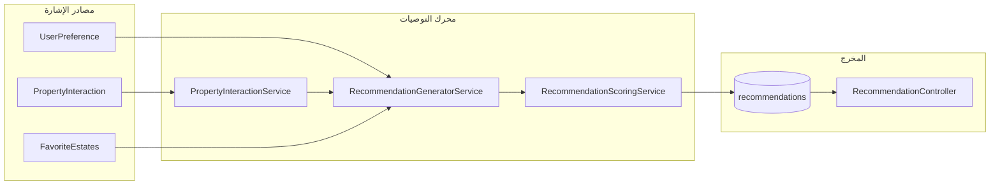
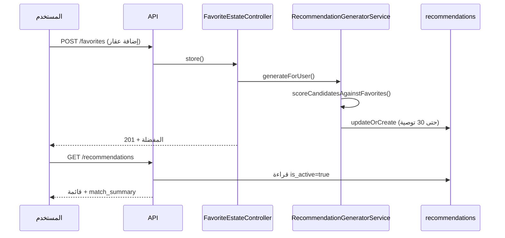
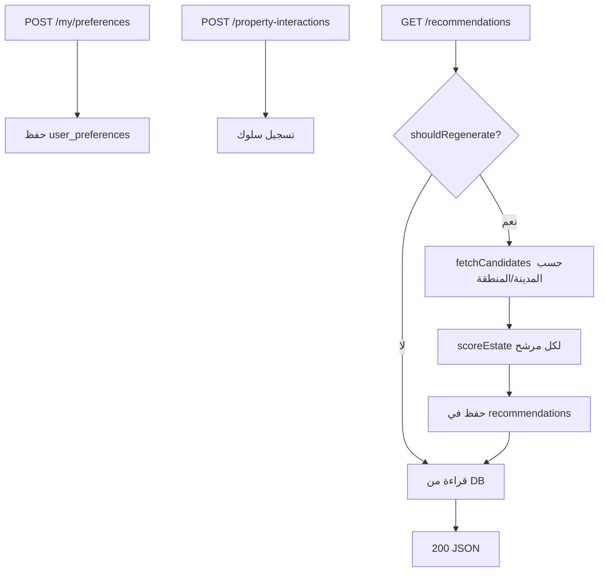

# دليل الاقتراحات الذكية (Smart Suggestions / Recommendations)

> **المشروع:** `project-RealEstate_database` (Laravel 12 API)  
> **الغرض:** توثيق تقني كامل لنظام اقتراح العقارات — الملفات المرتبطة، آلية العمل في الكود، سير العمل، ومعادلات الحساب.  
> **مهم:** النظام **ليس** نموذج تعلم آلي (ML) ولا LLM. هو **محرك تقييم مرجّح (Heuristic Scoring Engine)** يجمع بين: تفضيلات المستخدم الصريحة، سلوكه على المنصة، وعقاراته المفضلة.

---

## جدول المحتويات

1. [نظرة عامة](#1-نظرة-عامة)
2. [الملفات المرتبطة بالكامل](#2-الملفات-المرتبطة-بالكامل)
3. [معمارية النظام](#3-معمارية-النظام)
4. [كيف يعمل في الكود — طبقة بطبقة](#4-كيف-يعمل-في-الكود--طبقة-طبقة)
5. [سير العمل الكامل (Workflow)](#5-سير-العمل-الكامل-workflow)
6. [كيف يتم الحساب؟ — محرك التقييم بالتفصيل](#6-كيف-يتم-الحساب--محرك-التقييم-بالتفصيل)
7. [واجهات API](#7-واجهات-api)
8. [قاعدة البيانات](#8-قاعدة-البيانات)
9. [الإعدادات (Configuration)](#9-الإعدادات-configuration)
10. [ملاحظات مهمة للمطورين](#10-ملاحظات-مهمة-للمطورين)

---

## 1. نظرة عامة

نظام **الاقتراحات الذكية** يقترح على المستخدم (المشتري/المستثمر) عقارات مناسبة بناءً على **ثلاثة مصادر إشارة (Signals)**:

| المصدر | الجدول / الكيان | الدور |
|--------|-----------------|-------|
| **التفضيلات الصريحة** | `user_preferences` | ما يحدده المستخدم: المدينة، المنطقة، الميزانية، نوع العقار، هدف الاستثمار، مستوى المخاطرة |
| **السلوك الضمني** | `property_interactions` | ما يفعله المستخدم: مشاهدة، إضافة للمفضلة، مشاركة، التواصل مع الوكيل |
| **المفضلات** | `favorite_estates` | العقارات التي أضافها المستخدم — أقوى إشارة للتشابه |

**المخرج:** سجلات في جدول `recommendations` تحتوي على:
- درجة التوصية (`recommendation_score`) من 0 إلى 100
- نسبة التطابق (`matching_percentage`)
- عوامل التقييم (`score_factors`) — JSON
- أسباب الاقتراح (`recommendation_reason`) — JSON (نصوص تظهر للمستخدم)



---

## 2. الملفات المرتبطة بالكامل

### 2.1 طبقة الخدمات (Services) — قلب المنطق

| الملف | المسار | المسؤولية |
|-------|--------|-----------|
| `RecommendationService.php` | `app/Services/` | **الواجهة الرئيسية:** جلب التوصيات، التحقق من الحاجة لإعادة التوليد، العقارات المشابهة، أعلى N توصيات |
| `RecommendationGeneratorService.php` | `app/Services/` | **المولّد:** يجلب المرشحين (candidates)، يقيّمهم، يحفظ النتائج في `recommendations` |
| `RecommendationScoringService.php` | `app/Services/` | **محرك التقييم:** كل معادلات الدرجات (0–100) — الميزانية، الموقع، النوع، ROI، الهدف الاستثماري، التشابه |
| `PropertyInteractionService.php` | `app/Services/` | **تتبع السلوك:** تسجيل التفاعلات + استنتاج الملف السلوكي `inferBehavioralProfile()` |

**تبعيات الحقن (Dependency Injection):**

```
RecommendationService
  ├── PropertyInteractionService
  ├── RecommendationGeneratorService
  │     ├── PropertyInteractionService
  │     └── RecommendationScoringService
  └── RecommendationScoringService

FavoriteEstateController
  └── RecommendationGeneratorService
```

---

### 2.2 طبقة HTTP (Controllers & Requests)

| الملف | المسار | المسؤولية |
|-------|--------|-----------|
| `RecommendationController.php` | `app/Http/Controllers/Api/` | نقاط نهاية: قائمة التوصيات، top، similar، show، refresh |
| `UserPreferenceController.php` | `app/Http/Controllers/Api/` | CRUD لتفضيلات المستخدم (`my/preferences`) |
| `PropertyInteractionController.php` | `app/Http/Controllers/Api/` | تسجيل واستعراض التفاعلات + `insights` للملف السلوكي |
| `FavoriteEstateController.php` | `app/Http/Controllers/Api/` | إدارة المفضلة — **يعيد توليد التوصيات** عند الإضافة/الحذف |
| `StoreUserPreferenceRequest.php` | `app/Http/Requests/` | التحقق من صحة بيانات التفضيلات |
| `StorePropertyInteractionRequest.php` | `app/Http/Requests/` | التحقق من نوع التفاعل والعقار |

---

### 2.3 النماذج (Models)

| الملف | الجدول | العلاقات ذات الصلة |
|-------|--------|-------------------|
| `Recommendation.php` | `recommendations` | `belongsTo(User)`, `belongsTo(Estate)` |
| `UserPreference.php` | `user_preferences` | `belongsTo(User)` — 1:1، `belongsTo(Cities)`, `belongsTo(Places)` |
| `PropertyInteraction.php` | `property_interactions` | `belongsTo(User)`, `belongsTo(Estate)` |
| `User.php` | `users` | `hasOne(preference)`, `hasMany(recommendations)`, `hasMany(propertyInteractions)`, `hasMany(favoriteEstates)` |
| `Estate.php` | `estates` | مصدر بيانات العقار: السعر، ROI، الموقع، النوع، الغرف... |
| `Favorit_estate.php` | `favorite_estates` | ربط المستخدم بالعقارات المفضلة |

---

### 2.4 التعدادات (Enums)

| الملف | القيم | الاستخدام |
|-------|-------|-----------|
| `InteractionType.php` | `view`, `favorite`, `share`, `contact_agent` | نوع التفاعل + `defaultScore()` لوزن السلوك |
| `InvestmentGoal.php` | `primary_home`, `rental_income`, `capital_growth`, `flip`, `commercial_use` | تقييم `scoreInvestmentGoal()` |
| `PropertyFunction.php` | `buy`, `rent`, `invest` | يُخزَّن في التفضيلات (لا يدخل مباشرة في أوزان التقييم الحالية) |

**أوزان التفاعل الافتراضية** (من `InteractionType::defaultScore()`):

| النوع | الوزن الافتراضي |
|-------|-----------------|
| `view` | 1 |
| `favorite` | 5 |
| `share` | 3 |
| `contact_agent` | 10 |

---

### 2.5 Traits — تنسيق الاستجابة JSON

| الملف | المسار | الوظيفة |
|-------|--------|---------|
| `FormatsRecommendationResponse.php` | `app/Traits/` | تحويل `Recommendation` + `Estate` إلى JSON للواجهة |
| `FormatsUserPreferenceResponse.php` | `app/Traits/` | تنسيق التفضيلات في استجابة التوصيات |
| `FormatsPropertyInteractionResponse.php` | `app/Traits/` | تنسيق سجل التفاعل |

---

### 2.6 المسارات (Routes)

**الملف:** `routes/api/v1/authenticated/preferences.php`

| Method | المسار | الدالة | الوصف |
|--------|--------|--------|-------|
| GET | `/my/preferences` | `UserPreferenceController@show` | عرض التفضيلات |
| POST/PUT | `/my/preferences` | `UserPreferenceController@store` | إنشاء/تحديث |
| DELETE | `/my/preferences` | `UserPreferenceController@destroy` | حذف |
| GET | `/recommendations` | `RecommendationController@index` | قائمة التوصيات (paginated) |
| GET | `/recommendations/top` | `RecommendationController@top` | أعلى N توصيات |
| GET | `/recommendations/similar-estates/{estate}` | `RecommendationController@similarEstates` | عقارات مشابهة |
| POST | `/recommendations/refresh` | `RecommendationController@refresh` | إعادة توليد إجبارية |
| GET | `/recommendations/{recommendation}` | `RecommendationController@show` | توصية واحدة |

**الملف:** `routes/api/v1/authenticated/property-interactions.php`

| Method | المسار | الوصف |
|--------|--------|-------|
| GET | `/property-interactions` | سجل التفاعلات |
| POST | `/property-interactions` | تسجيل تفاعل |
| GET | `/property-interactions/insights` | الملف السلوكي المستنتج |

**الملف:** `routes/api/v1/authenticated/estates.php`

| Method | المسار | الوصف |
|--------|--------|-------|
| POST | `/estates/{estate}/interactions` | تسجيل تفاعل لعقار محدد |
| POST | `/estates/{estate}/contact-agent` | تسجيل `contact_agent` |

---

### 2.7 الإعدادات والهجرة والاختبارات

| الملف | المسار | الدور |
|-------|--------|-------|
| `realestate.php` | `config/` | حدود التوصيات، pool المرشحين، stale hours |
| `2026_05_21_160000_create_recommendations_table.php` | `database/migrations/` | جدول التوصيات |
| `2026_05_21_140000_create_user_preferences_table.php` | `database/migrations/` | جدول التفضيلات |
| `2026_05_21_150000_create_property_interactions_table.php` | `database/migrations/` | جدول التفاعلات |
| `RecommendationTest.php` | `tests/Feature/Recommendations/` | اختبارات API |
| `RecommendationScoringServiceTest.php` | `tests/Unit/Services/` | اختبارات وحدة التقييم |
| `InteractsWithRecommendationApi.php` | `tests/Concerns/` | مساعدات الاختبار |

---

### 2.8 مخططات توثيقية موجودة (مرجع إضافي)

| الملف | المحتوى |
|-------|---------|
| `docs/ar/diagrams/activity-recommendations.md` | مخطط نشاط Mermaid |
| `docs/ar/diagrams/sequence-recommendations.md` | مخطط تسلسل Mermaid |

---

## 3. معمارية النظام

النظام يتبع **نمط طبقات واضح**:

```
HTTP Request
    ↓
Controller (RecommendationController)
    ↓
RecommendationService (قراءة + قرار إعادة التوليد)
    ↓
RecommendationGeneratorService (توليد + حفظ)
    ↓
RecommendationScoringService (حساب الدرجات)
    ↑
PropertyInteractionService (ملف سلوكي)
UserPreference + FavoriteEstates (إشارات المستخدم)
    ↓
Model Recommendation → JSON Response (FormatsRecommendationResponse)
```

**مبدأ التصميم:**
- **القراءة lazy:** التوصيات تُقرأ من DB إلا إذا كانت قديمة أو لا توجد
- **التوليد eager عند المفضلة:** إضافة/حذف مفضلة يُعيد التوليد فوراً
- **Soft invalidation:** التوصيات القديمة تُعلَّم `is_active = false` بدلاً من الحذف الفيزيائي

---

## 4. كيف يعمل في الكود — طبقة بطبقة

### 4.1 `RecommendationController::index`

```php
$result = $this->recommendations->getRecommendationsForUser(
    $request->user(),
    $request->integer('per_page', 15),
    $request->boolean('refresh')  // ?refresh=1 لإجبار إعادة التوليد
);
```

يستدعي `RecommendationService::getRecommendationsForUser()` ثم يُنسّق الاستجابة عبر `formatListResponse()`.

---

### 4.2 `RecommendationService::getRecommendationsForUser`

**الخطوات:**

1. تحميل `$preference`، `$behavior`، `$favoriteEstates`
2. **إذا لم يوجد أي إشارة** (لا تفضيلات + لا سلوك + لا مفضلات):
   - إرجاع paginator فارغ + رسالة: *"Add properties to your favorites..."*
3. **إذا** `forceRefresh` **أو** `shouldRegenerate()`:
   - استدعاء `RecommendationGeneratorService::generateForUser()`
4. قراءة التوصيات النشطة من DB عبر `baseQuery()` مع pagination
5. بناء `match_summary` (ملخص المصادر والفلاتر)

**`shouldRegenerate()` — متى يُعاد التوليد؟**

| الشرط | النتيجة |
|-------|---------|
| لا توجد توصيات `is_active = true` | إعادة توليد |
| تاريخ تحديث المفضلة > تاريخ آخر توصية | إعادة توليد |
| مرّ أكثر من `recommendation_stale_hours` (افتراضي 24 ساعة) على آخر تحديث | إعادة توليد |

---

### 4.3 `RecommendationGeneratorService::generateForUser`

**الخطوات:**

1. تحميل المفضلات النشطة (`status = active`)
2. استنتاج الملف السلوكي
3. **إذا لا إشارات:** إلغاء تفعيل كل التوصيات → return
4. **مسار A — يوجد مفضلات:**
   - `scoreCandidatesAgainstFavorites()` — pool من 150 عقار نشط (غير المفضلة)
5. **مسار B — لا مفضلات:**
   - `fetchCandidates()` — فلترة حسب المدينة/المنطقة من التفضيلات أو السلوك
   - `scoreCandidates()` — تقييم كل مرشح
6. ترتيب تنازلي حسب `score`
7. إلغاء تفعيل التوصيات القديمة (`is_active = false`)
8. حفظ أفضل النتائج (حتى `recommendation_limit` = 30) بشرط `score >= recommendation_min_score` (40)
9. `Recommendation::updateOrCreate()` لكل عقار مقبول

---

### 4.4 `PropertyInteractionService::inferBehavioralProfile`

يقرأ **آخر 200 تفاعل** للمستخدم (عقارات نشطة فقط) ويُنتج:

```php
[
    'has_data' => true,
    'total_interactions' => int,
    'total_weight' => int,
    'cities_id' => ?int,           // المدينة الأكثر وزناً
    'places_id' => ?int,           // المنطقة الأكثر وزناً
    'avg_price' => ?float,          // متوسط السعر المرجّح
    'min_price' => ?float,          // avg × 0.85
    'max_price' => ?float,          // avg × 1.15
    'dominant_property_type' => ?string,
    'avg_bedrooms' => ?int,
    'top_estate_ids' => list<int>, // أعلى 10 عقارات تفاعلاً
    'interaction_breakdown' => array,
]
```

**الوزن:** كل تفاعل يُضاف `interaction_score` (من النوع أو مخصص). المدينة/المنطقة/النوع يُختار الأعلى تراكم وزن.

---

### 4.5 `FavoriteEstateController` — محفّز فوري

عند **إضافة** أو **حذف** مفضلة:

```php
$this->recommendations->generateForUser($request->user());
```

هذا يجعل المفضلات **أقوى محفّز** لإعادة حساب التوصيات فوراً (بدون انتظار stale hours).

---

### 4.6 `getSimilarEstates` — عقارات مشابهة (مسار منفصل)

لا يحفظ في `recommendations`. يُحسب live:

1. جلب حتى 50 عقار نشط في **نفس المدينة** (pool)
2. `scoreSimilarity(source, candidate)` لكل مرشح
3. إن وُجدت مفضلات: `scoreAgainstFavorites()` كتخصيص
4. وإلا إن وُجدت تفضيلات: `scoreEstate()`
5. **الدمج:** `(similarity × 0.6) + (personalized × 0.4)` إن وُجد تخصيص
6. ترتيب + أخذ أفضل `limit` (افتراضي 10)

---

## 5. سير العمل الكامل (Workflow)

### 5.1 سير عمل المستخدم الجديد



---

### 5.2 سير عمل المستخدم بتفضيلات فقط (بدون مفضلات)



---

### 5.3 دورة حياة سجل التوصية

```
1. generateForUser()
2. كل التوصيات القديمة → is_active = false
3. المرشحون الجدد → updateOrCreate (is_active = true)
4. unique(user_id, estate_id) — عقار واحد = سجل واحد لكل مستخدم
5. عند انتهاء stale_hours أو تغيير المفضلة → إعادة الدورة
```

---

### 5.4 مصادر الإشارة وأولويتها في التوليد

| الأولوية | الشرط | خوارزمية التقييم |
|-----------|-------|------------------|
| **1 (الأعلى)** | `favorite_estates` غير فارغة | 75% تشابه مع المفضلة + 25% تفضيلات (إن وُجدت) |
| **2** | لا مفضلات + تفضيلات و/أو سلوك | `scoreEstate()` كاملة |
| **3** | لا شيء | قائمة فارغة + رسالة توجيهية |

---

## 6. كيف يتم الحساب؟ — محرك التقييم بالتفصيل

> **الملف المركزي:** `app/Services/RecommendationScoringService.php`  
> **النطاق:** جميع الدرجات بين **0 و 100**

---

### 6.1 التقييم الشخصي `scoreEstate()`

#### الأوزان الثابتة (WEIGHTS)

| العامل | الوزن | الوصف |
|--------|-------|-------|
| `budget_match` | **25%** | مطابقة السعر مع الميزانية |
| `location_match` | **25%** | مطابقة المدينة/المنطقة |
| `property_type_match` | **20%** | مطابقة نوع العقار |
| `roi_potential` | **15%** | إمكانية العائد |
| `investment_goal_match` | **15%** | مطابقة هدف الاستثمار |

**معادلة نسبة التطابق:**

```
matching_percentage = Σ (factor_i × weight_i)
```

**الدرجة النهائية:**

```
score = min(100, matching_percentage + behaviorBonus)
```

**`behaviorBonus` (حتى +8):**
- +5 إذا نوع العقار = `dominant_property_type` من السلوك
- +3 إذا `places_id` = المنطقة المفضلة من السلوك

---

#### 6.1.1 `scoreBudget` — مطابقة الميزانية

| الحالة | الدرجة |
|--------|--------|
| السعر بين `min_budget` و `max_budget` | **100** |
| السعر ضمن ±10% من النطاق | **70** |
| خارج النطاق بشكل واضح | **20** |
| `max_budget` فقط والسعر ≤ max | **85** |
| `max_budget` فقط والسعر > max | تنازلي: `max(0, 100 - ((price-max)/max × 100))` |
| لا ميزانية محددة | **50** (محايد) |

**مصدر الميزانية:** `UserPreference` أولاً، ثم `behavior['min_price']` / `behavior['max_price']` كبديل.

---

#### 6.1.2 `scoreLocation` — مطابقة الموقع

| الحالة | الدرجة |
|--------|--------|
| `places_id` متطابق | **100** |
| `cities_id` متطابق (نفس المدينة) | **80** |
| تفضيل محدد لكن لا تطابق | **0** |
| لا تفضيل موقع | **50** |

---

#### 6.1.3 `scorePropertyType` — نوع العقار

- يبحث في `type_text` و `kind_text` (contains case-insensitive)
- تطابق: **100** | عدم تطابق: **15** | لا تفضيل: **50**

---

#### 6.1.4 `scoreRoi` — إمكانية العائد

```
normalized = min(100, roi × 8)
```

| مستوى المخاطرة | المعالجة |
|----------------|----------|
| `low` | `min(normalized, 60)` — يُقيَّد العائد العالي |
| `high` | `min(100, normalized × 1.2)` — يُكافأ العائد |
| `moderate` | `normalized` |
| ROI = 0 + يوجد `monthly_rent` | **40** |
| ROI = 0 بدون إيجار | **20** |

> **ملاحظة:** `roi` على العقار يُحسب مسبقاً عبر `InvestmentCalculatorService` عند حفظ العقار.

---

#### 6.1.5 `scoreInvestmentGoal` — هدف الاستثمار

| الهدف (`InvestmentGoal`) | المنطق |
|--------------------------|--------|
| `rental_income` | `min(100, max(20, roi×10 + (monthly_rent ? 20 : 0)))` |
| `capital_growth` | **80** إذا price > 0 و place موجود، وإلا **40** |
| `primary_home` | **90** إذا ≥ 2 غرف، وإلا **55** |
| `flip` | `min(100, max(30, 100 - price_of_meter/100))` |
| `commercial_use` | **95** إذا النوع commercial، وإلا **25** |
| لا هدف | **50** |

---

#### 6.1.6 `buildReasons` — أسباب الاقتراح (بالإنجليزية في الكود)

| الشرط | النص |
|-------|------|
| `budget_match >= 70` | Within your budget range |
| `location_match >= 80` | Located in your preferred area/city |
| `property_type_match >= 80` | Matches your preferred property type |
| `roi_potential >= 60` | Strong ROI potential for your risk profile |
| `investment_goal_match >= 70` | Aligns with your investment goal: ... |
| يوجد سلوك | Similar to properties you have interacted with |

---

### 6.2 التقييم مقابل المفضلة `scoreAgainstFavorites()`

لكل عقار مرشح:

1. حساب `scoreSimilarity(favorite, candidate)` **لكل** مفضلة
2. **أفضل تشابه** (`bestScore`) = أعلى درجة
3. **متوسط التشابه** (`avgScore`) = متوسط كل المفضلات
4. **الدرجة النهائية:**

```
score = (bestScore × 0.7) + (avgScore × 0.3)
```

**عند وجود تفضيلات أيضاً** (في `RecommendationGeneratorService`):

```
score = (favoriteScore × 0.75) + (preferenceScore × 0.25)
```

**أسباب عربية** (`buildFavoriteReasons`):
- نفس المنطقة / نفس المدينة مع مفضلة
- نوع عقار مشابه
- قريب من نطاق الأسعار (ratio ≥ 0.85)
- عدد غرف قريب (فرق ≤ 1)
- شبيه جداً بـ «اسم المفضلة»

---

### 6.3 التشابه بين عقارين `scoreSimilarity()`

يُستخدم في: **المفضلات** + **API العقارات المشابهة**

**العوامل (يُحسب متوسطها):**

| العامل | المنطق | الدرجة |
|--------|--------|--------|
| **السعر** | `min(priceA, priceB) / max(priceA, priceB) × 100` | 0–100 |
| **الموقع** | نفس `places_id` | **100** |
| | نفس `cities_id` | **70** |
| | مختلف | **0** |
| **type_text** | تطابق | **100** أو **0** |
| **kind_text** | تطابق | **80** أو **0** |
| **الغرف** | `max(0, 100 - bedDiff × 25)` | 0–100 |

```
similarity = average(جميع العوامل المتاحة)
```

**مثال رقمي:**

| العامل | القيمة |
|--------|--------|
| السعر (ratio 0.9) | 90 |
| نفس المدينة | 70 |
| type متطابق | 100 |
| kind غير متطابق | 0 |
| غرف (فرق 1) | 75 |
| **المتوسط** | **(90+70+100+0+75)/5 = 67** |

---

### 6.4 فلترة المرشحين `fetchCandidates()`

- فقط `estates.status = active`
- استبعاد `top_estate_ids` (أعلى 10 تفاعلاً — لتجنب التكرار)
- فلترة `places_id` إن وُجد، وإلا `cities_id`
- `latest('id')->limit(150)` — أحدث 150 عقار

---

### 6.5 عتبات القبول النهائية

| الإعداد | الافتراضي | المعنى |
|---------|-----------|--------|
| `recommendation_candidate_pool` | 150 | عدد المرشحين المُقيَّمين |
| `recommendation_limit` | 30 | أقصى توصيات تُحفظ |
| `recommendation_min_score` | 40 | أقل درجة للقبول |
| `recommendation_stale_hours` | 24 | مدة صلاحية قبل إعادة التوليد |
| `similar_estates_pool` | 50 | pool العقارات المشابهة |

---

## 7. واجهات API

### 7.1 GET `/recommendations`

**Query params:** `per_page` (15), `refresh` (boolean)

**استجابة نموذجية:**

```json
{
  "preferences": { "cities_id": 1, "max_budget": "500000.00", ... },
  "behavioral_profile": { "cities_id": 1, "dominant_property_type": "apartment", ... },
  "match_summary": {
    "has_preferences": true,
    "has_favorite_estates": true,
    "favorite_estates_count": 3,
    "sources": ["favorite_estates", "user_preferences"],
    "total_active": 12
  },
  "recommendations": [
    {
      "id": 1,
      "recommendation_score": "78.50",
      "matching_percentage": "75.00",
      "score_factors": { "favorite_similarity": 78.5, "preference_match": 72.0 },
      "why_recommended": ["نفس المنطقة مع أحد عقاراتك المفضلة", "Within your budget range"],
      "estate": { "id": 42, "name": "...", "price": "450000.00", "roi": "6.2500" }
    }
  ]
}
```

---

### 7.2 POST `/recommendations/refresh`

إعادة توليد إجبارية + إرجاع القائمة المحدّثة مع `last_generation: { generated, deactivated }`.

---

### 7.3 GET `/recommendations/similar-estates/{estate}`

**Query:** `limit` (10)

يرجع `similarity_score` + `recommendation_score` (إن وُجد تخصيص) + `why_recommended`.

---

## 8. قاعدة البيانات

### جدول `recommendations`

| العمود | النوع | الوصف |
|--------|-------|-------|
| `user_id` | FK → users | المستخدم |
| `estate_id` | FK → estates | العقار المقترح |
| `recommendation_score` | decimal(5,2) | الدرجة النهائية 0–100 |
| `matching_percentage` | decimal(5,2) | نسبة التطابق المرجّحة |
| `score_factors` | json | تفصيل العوامل |
| `recommendation_reason` | json | أسباب الاقتراح (مصفوفة نصوص) |
| `is_active` | boolean | نشط / قديم |

**فهرس فريد:** `(user_id, estate_id)`  
**فهرس:** `(user_id, is_active, recommendation_score)`

---

## 9. الإعدادات (Configuration)

**الملف:** `config/realestate.php`

```php
'recommendation_limit' => env('RECOMMENDATION_LIMIT', 30),
'recommendation_min_score' => env('RECOMMENDATION_MIN_SCORE', 40),
'recommendation_candidate_pool' => env('RECOMMENDATION_CANDIDATE_POOL', 150),
'recommendation_stale_hours' => env('RECOMMENDATION_STALE_HOURS', 24),
'similar_estates_pool' => env('SIMILAR_ESTATES_POOL', 50),
```

---

## 10. ملاحظات مهمة للمطورين

### 10.1 ما الذي **ليس** ذكاء اصطناعي؟

- لا يوجد استدعاء OpenAI / LLM
- لا يوجد تدريب sklearn لنموذج توصيات
- التنبؤ بالسعر (Flask/sklearn) **منفصل تماماً** في `EstatePricePredictionService`

### 10.2 ما الذي يُحسّن جودة التوصيات؟

1. **إضافة عقارات للمفضلة** — أقوى إشارة
2. **ملء التفضيلات** (`my/preferences`)
3. **تسجيل التفاعلات** (`view`, `contact_agent`, ...)
4. **ROI دقيق على العقارات** — يعتمد على `InvestmentCalculatorService`

### 10.3 `property_function` و `interests`

- `property_function` و `interests` يُخزَّنان في `user_preferences` لكن **لا يدخلان حالياً** في أوزان `RecommendationScoringService`
- يمكن توسيع المحرك لاحقاً بإضافة عوامل جديدة

### 10.4 حفظ التفضيلات لا يُعيد التوليد تلقائياً

- `UserPreferenceController::store()` **لا** يستدعي `generateForUser()`
- التوليد يحدث عند: `GET /recommendations` (إذا stale)، `refresh`، أو تغيير المفضلة
- **اقتراح تحسين مستقبلي:** استدعاء `generateForUser()` بعد حفظ التفضيلات

### 10.5 العقارات المقترحة فقط `status = active`

- المرشحون والمفضلات تُفلتر على `active`
- العقارات `pending` أو `rejected` لا تدخل في أي حساب

### 10.6 العلاقة مع ROI

- عامل `roi_potential` يقرأ `estates.roi` المحسوب مسبقاً
- لضمان دقة التوصيات: تأكد من صحة حقول الإيجار والمصاريف عند إنشاء العقار

---

## ملخص سريع

| السؤال | الجواب |
|--------|--------|
| **أين المنطق؟** | `RecommendationScoringService` + `RecommendationGeneratorService` |
| **متى تُولَّد؟** | stale / لا توصيات / تغيير مفضلة / `refresh` |
| **ما المصدر الأقوى؟** | المفضلات (75%) |
| **كيف تُحسب الدرجة؟** | متوسط مرجّح 5 عوامل + bonus سلوكي |
| **أين تُخزَّن؟** | `recommendations` مع `is_active` |
| **هل ML؟** | لا — heuristics مرجّحة |

---

*آخر مراجعة: بناءً على الكود في `project-RealEstate_database` — 29 migration، Laravel 12.*
