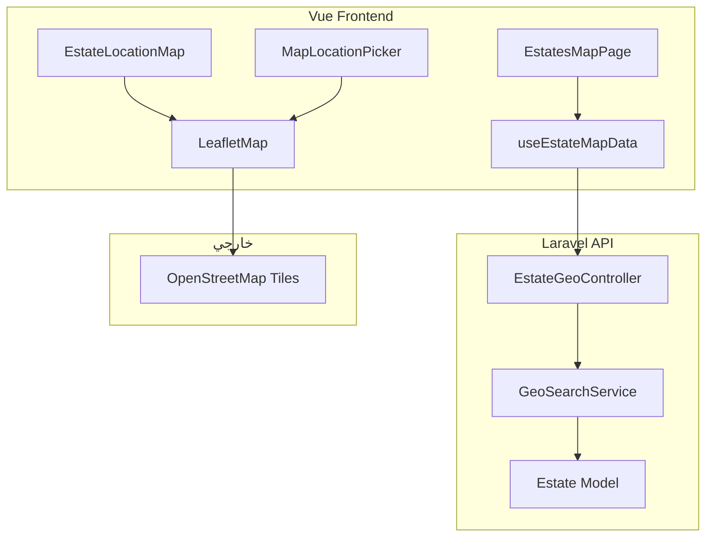
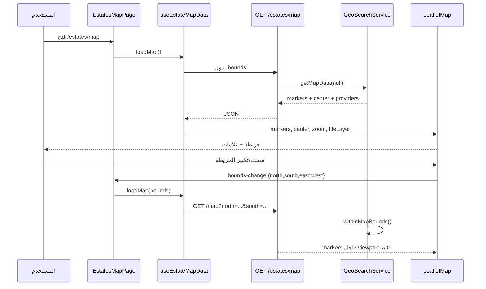
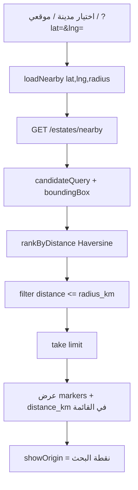
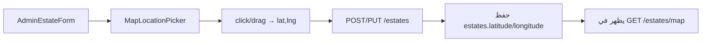

# دليل الخرائط والموقع الجغرافي (Maps & Geolocation)

> **المشروع:** `project-RealEstate_database` (Laravel API) + `project-RealEstate` (Vue + Leaflet)  
> **الغرض:** توثيق تقني كامل لنظام الخرائط — الملفات المرتبطة، آلية العمل في الكود، سير العمل، ومعادلات حساب المسافة.  
> **مهم:** الخرائط تعتمد على **Leaflet + OpenStreetMap** في الواجهة، و**Haversine** في الخادم لحساب المسافات. Google Maps مدعوم كـ metadata فقط (يتطلب مفتاح API من `.env`).

---

## جدول المحتويات

1. [نظرة عامة](#1-نظرة-عامة)
2. [الملفات المرتبطة بالكامل](#2-الملفات-المرتبطة-بالكامل)
3. [معمارية النظام](#3-معمارية-النظام)
4. [كيف يعمل في الكود — طبقة بطبقة](#4-كيف-يعمل-في-الكود--طبقة-طبقة)
5. [سير العمل الكامل (Workflow)](#5-سير-العمل-الكامل-workflow)
6. [كيف يتم الحساب؟ — Haversine و Bounding Box](#6-كيف-يتم-الحساب--haversine-و-bounding-box)
7. [واجهات API](#7-واجهات-api)
8. [قاعدة البيانات](#8-قاعدة-البيانات)
9. [الإعدادات (Configuration)](#9-الإعدادات-configuration)
10. [ملاحظات مهمة للمطورين](#10-ملاحظات-مهمة-للمطورين)

---

## 1. نظرة عامة

نظام الخرائط في المنصة يحقق **ثلاث وظائف رئيسية**:

| الوظيفة | الوصف | Endpoint |
|---------|-------|----------|
| **عرض العلامات (Markers)** | جلب عقارات نشطة بإحداثيات لرسمها على Leaflet | `GET /estates/map` |
| **البحث القريب (Nearby)** | أقرب N عقار لنقطة معينة | `GET /estates/nearby` |
| **البحث ضمن نصف قطر (Radius)** | عقارات داخل دائرة km مع pagination وفلاتر | `GET /estates/in-radius` |

**مصادر الإحداثيات في DB:**

| الجدول | الأعمدة | الاستخدام |
|--------|---------|-----------|
| `cities` | `latitude`, `longitude` | مركز المدينة على الخريطة + فلترة بحسب المدينة |
| `places` | `latitude`, `longitude` | مركز المنطقة + تركيز الخريطة في النماذج |
| `estates` | `latitude`, `longitude` | موقع العقار الفعلي — **أساس كل استعلام جغرافي** |

**نظام الإحداثيات:** WGS-84 (EPSG:4326) — `latitude` بين -90 و 90، `longitude` بين -180 و 180.



---

## 2. الملفات المرتبطة بالكامل

### 2.1 Backend — Laravel API

#### الخدمة المركزية

| الملف | المسار | المسؤولية |
|-------|--------|-----------|
| **`GeoSearchService.php`** | `app/Services/` | **قلب المنطق الجغرافي:** Haversine، bounding box، nearby، in-radius، map data |

#### Controllers

| الملف | المسار | المسؤولية |
|-------|--------|-----------|
| **`EstateGeoController.php`** | `app/Http/Controllers/Api/` | **الـ API الفعلي:** `nearby()`, `inRadius()`, `map()` |
| `EstateController.php` | `app/Http/Controllers/Api/` | يحتوي `mapConfig()` و `mapMarkers()` — **legacy** (غير مربوطة بـ routes حالياً) |

#### Form Requests (التحقق)

| الملف | المسار | يُستخدم في |
|-------|--------|-----------|
| `EstateNearbyRequest.php` | `app/Http/Requests/Geo/` | `GET /estates/nearby` |
| `EstateInRadiusRequest.php` | `app/Http/Requests/Geo/` | `GET /estates/in-radius` |
| `EstateMapRequest.php` | `app/Http/Requests/Geo/` | `GET /estates/map` (bounding box اختياري) |
| `EstateValidationRules.php` | `app/Http/Requests/Concerns/` | `latitude`/`longitude` مطلوبان عند إنشاء/تحديث العقار |

#### Models & Scopes

| الملف | Scopes / حقول |
|-------|---------------|
| `Estate.php` | `scopeWithCoordinates()`, `scopeWithinMapBounds()` |
| `Cities.php` | `scopeWithCoordinates()` |
| `Places.php` | `scopeWithCoordinates()` |

#### Traits

| الملف | الدور |
|-------|------|
| `FormatsEstateResponse.php` | يُرجع `latitude` و `longitude` في JSON العقار |

#### Routes

| الملف | المسارات |
|-------|----------|
| `routes/api/v1/public.php` | `estates/nearby`, `estates/in-radius`, `estates/map` |

#### Config

| الملف | المفاتيح |
|-------|----------|
| `config/realestate.php` | `map.*` (center, zoom, tiles) + `geo.*` (radius, Google key) |

#### Tests

| الملف | ما يختبره |
|-------|-----------|
| `GeoSearchServiceTest.php` | Haversine + `mapProviders()` |
| `AdminLocationManagementTest.php` | إدارة مدن/مناطق بإحداثيات |

#### توثيق إنجليزي (مرجع)

| الملف | المحتوى |
|-------|---------|
| `docs/api/geolocation-maps.md` | مرجع API بالإنجليزية |

---

### 2.2 Frontend — Vue + Leaflet

| الملف | المسار | المسؤولية |
|-------|--------|-----------|
| **`EstatesMapPage.vue`** | `src/views/estates/` | **صفحة الخريطة الرئيسية** — بحث، مدينة، نصف قطر، موقعي |
| **`LeafletMap.vue`** | `src/components/map/` | مكوّن Leaflet قابل لإعادة الاستخدام — markers، popups، bounds |
| **`MapLocationPicker.vue`** | `src/components/map/` | اختيار موقع بالنقر/السحب (نماذج Admin) |
| **`EstateLocationMap.vue`** | `src/components/estates/` | خريطة موقع عقار واحد في صفحة التفاصيل |
| **`useEstateMapData.js`** | `src/composables/` | composable: `loadMap()`, `loadNearby()` |
| **`map.js`** | `src/utils/` | `hasMapCoordinates`, `toLeafletLatLng`, defaults |
| **`location.js`** | `src/utils/` | تنسيق إحداثيات المدن/المناطق |
| **`estates.js`** | `src/api/` | `map()`, `nearby()` → API calls |

#### نماذج Admin تستخدم MapLocationPicker

| الملف | الغرض |
|-------|-------|
| `AdminEstateForm.vue` | تحديد موقع العقار |
| `AdminCityForm.vue` | تحديد مركز المدينة |
| `AdminPlaceForm.vue` | تحديد مركز المنطقة |

#### Router

| الملف | المسار |
|-------|--------|
| `router/index.js` | `/estates/map` → `EstatesMapPage` |

---

## 3. معمارية النظام

```
المستخدم (Vue)
    │
    ├─► EstatesMapPage
    │       ├─ loadMap(bounds?)     → GET /estates/map
    │       └─ loadNearby(lat,lng)  → GET /estates/nearby
    │
    ├─► EstateDetailPage
    │       └─ EstateLocationMap    → LeafletMap (بيانات من show estate)
    │
    └─► Admin Forms
            └─ MapLocationPicker    → v-model latitude/longitude

Laravel
    EstateGeoController
        └─ GeoSearchService
              ├─ calculateDistanceKm()   [Haversine]
              ├─ boundingBox()           [فلترة SQL أولية]
              ├─ candidateQuery()        [Estate + withCoordinates]
              ├─ rankByDistance()        [ترتيب + distance_km]
              ├─ searchNearby()
              ├─ searchWithinRadius()
              └─ getMapData()
```

**مبدأ الأداء:**  
1. **Bounding box** في SQL (سريع) → يقلّص المرشحين  
2. **Haversine** في PHP (دقيق) → يحسب المسافة الحقيقية ويرتّب

---

## 4. كيف يعمل في الكود — طبقة بطبقة

### 4.1 `EstateGeoController`

#### `nearby(EstateNearbyRequest)`

```php
$estates = $this->geo->searchNearby(
    latitude, longitude,
    limit: 10,
    maxRadiusKm: 25  // افتراضي من config
);
```

يرجع `origin` + `estates[]` مع `distance_km` لكل عقار.

#### `inRadius(EstateInRadiusRequest)`

```php
$paginator = $this->geo->searchWithinRadius(
    latitude, longitude, radiusKm,
    perPage: 15,
    filters: [type_text, kind_text, min_price, max_price],
    page: 1
);
```

#### `map(EstateMapRequest)`

```php
$bounds = $request->filled('north') ? ['north','south','east','west'] : null;
return $this->geo->getMapData($bounds);
```

يرجع: `providers`, `center`, `default_zoom`, `markers[]`, `total_markers`.

---

### 4.2 `GeoSearchService` — المنطق الأساسي

#### `candidateQuery()` — استعلام المرشحين

```php
Estate::query()
    ->where('status', 'active')
    ->withCoordinates()                    // latitude & longitude NOT NULL
    ->whereBetween('latitude', [$minLat, $maxLat])
    ->whereBetween('longitude', [$minLng, $maxLng])
    ->with(['place.city']);
```

#### `scopeWithCoordinates()` على Estate

```php
return $query->whereNotNull('latitude')->whereNotNull('longitude');
```

**العقارات بدون إحداثيات مستبعدة تماماً** من أي استعلام جغرافي.

#### `scopeWithinMapBounds()` — viewport Leaflet

```php
->whereBetween('latitude', [$south, $north])
->whereBetween('longitude', [$west, $east]);
```

يُستخدم عند إرسال `north/south/east/west` من `LeafletMap.getBounds()`.

#### `getMapData()` — payload الخريطة

1. جلب عقارات `active` + `withCoordinates`
2. فلترة bounds إن وُجدت
3. `formatMarker()` لكل عقار
4. إرفاق `mapProviders()` + center/zoom من config

---

### 4.3 Frontend — `useEstateMapData.js`

#### `loadMap(bounds = null)`

```javascript
const { data } = await estatesService.map(bounds ? { north, south, east, west } : undefined)
markers.value = data.markers
// center/zoom/tileLayer من أول تحميل فقط
```

#### `loadNearby(latitude, longitude, radiusKm, limit)`

```javascript
const { data } = await estatesService.nearby({ latitude, longitude, radius_km, limit })
markers.value = data.estates  // مع distance_km
center.value = { latitude, longitude }
```

---

### 4.4 `LeafletMap.vue` — العرض

| الميزة | التفاصيل |
|--------|----------|
| **Tile layer** | OpenStreetMap URL من props أو API |
| **Markers** | `L.marker` + popup (اسم، سعر، مسافة، رابط) |
| **emitBounds** | عند `moveend` → `@bounds-change` بعد debounce 450ms |
| **showOrigin** | `circleMarker` أزرق لنقطة البحث |
| **toLeafletLatLng** | `[lat, lng]` — ترتيب Leaflet |

---

### 4.5 `EstatesMapPage.vue` — سينarios الاستخدام

| الإجراء | ما يحدث |
|---------|---------|
| **تحميل أولي** | `loadMap()` بدون bounds |
| **تحريك الخريطة** | `handleBoundsChange` → `loadMap(bounds)` |
| **اختيار مدينة** | `loadNearby(city.lat, city.lng, radius)` |
| **تغيير نصف القطر** | `loadNearby` من المركز الحالي |
| **موقعي** | `navigator.geolocation` → `loadNearby` |
| **URL query** | `?lat=&lng=&zoom=` → nearby عند الدخول |
| **بحث نصي** | فلترة client-side على `filteredMarkers` |

---

### 4.6 `MapLocationPicker.vue` — إدخال الإحداثيات

- النقر على الخريطة → `emit('update:latitude')` / `update:longitude`
- Marker قابل للسحب (`dragend`)
- دقة: `toFixed(8)` (~1mm)
- `focus` prop: يطير للمدينة/المنطقة عند إنشاء عقار جديد

---

## 5. سير العمل الكامل (Workflow)

### 5.1 سير عمل — عرض الخريطة العامة



---

### 5.2 سير عمل — البحث بالقرب (Nearby)



---

### 5.3 سير workflow — إنشاء عقار بموقع (Admin)



---

### 5.4 سير workflow — صفحة تفاصيل العقار

1. `GET /estates/{id}` → `latitude`, `longitude` في JSON
2. `EstateDetailPage` → `EstateLocationMap`
3. إن وُجدت إحداثيات: `LeafletMap` بmarker واحد + zoom 15
4. زر «استكشف على الخريطة» → `/estates/map?lat=...&lng=...&zoom=15`

---

## 6. كيف يتم الحساب؟ — Haversine و Bounding Box

> **الملف:** `app/Services/GeoSearchService.php`  
> **ثابت:** `EARTH_RADIUS_KM = 6371`

---

### 6.1 معادلة Haversine — المسافة بين نقطتين

**الدالة:** `calculateDistanceKm($lat1, $lng1, $lat2, $lng2)`

```
latFrom = deg2rad(lat1)
latTo   = deg2rad(lat2)
Δlat    = deg2rad(lat2 - lat1)
Δlng    = deg2rad(lng2 - lng1)

a = sin²(Δlat/2) + cos(latFrom) × cos(latTo) × sin²(Δlng/2)
c = 2 × atan2(√a, √(1-a))

distance_km = round(6371 × c, 3)
```

**مثال (من الاختبارات):**

| من | إلى | المسافة المتوقعة |
|----|-----|------------------|
| (33.5138, 36.2765) | (33.5138, 36.2765) | **0 km** |
| (33.5138, 36.2765) | (33.5228, 36.2765) | **~1 km** (شمالاً) |

---

### 6.2 Bounding Box — فلترة SQL قبل Haversine

**الدالة:** `boundingBox($latitude, $longitude, $radiusKm)`

```
latDelta = radiusKm / 111.045
lngDelta = radiusKm / (111.045 × max(cos(deg2rad(latitude)), 0.00001))

minLat = latitude - latDelta
maxLat = latitude + latDelta
minLng = longitude - lngDelta
maxLng = longitude + lngDelta
```

**لماذا؟**  
- `111.045 km` ≈ درجة خط عرض واحدة  
- خط الطول يتقلص عند الاقتراب من القطبين → `cos(latitude)`

**ثم:** `WHERE latitude BETWEEN minLat AND maxLat AND longitude BETWEEN minLng AND maxLng`

---

### 6.3 `searchNearby()` — خطوات الحساب

```
1. maxRadiusKm = config('geo.default_nearby_radius_km')  // 25
2. candidates = candidateQuery(origin, maxRadiusKm).get()
3. rankByDistance(candidates, origin)  → يضيف distance_km لكل estate
4. filter(distance_km <= maxRadiusKm)
5. take(limit)  // افتراضي 10، max 50
6. sortBy distance_km (تصاعدي)
```

---

### 6.4 `searchWithinRadius()` — مع pagination

```
1. radiusKm = min(requested, max_radius_km)  // max 100
2. candidates + applyFilters(type, kind, price)
3. rankByDistance + filter(distance <= radiusKm)
4. slice للصفحة المطلوبة
5. LengthAwarePaginator يدوي (لأن distance_km محسوب في PHP)
```

**ملاحظة:** Pagination يحدث **بعد** Haversine — مناسب لآلاف السجلات، قد يحتاج تحسين PostGIS/MySQL spatial index عند scale كبير.

---

### 6.5 `getMapData()` — **لا يوجد** حساب مسافة

- يُرجع markers داخل bounds (أو الكل)
- **لا** `distance_km` — فقط إحداثيات + metadata
- الترتيب: `orderBy('id')`

---

### 6.6 Frontend — حسابات client-side فقط

| العملية | أين | ملاحظة |
|---------|-----|--------|
| `hasMapCoordinates()` | `map.js` | تحقق lat/lng صالحة |
| `formatCoordinates()` | `map.js` | عرض 6 خانات عشرية |
| `filteredMarkers` | `EstatesMapPage` | بحث نصي — **ليس** geo |
| `boundsKey()` | `EstatesMapPage` | منع طلبات API مكررة (3 decimals) |

**لا يُحسب Haversine في Vue** — المسافة تأتي من API في `nearby` فقط.

---

## 7. واجهات API

**Base:** `/api/v1/estates` — **عام (بدون توكن)**

### GET `/estates/map`

| Parameter | Required | Description |
|-----------|----------|-------------|
| `north`, `south`, `east`, `west` | optional | bounding box من Leaflet |

**Response:**

```json
{
  "providers": {
    "leaflet": { "tile_url": "...", "attribution": "..." },
    "google_maps": { "api_key_configured": false }
  },
  "center": { "latitude": 33.5138, "longitude": 36.2765 },
  "default_zoom": 12,
  "markers": [
    {
      "id": 1,
      "name": "شقة",
      "price": 450000,
      "latitude": 33.514,
      "longitude": 36.277,
      "type_text": "apartment",
      "place": { "name": "المزة", "city": { "name": "دمشق" } }
    }
  ],
  "total_markers": 1
}
```

---

### GET `/estates/nearby`

| Parameter | Required | Default |
|-----------|----------|---------|
| `latitude` | yes | — |
| `longitude` | yes | — |
| `limit` | no | 10 (max 50) |
| `radius_km` | no | 25 |

---

### GET `/estates/in-radius`

| Parameter | Required | Default |
|-----------|----------|---------|
| `latitude`, `longitude` | yes | — |
| `radius_km` | yes | max 100 |
| `per_page` | no | 15 |
| `type_text`, `kind_text`, `min_price`, `max_price` | no | فلاتر |

---

## 8. قاعدة البيانات

### أعمدة الإحداثيات

```sql
-- cities, places, estates
latitude  DECIMAL(10,8) NULL
longitude DECIMAL(11,8) NULL
```

### فهرس estates

```sql
INDEX (latitude, longitude)  -- migration create_estates_table
```

### Scopes Eloquent

| Scope | SQL equivalent |
|-------|----------------|
| `withCoordinates()` | `latitude IS NOT NULL AND longitude IS NOT NULL` |
| `withinMapBounds(n,s,e,w)` | `lat BETWEEN s AND n AND lng BETWEEN w AND e` |

---

## 9. الإعدادات (Configuration)

**الملف:** `config/realestate.php`

### قسم `map` — عرض Leaflet

| ENV | Default | الوصف |
|-----|---------|-------|
| `MAP_DEFAULT_LAT` | 33.5138 | مركز افتراضي (دمشق) |
| `MAP_DEFAULT_LNG` | 36.2765 | |
| `MAP_DEFAULT_ZOOM` | 12 | |
| `MAP_TILE_URL` | OSM tiles | |
| `MAP_TILE_ATTRIBUTION` | OSM copyright | |

### قسم `geo` — البحث الجغرافي

| ENV | Default | الوصف |
|-----|---------|-------|
| `GEO_DEFAULT_NEARBY_RADIUS_KM` | 25 | نصف قطر nearby الافتراضي |
| `GEO_MAX_RADIUS_KM` | 100 | أقصى radius مسموح |
| `GOOGLE_MAPS_API_KEY` | — | Google Maps (اختياري) |
| `GEO_OSM_TILE_URL` | OSM | بديل tile URL |

---

## 10. ملاحظات مهمة للمطورين

### 10.1 ما هو **ليس** في نظام الخرائط

- **Geocoding** (تحويل عنوان → إحداثيات) — غير مُنفَّذ
- **Reverse geocoding** — غير مُنفَّذ
- **PostGIS / MySQL SPATIAL** — Haversine في PHP فقط
- **Google Maps SDK** — metadata فقط؛ Vue يستخدم Leaflet/OSM

### 10.2 Legacy code

`EstateController::mapConfig()` و `mapMarkers()` **موجودان في الكود** لكن **لا routes** لهم.  
الواجهة تستخدم **`GET /estates/map`** عبر `EstateGeoController` — API موحّد.

### 10.3 العقارات بدون إحداثيات

- لا تظهر على الخريطة
- لا تدخل nearby/in-radius
- `EstateLocationMap` **مخفي** إن لم تكن هناك إحداثيات
- عند الإنشاء: `latitude`/`longitude` **مطلوبان** في `EstateValidationRules`

### 10.4 Leaflet vs API coordinates

- Leaflet: `[latitude, longitude]` كـ `[lat, lng]`
- GeoJSON convention: `[lng, lat]` — **انتبه** عند التكامل مع مكتبات أخرى

### 10.5 تحسينات مستقبلية محتملة

1. MySQL `ST_Distance_Sphere` أو PostGIS للـ scale
2. Geocoding API (Nominatim / Google)
3. Clustering للـ markers الكثيرة
4. ربط `in-radius` API في Vue (حالياً `nearby` + `map` فقط)

### 10.6 العلاقة مع التوصيات الذكية

- `RecommendationScoringService::scoreLocation()` يستخدم `places_id` / `cities_id` — **ليس** Haversine
- الخرائط والتوصيات **أنظمة منفصلة** لكنهما يتشاركان بيانات الموقع

---

## ملخص سريع

| السؤال | الجواب |
|--------|--------|
| **أين المنطق الجغرافي؟** | `GeoSearchService` |
| **أين API؟** | `EstateGeoController` — `/estates/map`, `/nearby`, `/in-radius` |
| **أين الواجهة؟** | `EstatesMapPage` + `LeafletMap` + `useEstateMapData` |
| **كيف تُحسب المسافة؟** | Haversine — نصف قطر الأرض 6371 km |
| **كيف تُسرَّع الاستعلام؟** | Bounding box SQL ثم Haversine في PHP |
| **ما مكتبة الخريطة؟** | Leaflet + OpenStreetMap tiles |
| **هل Google Maps؟** | metadata فقط — يحتاج `GOOGLE_MAPS_API_KEY` |

---

*آخر مراجعة: بناءً على الكود في `project-RealEstate_database` + `project-RealEstate`.*
