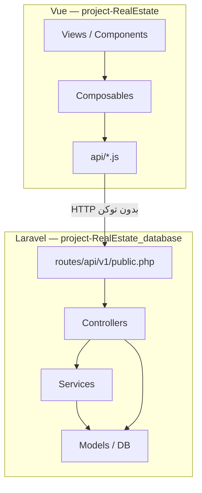
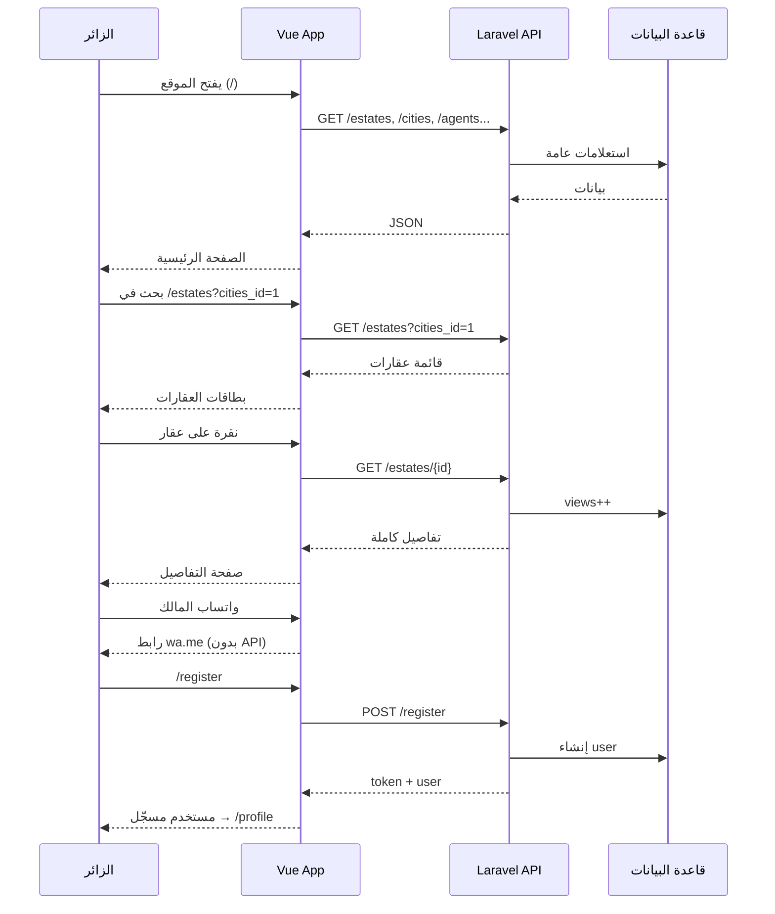

# دليل الزائر (Visitor) — الوظائف، الكود، سير العمل، والحسابات

> **المشروع:** `project-RealEstate` (Vue Frontend) + `project-RealEstate_database` (Laravel API)  
> **الجمهور:** زائر غير مسجّل الدخول (Guest)  
> **الغرض:** توثيق كامل لما يمكن للزائر فعله، وأين يقع في الكود، وكيف يعمل التدفق، وما الذي يُحسب أثناء التصفح.

---

## جدول المحتويات

1. [نظرة عامة](#1-نظرة-عامة)
2. [وظائف الزائر (1.1 – 8.1)](#2-وظائف-الزائر)
3. [كيف يعمل في الكود](#3-كيف-يعمل-في-الكود)
4. [سير العمل (Workflow)](#4-سير-العمل-workflow)
5. [الحسابات المتعلقة بالزائر](#5-الحسابات-المتعلقة-بالزائر)
6. [ما لا يستطيع الزائر فعله](#6-ما-لا-يستطيع-الزائر-فعله)
7. [مرجع الملفات والمسارات](#7-مرجع-الملفات-والمسارات)

---

## 1. نظرة عامة

المنصة مبنية على **واجهة Vue** تتصل بـ **REST API** في Laravel.  
مسارات الزائر **لا تتطلب** توكن مصادقة (`auth:sanctum`).

### تقسيم المسارات في API

| الطبقة | الملف | السلوك |
|--------|-------|--------|
| نقطة الدخول | `routes/api.php` | يحمّل `api/v1.php` |
| الموجّه الرئيسي | `routes/api/v1.php` | **عام أولاً**، ثم مجموعة `auth:sanctum` |
| مسارات عامة | `routes/api/v1/public.php` | بدون middleware — للجميع |
| مصادقة | `routes/api/v1/auth.php` | `register` و `login` عامان؛ `logout` يحتاج توكن |
| مسارات محمية | `routes/api/v1/authenticated/*.php` | تتطلب تسجيل دخول |

### تقسيم المسارات في Vue

| الحارس | الملف | الاستخدام |
|--------|-------|-----------|
| بدون حارس | — | التصفح العام (الرئيسية، العقارات، المدن...) |
| `guestGuard` | `src/router/guards.js` | `/login`, `/register` — يمنع المسجّل من الدخول |
| `authGuard` | نفس الملف | `/profile`, `/favorites`, `/recommendations` |
| `adminGuard` | نفس الملف | `/admin/*` |

**المسارات العامة في Vue** (بدون تسجيل دخول):

```
/  /estates  /estates/map  /estates/:id
/cities  /cities/:id  /places  /places/:id
/agents  /agents/:id  /companies  /companies/:id
/login  /register
```

---

## 2. وظائف الزائر

### 1.1 تصفّح العقارات العامة دون تسجيل دخول

**ما يفعله الزائر:** يفتح قائمة العقارات ويتصفحها بدون حساب.

| العنصر | القيمة |
|--------|--------|
| **مسار Vue** | `/estates` |
| **المكوّن** | `project-RealEstate/src/views/estates/EstatesListPage.vue` |
| **Composable** | `src/composables/useEstatesList.js` |
| **API** | `GET /api/v1/estates` |
| **المتحكم** | `app/Http/Controllers/Api/EstateController.php` → `index()` |
| **تعريف المسار** | `routes/api/v1/public.php` |

**قاعدة الوصول:** يُعرض فقط العقارات ذات `status = 'active'`.

---

### 2.1 عرض الصفحة الرئيسية وصفحات التعريف

**ما يفعله الزائر:** يدخل للموقع ويرى أقسام تعريفية وعقارات حديثة ومدن ووكلاء.

| العنصر | القيمة |
|--------|--------|
| **مسار Vue** | `/` |
| **المكوّن** | `src/views/HomePage.vue` |
| **Composable** | `src/composables/useHomePage.js` |
| **بحث البطل** | `src/components/home/HeroSearch.vue` |
| **نصوص التعريف** | `src/config/journey.js` → `PAGE_NARRATIVES` |
| **مكوّن النص** | `src/components/ui/PageIntro.vue` |
| **التذييل** | `src/components/layout/AppFooter.vue` |

**لا توجد** صفحات CMS منفصلة مثل `/about`. المحتوى التعريفي مدمج في المكوّنات والإعدادات.

**عند فتح الرئيسية** تُستدعى بالتوازي عدة APIs عامة:

```
GET /estates?sort=latest&per_page=8
GET /cities?per_page=4
GET /places?per_page=6
GET /agents?per_page=4
GET /companies?per_page=3
GET /estates/map
```

---

### 3.1 البحث عن العقارات بمعايير أساسية

**ما يفعله الزائر:** يبحث بالمدينة، السعر، نوع العقار، عدد الغرف، وغيرها.

| العنصر | القيمة |
|--------|--------|
| **واجهة الفلاتر** | `src/components/estates/EstateFilters.vue` |
| **بحث سريع (الرئيسية)** | `src/components/home/HeroSearch.vue` |
| **إدارة الحالة** | `src/composables/useEstatesList.js` |
| **ثوابت الخيارات** | `src/config/estates.js` |
| **API** | `GET /api/v1/estates` + query params |
| **منطق الفلترة** | `EstateController::applyFilters()` |

#### معاملات البحث المدعومة في API

| المعامل | المنطق في الكود |
|---------|-----------------|
| `cities_id` | عقارات في مدينة عبر `place.cities_id` |
| `places_id` | تطابق مباشر على `estates.places_id` |
| `type_text` | `residential` أو `commercial` |
| `kind_text` | `apartment`, `villa`, `office`... |
| `min_price` / `max_price` | نطاق السعر على عمود `price` |
| `min_bedrooms` | `num_of_bedrooms >= القيمة` |
| `is_furnished` | مفروش / غير مفروش |
| `search` | LIKE على `name` و `description` |
| `sort` | `latest`, `price_asc`, `price_desc` |
| `per_page`, `page` | ترقيم الصفحات |

**ملاحظة:** الفلاتر تُكتب في **query string** للمتصفح، مثلاً:

```
/estates?cities_id=1&type_text=residential&min_price=50000&max_price=300000&min_bedrooms=3
```

---

### 4.1 عرض تفاصيل العقار الأساسية

**ما يفعله الزائر:** يفتح صفحة عقار واحد ويرى الوصف والسعر والموقع والصور والمساحة.

| العنصر | القيمة |
|--------|--------|
| **مسار Vue** | `/estates/:id` |
| **المكوّن** | `src/views/estates/EstateDetailPage.vue` |
| **Composable** | `src/composables/useEstateDetail.js` |
| **API** | `GET /api/v1/estates/{estate}` |
| **المتحكم** | `EstateController::show()` |
| **تنسيق JSON** | `app/Traits/FormatsEstateResponse.php` |

#### أقسام صفحة التفاصيل

| القسم | المكوّن | متاح للزائر؟ |
|-------|---------|-------------|
| معرض الصور | `EstateGallery.vue` | ✅ |
| الوصف | داخل الصفحة | ✅ |
| المواصفات | `EstateSpecs.vue` | ✅ |
| الخريطة | `EstateLocationMap.vue` | ✅ |
| مقاييس الاستثمار | `EstateInvestment.vue` | ✅ (قراءة فقط) |
| التقييمات | `EstateReviews.vue` | ✅ (المعتمدة فقط) |
| الشريط الجانبي | `EstateSidebar.vue` | ✅ (سعر، موقع، تواصل) |
| تنبؤ السعر بالذكاء الاصطناعي | `EstatePricePrediction.vue` | ❌ يحتاج تسجيل دخول |
| المفضلة | `FavoriteButton.vue` | ❌ يوجّه لـ `/login` |

#### الحقول المعروضة في المواصفات

غرف النوم، الحمامات، الصالات، المطابخ، البلكونات، المساحة، الطابق، سنة البناء، الحالة، `type_text`, `kind_text`, مفروش/غير مفروش.

#### قواعد الوصول

```
إذا status = 'active'  → 200 للجميع
إذا status ≠ 'active'  → 404 للزائر (المالك يرى عقاره إن كان مسجّلاً)
```

**عداد المشاهدات:** عند `show()` يزيد `views` للعقارات النشطة إذا الزائر **ليس** المالك.

---

### 5.1 التصفّح حسب الفئة

**ما يفعله الزائر:** يصفّي حسب سكني/تجاري، للبيع/للإيجار.

| الفئة | التنفيذ |
|-------|---------|
| **سكني** | `type_text=residential` — يُرسل للـ API |
| **تجاري** | `type_text=commercial` — يُرسل للـ API |
| **نوع فرعي** (شقة/فيلا/مكتب) | `kind_text=...` — يُرسل للـ API |
| **للبيع** | `listing_type=sale` — **فلترة على الواجهة فقط** |
| **للإيجار** | `listing_type=rent` — **فلترة على الواجهة فقط** |
| **استثماري** | **ليس فئة تصفّح** — يُعرض كمقاييس ROI على صفحة التفاصيل |

**لا يوجد** مسار مثل `/estates/residential`. الفئات = **معاملات query**.

#### منطق البيع/الإيجار (واجهة فقط)

**الملف:** `src/utils/estate.js` → `matchesListingType()`

```javascript
// للإيجار: monthly_rent > 0
// للبيع: لا يوجد إيجار شهري موجب
```

**الملف:** `src/composables/useEstatesList.js` → `displayedEstates`

```
إذا listing_type موجود → يُصفّي النتائج بعد استلامها من API
(على الصفحة الحالية فقط — ليس على كل قاعدة البيانات)
```

**الخيارات معرّفة في:** `src/config/estates.js`

---

### 6.1 الوصول لمعلومات محدودة عن الشركات والوكلاء

**ما يفعله الزائر:** يتصفح ملفات الشركات والوكلاء المعتمدين علناً.

#### الشركات

| العنصر | القيمة |
|--------|--------|
| **قائمة** | `/companies` → `CompaniesListPage.vue` |
| **تفاصيل** | `/companies/:id` → `CompanyDetailPage.vue` |
| **API** | `GET /api/v1/companies`, `GET /api/v1/companies/{id}` |
| **المتحكم** | `CompanyController.php` |
| **شرط الظهور** | `Companies::isPubliclyVisible()` → `status === 'approved'` |

**بيانات إضافية عامة:**

```
GET /companies/{id}/agents
GET /companies/{id}/reviews
GET /companies/{id}/reviews/summary
GET /companies/{id}/trust-score
```

#### الوكلاء

| العنصر | القيمة |
|--------|--------|
| **قائمة** | `/agents` → `AgentsListPage.vue` |
| **تفاصيل** | `/agents/:id` → `AgentDetailPage.vue` |
| **API** | `GET /api/v1/agents`, `GET /api/v1/agents/{id}` |
| **المتحكم** | `AgentController.php` |
| **مشاركة** | `POST /api/v1/agents/{id}/share` (يزيد `views`) |

#### المدن والمناطق (مساعدة للتصفح)

| المسار | المكوّن |
|--------|---------|
| `/cities` | `CitiesListPage.vue` |
| `/cities/:id` | `CityDetailPage.vue` |
| `/places` | `PlacesListPage.vue` |
| `/places/:id` | `PlaceDetailPage.vue` |

---

### 7.1 التسجيل لإنشاء حساب جديد

**ما يفعله الزائر:** يملأ نموذج التسجيل ويصبح مستخدماً.

| العنصر | القيمة |
|--------|--------|
| **مسار Vue** | `/register` |
| **المكوّن** | `src/views/auth/RegisterPage.vue` |
| **حارس** | `guestGuard` |
| **عميل API** | `src/api/auth.js` → `register()` |
| **API** | `POST /api/v1/register` |
| **المتحكم** | `AuthController::register()` |
| **التحقق** | `RegisterUserRequest.php` |
| **تعريف المسار** | `routes/api/v1/auth.php` |

#### الحقول المطلوبة

`username`, `fname`, `lname`, `email`, `password` (تأكيد، 8+ أحرف), `phone`, `country_code_phone`, `gender`, `type`

**أنواع الحساب:** `buyer`, `owner`, `agent`, `company` (من `src/config/auth.js`)

#### ماذا يحدث بعد التسجيل؟

1. يُنشأ مستخدم بـ `status = 'active'`
2. يُصدر **توكن Sanctum** فوراً (تسجيل دخول تلقائي)
3. يُخزَّن التوكن في `localStorage` عبر `useAuthStore`
4. إعادة توجيه إلى `/profile` أو `?redirect=` إن وُجد

---

### 8.1 صفحة التواصل أو إرسال استفسار عام

**الوضع الحالي في الكود:**

| الميزة | الحالة |
|--------|--------|
| مسار `/contact` | ❌ **غير موجود** |
| نموذج استفسار عام | ❌ **غير موجود** |
| API رسائل للزائر | ❌ الرسائل خلف `auth:sanctum` |

#### ما يستطيع الزائر فعله للتواصل اليوم

| الطريقة | الملف | الآلية |
|---------|-------|--------|
| **معلومات ثابتة في التذييل** | `AppFooter.vue` | بريد، هاتف، عنوان (ثابت في الكود) |
| **واتساب / هاتف من صفحة العقار** | `EstateSidebar.vue` | `getWhatsAppLink()` من `src/utils/estate.js` |
| **بيانات الوكيل/الشركة** | صفحات التفاصيل | من API العام |
| **CTA للتسجيل** | `HomePage.vue` | يحوّل لـ `/register` |

**معلومات التذييل (ثابتة):**

```
البريد: info@ziad-realestate.com
الهاتف: +963 11 000 0000
العنوان: دمشق، سوريا
```

> **ملاحظة للمطور:** إذا طُلبت ميزة "استفسار عام"، يلزم إنشاء مسار Vue + endpoint API جديد — غير موجود حالياً.

---

## 3. كيف يعمل في الكود

### 3.1 طبقات النظام



### 3.2 تصفّح قائمة العقارات — تسلسل الكود

```
1. EstatesListPage.vue
      ↓
2. useEstatesList.js
   ├── parseQuery(route.query)        ← قراءة الفلاتر من URL
   ├── buildApiParams(filters)        ← تحويل لفلاتر API
   └── estatesService.list(params)    ← src/api/estates.js
      ↓
3. GET /api/v1/estates
      ↓
4. EstateController::index()
   ├── Estate::where('status','active')
   ├── applyFilters($query, $request)
   └── paginate()
      ↓
5. formatEstate() لكل عنصر
      ↓
6. JSON → Vue → PropertyCard.vue
```

### 3.3 تفاصيل العقار — تسلسل الكود

```
1. EstateDetailPage.vue
      ↓
2. useEstateDetail.js → estatesService.getById(id)
      ↓
3. GET /api/v1/estates/{id}
      ↓
4. EstateController::show()
   ├── canViewEstate()               ← active أو مالك
   ├── increment('views')            ← إن لم يكن مالكاً
   └── load(place, images, videos...)
      ↓
5. بالتوازي:
   GET /estates/{id}/reviews
   GET /estates/{id}/reviews/summary
      ↓
6. EstateGallery, EstateSpecs, EstateInvestment, EstateSidebar...
```

### 3.4 البحث الجغرافي (خريطة)

| API | المتحكم | الخدمة |
|-----|---------|--------|
| `GET /estates/map` | `EstateGeoController::map()` | `GeoSearchService` |
| `GET /estates/nearby` | `EstateGeoController::nearby()` | `GeoSearchService` |
| `GET /estates/in-radius` | `EstateGeoController::inRadius()` | `GeoSearchService` |

**الواجهة:** `EstatesMapPage.vue` + `useEstateMapData.js`

### 3.5 التسجيل — تسلسل الكود

```
1. RegisterPage.vue — نموذج
      ↓
2. auth.register(payload) — src/api/auth.js
      ↓
3. POST /api/v1/register
      ↓
4. RegisterUserRequest — validation
      ↓
5. AuthController::register()
   ├── User::create()
   └── $user->createToken()
      ↓
6. useAuthStore — حفظ token + user
      ↓
7. router.push('/profile' أو redirect)
```

---

## 4. سير العمل (Workflow)

### 4.1 رحلة الزائر الكاملة (من الدخول للتسجيل)



### 4.2 سير عمل البحث والفلترة

| الخطوة | ماذا يحدث |
|--------|-----------|
| 1 | الزائر يغيّر الفلاتر في `EstateFilters` أو `HeroSearch` |
| 2 | `router.push({ query: {...} })` — تحديث URL |
| 3 | `watch(route.query)` في `useEstatesList` |
| 4 | `buildApiParams()` — إرسال فلاتر مدعومة فقط للـ API |
| 5 | `GET /estates` — فلترة على السيرفر |
| 6 | إن وُجد `listing_type` — `displayedEstates` يصفّي محلياً |
| 7 | `PropertyCard` يعرض النتائج |

### 4.3 سير عمل عرض التفاصيل

| الخطوة | ماذا يحدث |
|--------|-----------|
| 1 | طلب `GET /estates/{id}` |
| 2 | التحقق: `active` أو مالك |
| 3 | زيادة `views` (للنشط وغير المالك) |
| 4 | تحميل العلاقات: مكان، صور، فيديو، إعلانات |
| 5 | عرض ROI والدخل (قيم مخزنة مسبقاً) |
| 6 | تحميل التقييمات المعتمدة فقط |
| 7 | عرض أزرار تواصل (واتساب/هاتف) |

### 4.4 سير عمل التسجيل

| الخطوة | ماذا يحدث |
|--------|-----------|
| 1 | الزائر يفتح `/register` |
| 2 | `guestGuard` — إن كان مسجّلاً يُوجَّه بعيداً |
| 3 | إرسال `POST /register` |
| 4 | التحقق من الحقول ونوع المستخدم |
| 5 | إنشاء المستخدم + توكن |
| 6 | تخزين الجلسة في المتصفح |
| 7 | إعادة توجيه — يصبح "مستخدم" وليس "زائر" |

---

## 5. الحسابات المتعلقة بالزائر

> الزائر **لا يُشغّل** محرك الحساب مباشرة في أغلب الحالات. يرى **نتائج محسوبة مسبقاً** أو **حسابات عرض/بحث**.

### 5.1 مقاييس الاستثمار على صفحة العقار (عرض فقط)

**ما يراه الزائر:** `roi`, `expected_annual_income`, `payback_period`, `monthly_rent`, `occupancy_rate`, `price_of_meter`

**المكوّن:** `EstateInvestment.vue`

**مصدر القيم:** حُسبت عند إنشاء/تحديث العقار عبر:

```
InvestmentCalculatorService::applyToEstatePayload()
→ calculateCore()
```

**الملف:** `app/Services/Investment/InvestmentCalculatorService.php`

#### الصيغ (للفهم — لا تُعاد عند كل زيارة)

```
grossAnnual        = monthlyRent × 12 × (occupancyRate / 100)
totalAnnualCosts   = expenses + maintenance + tax + hoa
expectedAnnualIncome = max(0, grossAnnual − totalAnnualCosts)
roi                = (expectedAnnualIncome / price) × 100
payback_period     = price / expectedAnnualIncome
```

**عند زيارة الزائر:** `GET /estates/{id}` يُرجع القيم **من قاعدة البيانات** — **بدون إعادة حساب**.

---

### 5.2 المسافة الجغرافية (الخريطة والقرب)

**متى:** بحث "قريب مني" أو العقارات ضمن نصف قطر على الخريطة.

**الخدمة:** `app/Services/GeoSearchService.php`  
**الدالة:** `calculateDistanceKm()`

#### صيغة Haversine

```
نصف قطر الأرض = 6371 كم

a = sin²(Δlat/2) + cos(lat1)×cos(lat2)×sin²(Δlng/2)
c = 2 × atan2(√a, √(1−a))
المسافة = 6371 × c  (بالكيلومتر)
```

**الغرض:** ترتيب العقارات حسب القرب من نقطة (إحداثيات المستخدم).

---

### 5.3 درجة الثقة (Trust Score)

**متى:** صفحات الشركة أو الوكيل.

**API عام:**

```
GET /companies/{id}/trust-score
GET /agents/{id}/trust-score
```

**الخدمة:** `TrustScoreService` — حساب على السيرفر من التقييمات والبيانات؛ الزائر **يقرأ النتيجة فقط**.

---

### 5.4 ملخص التقييمات

```
GET /estates/{id}/reviews/summary
→ متوسط التقييم، العدد، توزيع النجوم
```

حساب تجميعي SQL — لا يتطلب تسجيل دخول للقراءة.

---

### 5.5 ما لا يُحسب للزائر

| الميزة | السبب |
|--------|-------|
| تنبؤ السعر بالذكاء الاصطناعي | `POST /estates/{id}/price-prediction` يتطلب `auth:sanctum` |
| تحليل استثماري مخصص | يتطلب حساباً |
| محفظة المستثمر | يتطلب حساباً |
| التوصيات الذكية | يتطلب حساباً |

---

### 5.6 فلتر البيع/الإيجار (منطق واجهة — ليس حساباً مالياً)

**الملف:** `src/utils/estate.js`

```javascript
isRent = monthly_rent > 0
listing_type === 'rent'  → يُعرض إن isRent
listing_type === 'sale'  → يُعرض إن !isRent
```

**تسمية العرض:** `getListingType()` → `'للإيجار'` أو `'للبيع'`

---

## 6. ما لا يستطيع الزائر فعله

| الميزة | السبب |
|--------|-------|
| إضافة للمفضلة | `authGuard` / توجيه لـ login |
| كتابة تقييم | `ReviewForm` يطلب تسجيل دخول |
| تنبؤ السعر AI | يتطلب توكن |
| إنشاء عقار | `POST /my/estates` محمي |
| تحليل استثماري | `investment-analyses` محمي |
| الرسائل الداخلية | `messages` محمي |
| `POST /estates/{id}/contact-agent` | محمي — غير مستخدم في واجهة الزائر |
| لوحة الإدارة | `adminGuard` |

---

## 7. مرجع الملفات والمسارات

### 7.1 API عامة (للزائر)

```
POST /api/v1/register
POST /api/v1/login

GET  /api/v1/estates
GET  /api/v1/estates/{id}
GET  /api/v1/estates/nearby
GET  /api/v1/estates/in-radius
GET  /api/v1/estates/map
POST /api/v1/estates/{id}/share
GET  /api/v1/estates/{id}/reviews
GET  /api/v1/estates/{id}/reviews/summary

GET  /api/v1/cities
GET  /api/v1/cities/{id}
GET  /api/v1/cities/{id}/places
GET  /api/v1/places
GET  /api/v1/places/{id}

GET  /api/v1/agents
GET  /api/v1/agents/{id}
POST /api/v1/agents/{id}/share
GET  /api/v1/agents/{id}/reviews
GET  /api/v1/agents/{id}/trust-score

GET  /api/v1/companies
GET  /api/v1/companies/{id}
GET  /api/v1/companies/{id}/agents
GET  /api/v1/companies/{id}/reviews
GET  /api/v1/companies/{id}/trust-score
```

**التعريف:** `routes/api/v1/public.php` + `routes/api/v1/auth.php`

### 7.2 Vue — مسارات الزائر

| المسار | الملف |
|--------|-------|
| `/` | `src/views/HomePage.vue` |
| `/estates` | `src/views/estates/EstatesListPage.vue` |
| `/estates/map` | `src/views/estates/EstatesMapPage.vue` |
| `/estates/:id` | `src/views/estates/EstateDetailPage.vue` |
| `/cities` | `src/views/cities/CitiesListPage.vue` |
| `/places` | `src/views/places/PlacesListPage.vue` |
| `/agents` | `src/views/agents/AgentsListPage.vue` |
| `/companies` | `src/views/companies/CompaniesListPage.vue` |
| `/register` | `src/views/auth/RegisterPage.vue` |
| `/login` | `src/views/auth/LoginPage.vue` |

**التعريف:** `src/router/index.js`

### 7.3 ملفات Backend الأساسية

| الدور | المسار |
|-------|--------|
| مسارات عامة | `routes/api/v1/public.php` |
| عقارات | `app/Http/Controllers/Api/EstateController.php` |
| جغرافيا | `app/Http/Controllers/Api/EstateGeoController.php` |
| شركات | `app/Http/Controllers/Api/CompanyController.php` |
| وكلاء | `app/Http/Controllers/Api/AgentController.php` |
| تسجيل | `app/Http/Controllers/Api/AuthController.php` |
| بحث جغرافي | `app/Services/GeoSearchService.php` |
| حساب استثمار | `app/Services/Investment/InvestmentCalculatorService.php` |

### 7.4 ملفات Frontend الأساسية

| الدور | المسار |
|-------|--------|
| Router | `src/router/index.js` |
| Guards | `src/router/guards.js` |
| API عقارات | `src/api/estates.js` |
| API مصادقة | `src/api/auth.js` |
| قائمة عقارات | `src/composables/useEstatesList.js` |
| فلاتر | `src/components/estates/EstateFilters.vue` |
| بطاقة عقار | `src/components/cards/PropertyCard.vue` |
| تذييل/تواصل | `src/components/layout/AppFooter.vue` |
| منطق بيع/إيجار | `src/utils/estate.js` |

---

## ملحق — مصفوفة الزائر مقابل المسجّل

| الميزة | زائر | مسجّل |
|--------|------|-------|
| تصفح/بحث العقارات | ✅ | ✅ |
| تفاصيل العقار | ✅ | ✅ (+ عقاراته pending) |
| الخريطة | ✅ | ✅ |
| مشاركة عقار/وكيل | ✅ | ✅ |
| واتساب/هاتف | ✅ | ✅ |
| مقاييس ROI (عرض) | ✅ | ✅ |
| مفضلة | ❌ | ✅ |
| كتابة تقييم | ❌ | ✅ |
| تنبؤ AI | ❌ | ✅ |
| تسجيل/دخول | ✅ | — |
| محفظة/تحليلات | ❌ | ✅ |

---

*آخر تحديث: يونيو 2026 — مبني على تحليل `project-RealEstate` و `project-RealEstate_database`.*
