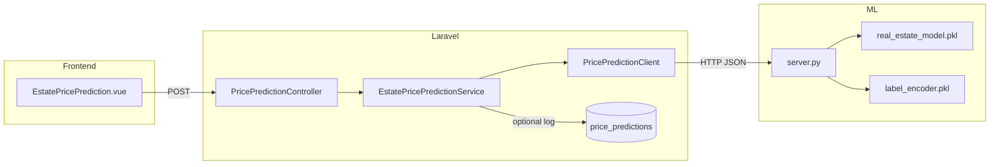
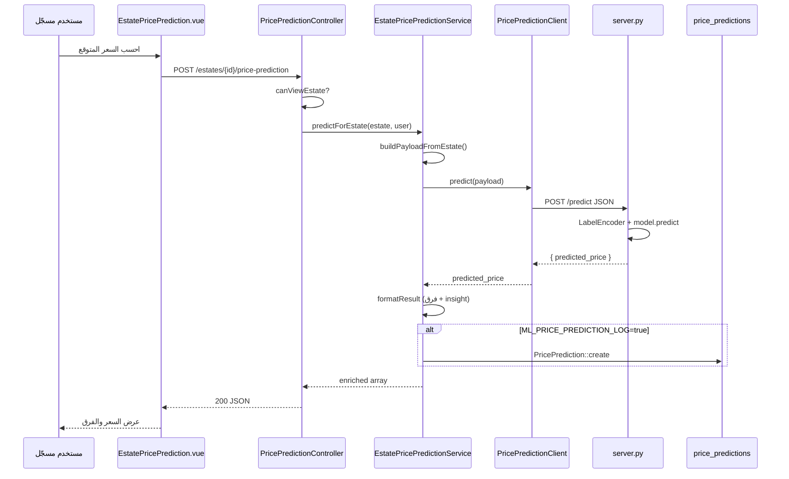
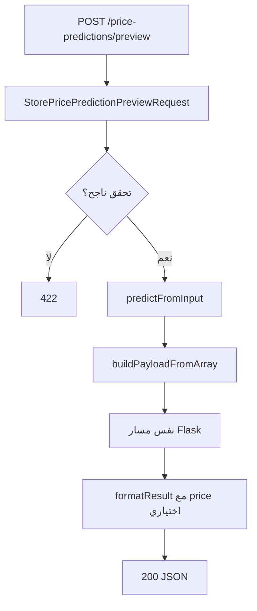
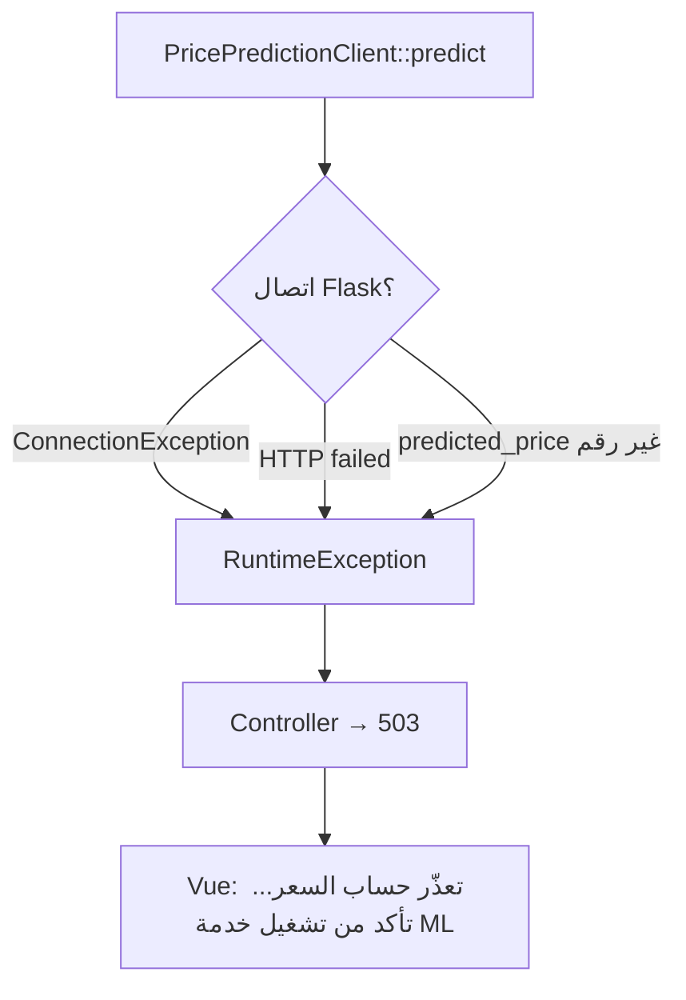

# دليل توقع السعر بالذكاء الاصطناعي (AI Price Prediction)

> **المشروع:** `project-RealEstate_database` (Laravel API) + `ml/pricing` (Flask/sklearn) + `project-RealEstate` (Vue)  
> **الغرض:** توثيق تقني كامل لنظام **تقدير السعر المتوقع** — الملفات المرتبطة، آلية العمل في الكود، سير العمل، ومعادلات الحساب.  
> **مهم:** هذا **ليس** ChatGPT ولا LLM. هو **نموذج انحدار (scikit-learn)** مُدرَّب مسبقاً يعمل عبر **خادم Flask منفصل**.

---

## جدول المحتويات

1. [نظرة عامة](#1-نظرة-عامة)
2. [الملفات المرتبطة بالكامل](#2-الملفات-المرتبطة-بالكامل)
3. [معمارية النظام](#3-معمارية-النظام)
4. [كيف يعمل في الكود — طبقة بطبقة](#4-كيف-يعمل-في-الكود--طبقة-طبقة)
5. [سير العمل الكامل (Workflow)](#5-سير-العمل-الكامل-workflow)
6. [كيف يتم الحساب؟](#6-كيف-يتم-الحساب)
7. [واجهات API](#7-واجهات-api)
8. [قاعدة البيانات](#8-قاعدة-البيانات)
9. [الإعدادات والتشغيل](#9-الإعدادات-والتشغيل)
10. [ملاحظات مهمة للمطورين](#10-ملاحظات-مهمة-للمطورين)

---

## 1. نظرة عامة

نظام **توقع السعر** يقدّر سعر عقار بناءً على **مواصفاته** و**موقعه**، ثم يقارن التقدير بالسعر المعروض (إن وُجد).

| الطبقة | التقنية | الدور |
|--------|---------|-------|
| **الواجهة** | Vue (`EstatePricePrediction.vue`) | زر «احسب السعر المتوقع» + عرض النتيجة |
| **API** | Laravel (`PricePredictionController`) | مصادقة، بناء payload، تنسيق الاستجابة |
| **التنسيق** | `EstatePricePredictionService` | تحويل العقار → JSON متوافق مع النموذج |
| **الاتصال** | `PricePredictionClient` | HTTP POST إلى Flask |
| **النموذج** | Flask + sklearn (`ml/pricing/server.py`) | `model.predict()` + `LabelEncoder` للموقع |

**ما لا يفعله النظام:**
- لا يولّد نصوصاً تفسيرية بالذكاء الاصطناعي التوليدي
- لا يُدرَّب داخل Laravel أو أثناء الطلب
- لا يحل محل `InvestmentCalculatorService` (ROI والإيجار منفصلان)

**مكوّن مرتبط (ليس ML):** `MarketTrendsService` — إحصائيات SQL على العقارات والتنبؤات المحفوظة (متوسط الأسعار، إلخ).



---

## 2. الملفات المرتبطة بالكامل

### 2.1 Backend — Laravel (منطق التنبؤ)

| الملف | المسار | المسؤولية |
|-------|--------|-----------|
| **`EstatePricePredictionService.php`** | `app/Services/Ai/` | **القلب:** بناء payload، استدعاء العميل، `formatResult()`، حفظ اختياري |
| **`PricePredictionClient.php`** | `app/Services/Ai/` | HTTP POST إلى `{ML_URL}/predict`، معالجة الأخطاء |
| **`MarketTrendsService.php`** | `app/Services/Ai/` | تحليلات SQL — **لا يستدعي Flask** |
| **`PricePredictionController.php`** | `app/Http/Controllers/Api/` | `forEstate()`, `preview()` |
| **`MarketAnalyticsController.php`** | `app/Http/Controllers/Api/` | `GET market-analytics/trends` |
| **`StorePricePredictionPreviewRequest.php`** | `app/Http/Requests/` | تحقق تنبؤ ad-hoc قبل حفظ العقار |
| **`PricePrediction.php`** | `app/Models/` | نموذج Eloquent لجدول `price_predictions` |
| **`config/ml.php`** | `config/` | URL Flask، timeouts، `location_field`, `log_predictions` |

**تبعيات الحقن:**

```
PricePredictionController
  └── EstatePricePredictionService
        └── PricePredictionClient

MarketAnalyticsController
  └── MarketTrendsService
```

---

### 2.2 خدمة ML — Flask (Python)

| الملف | المسار | المسؤولية |
|-------|--------|-----------|
| **`server.py`** | `ml/pricing/` | نقطة `/predict` — تحميل النموذج والتنبؤ |
| **`requirements.txt`** | `ml/pricing/` | flask, flask-cors, scikit-learn, joblib |
| **`README.md`** | `ml/pricing/` | تعليمات التشغيل المحلي |
| **`real_estate_model.pkl`** | `ml/pricing/` | نموذج sklearn المُدرَّب (يُحمَّل عند بدء السيرفر) |
| **`label_encoder.pkl`** | `ml/pricing/` | ترميز اسم الموقع `place` → رقم |

> **ملاحظة:** `README.md` يذكر أيضاً `Abd_real_estate_model.pkl` — تأكد أن الملف الفعلي الذي يحمّله `server.py` موجود (`real_estate_model.pkl`).

---

### 2.3 Routes

| الملف | المسار | Endpoints |
|-------|--------|-----------|
| `routes/api/v1/authenticated/estates.php` | `POST /estates/{estate}/price-prediction` | تنبؤ لعقار موجود |
| `routes/api/v1/authenticated/price-predictions.php` | `POST /price-predictions/preview` | تنبؤ قبل الحفظ |
| `routes/api/v1/authenticated/market-analytics.php` | `GET /market-analytics/trends` | اتجاهات السوق (SQL) |

**جميع المسارات أعلاه داخل `auth:sanctum`** — تتطلب تسجيل دخول.

---

### 2.4 Frontend — Vue

| الملف | المسار | المسؤولية |
|-------|--------|-----------|
| **`EstatePricePrediction.vue`** | `src/components/estates/` | واجهة التنبؤ في صفحة تفاصيل العقار |
| **`pricePredictions.js`** | `src/api/` | `forEstate(id)`, `preview(payload)` |
| **`EstateDetailPage.vue`** | `src/views/estates/` | يضمّن `<EstatePricePrediction>` |
| **`estates.css`** | `src/styles/pages/` | تنسيقات `.estate-price-prediction__*` |

**حالياً:** الواجهة تستخدم **`forEstate` فقط**. `preview()` متاح في API لكن **غير موصول** في `AdminEstateForm`.

---

### 2.5 قاعدة البيانات والتوثيق

| الملف | الدور |
|-------|------|
| `database/migrations/2026_05_22_100000_create_price_predictions_table.php` | جدول سجل التنبؤات |
| `docs/ar/diagrams/activity-ai-pricing.md` | مخطط نشاط Mermaid |
| `docs/api/geolocation-maps.md` | (منفصل — خرائط) |

---

## 3. معمارية النظام

```
المستخدم (مسجّل)
    │
    ▼
EstatePricePrediction.vue
    │  POST /api/v1/estates/{id}/price-prediction
    ▼
PricePredictionController::forEstate
    │  canViewEstate (active أو مالك)
    ▼
EstatePricePredictionService::predictForEstate
    │  1. buildPayloadFromEstate()
    │  2. PricePredictionClient::predict()
    │  3. formatResult()
    ▼
Flask POST /predict
    │  LabelEncoder + model.predict
    ▼
{ predicted_price: float }
    │
    ▼
Laravel: فرق سعري + valuation_insight + (اختياري) PricePrediction::create
    │
    ▼
JSON → Vue
```

**مبدأ التصميم:**
- Laravel **لا يشغّل** sklearn — فقط HTTP
- النموذج **ثابت** (ملف `.pkl`) — لا تعلم أونلاين
- كل طلب تنبؤ **مستقل** — لا cache في الكود الحالي

---

## 4. كيف يعمل في الكود — طبقة بطبقة

### 4.1 `PricePredictionController::forEstate`

```php
// 1. التحقق من إمكانية عرض العقار
if (! $this->canViewEstate($request, $estate)) → 404

// 2. التنبؤ
$data = $this->predictions->predictForEstate($estate, $request->user());

// 3. RuntimeException (Flask معطّل) → 503
```

**`canViewEstate`:**
- `status === 'active'` → أي مستخدم مصادق
- غير active → فقط مالك العقار (`user_id`)

---

### 4.2 `EstatePricePredictionService::predictForEstate`

1. `$estate->loadMissing(['place.city'])`
2. `$payload = buildPayloadFromEstate($estate)`
3. `$result = $client->predict($payload)` → `['predicted_price' => float]`
4. `formatResult(...)` مع `listedPrice = $estate->price`

---

### 4.3 `buildPayloadFromEstate` → `buildPayloadFromArray`

**من العقار يُستخرج:**

| حقل Laravel | مفتاح Flask | ملاحظة |
|-------------|-------------|--------|
| `place.city.name` أو `place.name` | `place` | حسب `ML_PRICE_PREDICTION_LOCATION_FIELD` |
| `space_of_estate` | `space_of_estate` | float |
| `is_furnished` | `is_furnished` | `0` أو `1` |
| `floor` | `floor` | float |
| `num_of_bedrooms` … `num_of_balconies` | نفس الأسماء | float |
| `num_of_receptions` | **`num_of_receptioins`** | typo متعمد لتوافق النموذج |
| `date_of_build` | `date_of_build` | `Y-m-d` أو افتراضي `2000-01-01` |

**`resolveLocationLabel(Places $place)`:**

```php
$field = config('ml.price_prediction.location_field', 'city');

// city → place.city.name (أو place.name كبديل)
// place → place.name فقط
```

---

### 4.4 `PricePredictionClient::predict`

```php
POST {ML_PRICE_PREDICTION_URL}/predict
Content-Type: application/json
Body: $payload

// نجاح: { "predicted_price": 450000.50 }
// فشل: ConnectionException → RuntimeException 503
// فشل HTTP: json error أو body
```

**Timeouts:**
- `timeout_seconds` — انتظار الرد الكامل (افتراضي 10)
- `connect_timeout_seconds` — اتصال أولي (افتراضي 3)

---

### 4.5 `server.py` — استنتاج Flask

عند بدء السيرفر (مرة واحدة):

```python
model = joblib.load("real_estate_model.pkl")
label_encoder = joblib.load("label_encoder.pkl")
```

عند كل `POST /predict`:

1. قراءة JSON
2. `place_encoded = label_encoder.transform([place])[0]`
3. `date_of_build` → استخراج **السنة فقط** (`%Y`)
4. بناء مصفوفة `features` بترتيب **ثابت** (11 عنصر)
5. `prediction = model.predict([features])[0]`
6. `return {"predicted_price": prediction[0]}`

**أي خطأ** → HTTP 500 + `{"error": "..."}`

---

### 4.6 `formatResult` — ما بعد التنبؤ (Laravel)

يُحسب في PHP (ليس في sklearn):

| الحقل | المعنى |
|-------|--------|
| `predicted_price` | من Flask |
| `listed_price` | سعر العقار المعروض |
| `price_difference` | `predicted - listed` |
| `price_difference_percent` | `(difference / listed) × 100` |
| `valuation_insight` | تصنيف الفرق (انظر §6.2) |
| `input_features` | نسخة الـ payload المرسل |
| `prediction_id` | إن `log_predictions = true` |

---

### 4.7 `EstatePricePrediction.vue` (Frontend)

1. إن لم يكن المستخدم مسجلاً → redirect إلى login
2. `pricePredictionsService.forEstate(estate.id)`
3. عرض: السعر المتوقع، المعروض، الفرق، النسبة، `valuation_insight` بالعربية
4. زر «إعادة الحساب» يعيد الطلب

**تسميات `valuation_insight` في Vue:**

| القيمة | النص العربي |
|--------|-------------|
| `aligned_with_model` | السعر المعروض متوافق مع تقدير النموذج |
| `listed_below_prediction` | السعر المعروض أقل من التقدير — قد يكون عرضاً جيداً |
| `listed_above_prediction` | السعر المعروض أعلى من التقدير |

---

### 4.8 `MarketTrendsService` (مرتبط — ليس تنبؤاً)

`GET /market-analytics/trends` — يجمع:

- `AVG(price)`, `COUNT`, `AVG(roi)` من `estates` النشطة
- `AVG(predicted_price)`, `AVG(price_difference_percent)` من `price_predictions`
- أعلى 10 مناطق بعدد العقارات

**لا HTTP إلى Flask.**

---

## 5. سير العمل الكامل (Workflow)

### 5.1 تنبؤ لعقار موجود (المسار الرئيسي)



---

### 5.2 تنبؤ مسبق (قبل حفظ العقار)



**استخدام متوقع:** نموذج إنشاء/تعديل عقار في Admin — **API جاهز، الواجهة لم تُربط بعد**.

---

### 5.3 عند تعطّل خدمة ML



---

### 5.4 اتجاهات السوق (مسار منفصل)

```
GET /market-analytics/trends?places_id=&cities_id=
  → MarketAnalyticsController
  → MarketTrendsService::summarize()
  → SQL aggregates فقط
  → 200 JSON (listings + predictions stats)
```

---

## 6. كيف يتم الحساب؟

### 6.1 التنبؤ بالنموذج (sklearn) — داخل Flask

النموذج **انحدار (Regressor)** مُدرَّب مسبقاً. المعادلة الداخلية تعتمد على نوع الخوارزمية في `.pkl` (غير مكشوف في الكود — صندوق أسود)، لكن **مدخلات النموذج ثابتة**:

**ترتيب الميزات (11):**

| # | الميزة | المعالجة |
|---|--------|----------|
| 1 | `place` | `LabelEncoder.transform([place])` → رقم صحيح |
| 2 | `space_of_estate` | float — المساحة م² |
| 3 | `is_furnished` | `0` أو `1` |
| 4 | `floor` | float |
| 5 | `num_of_bedrooms` | float |
| 6 | `num_of_livingrooms` | float |
| 7 | `num_of_receptions` | float (مفتاح JSON: `num_of_receptioins`) |
| 8 | `num_of_bathrooms` | float |
| 9 | `num_of_kitchens` | float |
| 10 | `num_of_balconies` | float |
| 11 | `date_of_build` | **سنة البناء فقط** (مثلاً 2015) |

```python
features = [place_encoded, space, furnished, floor, beds, living, receptions, baths, kitchens, balconies, build_year]
predicted_price = model.predict([features])[0]
```

**قيود مهمة:**
- `place` يجب أن يكون من القيم التي رآها `LabelEncoder` عند التدريب — موقع غير معروف → **خطأ 500**
- ترتيب الميزات أي تغيير فيه **يفسد** التنبؤ
- `num_of_receptioins` (خطأ إملائي) **يجب الإبقاء عليه** — النموذج تدرب بهذا الاسم

---

### 6.2 تحليل الفرق السعري — `formatResult()` (Laravel)

يُنفَّذ **بعد** استلام `predicted_price` من Flask:

```
difference = predicted_price - listed_price

difference_percent = (difference / listed_price) × 100    // إذا listed_price > 0
```

**تصنيف `valuation_insight`:**

| الشرط | القيمة |
|-------|--------|
| `\|difference_percent\| < 5` | `aligned_with_model` |
| `difference > 0` (التقدير أعلى من المعروض) | `listed_below_prediction` |
| `difference < 0` (التقدير أقل من المعروض) | `listed_above_prediction` |
| لا `listed_price` | `insight = null` |

**مثال رقمي:**

| predicted | listed | difference | % | insight |
|-----------|--------|------------|---|---------|
| 500,000 | 480,000 | +20,000 | +4.17% | `aligned_with_model` |
| 500,000 | 400,000 | +100,000 | +25% | `listed_below_prediction` |
| 450,000 | 500,000 | -50,000 | -10% | `listed_above_prediction` |

---

### 6.3 تطبيع المدخلات في Laravel (قبل Flask)

| الحقل | القاعدة |
|-------|---------|
| `date_of_build` فارغ/غير صالح | `2000-01-01` |
| `is_furnished` نص | `filter_var(..., FILTER_VALIDATE_BOOLEAN)` |
| `places_id` بدون `place` | يُحمَّل `Places` ويُستنتج `place` من `resolveLocationLabel` |
| جميع الأرقام | `(float)` مع افتراضي `0` |

---

### 6.4 `MarketTrendsService` — حسابات SQL (ليس ML)

| المقياس | الاستعلام |
|---------|-----------|
| `avg_listed_price` | `AVG(estates.price)` حيث `status = active` |
| `avg_roi` | `AVG(estates.roi)` |
| `avg_predicted_price` | `AVG(price_predictions.predicted_price)` |
| `avg_difference_percent` | `AVG(price_predictions.price_difference_percent)` |
| `top_places_by_listings` | `GROUP BY places` + `COUNT` + `AVG(price)` — أعلى 10 |

فلترة اختيارية: `places_id` أو `cities_id`.

---

## 7. واجهات API

**Base:** `/api/v1` — **كلها تتطلب `Authorization: Bearer {token}`**

### POST `/estates/{estate}/price-prediction`

تنبؤ لعقار محفوظ.

**Response نموذجي:**

```json
{
  "success": true,
  "message": "Price prediction generated.",
  "data": {
    "predicted_price": 485000.00,
    "listed_price": 450000.00,
    "price_difference": 35000.00,
    "price_difference_percent": 7.78,
    "valuation_insight": "listed_below_prediction",
    "input_features": {
      "place": "دمشق",
      "space_of_estate": 120,
      "is_furnished": 1,
      "floor": 3,
      "num_of_bedrooms": 3,
      "num_of_receptioins": 1,
      "date_of_build": "2010-05-01"
    },
    "prediction_id": 42
  }
}
```

**أخطاء:** `404` (عقار غير متاح)، `503` (Flask معطّل أو خطأ نموذج)

---

### POST `/price-predictions/preview`

تنبؤ ad-hoc — body مثل `StorePricePredictionPreviewRequest`:

| الحقل | مطلوب |
|-------|-------|
| `space_of_estate` | نعم |
| `places_id`, `place`, `price`, `is_furnished`, غرف، `date_of_build` | اختياري |

---

### GET `/market-analytics/trends`

| Query | الوصف |
|-------|-------|
| `places_id` | فلتر منطقة |
| `cities_id` | فلتر مدينة |

---

## 8. قاعدة البيانات

### جدول `price_predictions`

| العمود | النوع | الوصف |
|--------|-------|-------|
| `user_id` | FK nullable | من طلب التنبؤ |
| `estate_id` | FK nullable | العقار |
| `place_label` | varchar | نص الموقع المُرسل |
| `input_features` | json | payload كامل |
| `predicted_price` | decimal(15,2) | من النموذج |
| `listed_price` | decimal(15,2) | السعر المعروض |
| `price_difference` | decimal(15,2) | الفرق |
| `price_difference_percent` | decimal(8,2) | النسبة |
| `valuation_insight` | varchar | التصنيف |

**فهارس:** `(estate_id, created_at)`, `created_at`

**التسجيل:** يحدث فقط إذا `ML_PRICE_PREDICTION_LOG=true` (افتراضي).

---

## 9. الإعدادات والتشغيل

### `config/ml.php`

| ENV | Default | الوصف |
|-----|---------|-------|
| `ML_PRICE_PREDICTION_URL` | `http://127.0.0.1:5000` | عنوان Flask |
| `ML_PRICE_PREDICTION_TIMEOUT` | 10 | ثوانٍ |
| `ML_PRICE_PREDICTION_CONNECT_TIMEOUT` | 3 | ثوانٍ |
| `ML_PRICE_PREDICTION_LOCATION_FIELD` | `city` | `city` أو `place` |
| `ML_PRICE_PREDICTION_LOG` | true | حفظ في DB |

### تشغيل خدمة ML محلياً

```bash
cd project-RealEstate_database/ml/pricing
pip install -r requirements.txt
python server.py
```

المنفذ الافتراضي: **5000** — endpoint: `http://127.0.0.1:5000/predict`

### تشغيل Laravel + Vue

1. تأكد من `.env`: `ML_PRICE_PREDICTION_URL=http://127.0.0.1:5000`
2. شغّل `php artisan serve`
3. شغّل `npm run dev` في `project-RealEstate`
4. افتح عقاراً → «احسب السعر المتوقع»

---

## 10. ملاحظات مهمة للمطورين

### 10.1 ما هو «الذكاء الاصطناعي» هنا؟

| نعم | لا |
|-----|-----|
| sklearn Regressor مُدرَّب | GPT / Claude / LLM |
| Flask microservice | تدريب داخل Laravel |
| LabelEncoder للموقع | Deep Learning في الإنتاج |

### 10.2 أخطاء شائعة

| المشكلة | السبب المحتمل |
|---------|---------------|
| 503 «service unavailable» | Flask غير مشغّل |
| 500 من Flask | `place` غير موجود في `label_encoder` |
| تنبؤ غير منطقي | بيانات تدريب قديمة أو موقع خاطئ (`city` vs `place`) |
| `num_of_receptions` لا يعمل | يجب إرسال `num_of_receptioins` لـ Flask |

### 10.3 الفرق عن الاستثمار (ROI)

| النظام | الملف | الحساب |
|--------|-------|--------|
| **توقع السعر** | `EstatePricePredictionService` | ML على المواصفات |
| **ROI / إيجار** | `InvestmentCalculatorService` | صيغ مالية محددة |

لا يُستخدم `roi` أو `monthly_rent` كمدخلات لنموذج السعر الحالي.

### 10.4 الفرق عن التوصيات الذكية

`RecommendationScoringService` = heuristics مرجّحة — **منفصل تماماً** عن تنبؤ السعر.

### 10.5 تحسينات مستقبلية

1. ربط `preview()` في `AdminEstateForm` قبل النشر
2. Cache للتنبؤات حسب `estate_id` + hash المواصفات
3. إعادة تدريب النموذج مع قائمة أماكن موسّعة
4. توحيد اسم `num_of_receptioins` بعد إعادة تدريب النموذج
5. Health check endpoint على Flask

---

## ملخص سريع

| السؤال | الجواب |
|--------|--------|
| **أين المنطق؟** | Laravel: `EstatePricePredictionService` — ML: `ml/pricing/server.py` |
| **كيف يُحسب السعر؟** | `model.predict([11 features])` في sklearn |
| **كيف يُحسب الفرق؟** | `predicted - listed` + insight إذا \|%| < 5 |
| **أين يُحفظ؟** | `price_predictions` (اختياري) |
| **هل LLM؟** | لا — sklearn + Flask |
| **متطلبات التشغيل** | Flask على المنفذ 5000 + ملفات `.pkl` |

---

*آخر مراجعة: بناءً على الكود في `project-RealEstate_database` + `ml/pricing` + `project-RealEstate`.*
