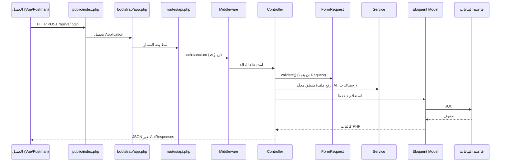

# كيف تقرأ مشروع منصة العقارات (دليل للمبتدئ)

> هذا الملف **مكمّل** للتعليقات العربية داخل ملفات `app/` و `routes/` و `database/` — ابدأ دائماً بفتح الملف نفسه وقراءة التعليقات سطراً بسطر.

## 1. ماذا يحدث عند طلب API واحد؟



## 2. ترتيب القراءة المقترح (من الصفر)

| المرحلة | الملفات | ماذا تتعلم |
|--------|---------|-----------|
| 1 | `public/index.php` → `bootstrap/app.php` | دخول الطلب وتهيئة Laravel |
| 2 | `routes/api.php` | كل endpoints والـ middleware |
| 3 | `app/Http/Middleware/EnsureUserIsAdmin.php` | صلاحية المدير |
| 4 | `app/Http/Controllers/Api/ApiController.php` + `app/Traits/ApiResponses.php` | شكل JSON الموحّد |
| 5 | `app/Http/Controllers/Api/AuthController.php` + Requests في `Auth/` | Sanctum والتوكن |
| 6 | `app/Models/User.php`, `Estate.php` | العلاقات belongsTo / hasMany |
| 7 | `app/Http/Controllers/Api/EstateController.php` | قلب المنصة |
| 8 | `database/migrations/*` | بنية الجداول |
| 9 | `app/Services/Ai/*` + `ml/pricing/server.py` | تنبؤ السعر |
| 10 | `app/Http/Controllers/Api/Admin/*` | لوحة الإدارة |

## 3. طبقات المشروع (بالعربي)

- **Routes**: خريطة URL → Controller@method
- **Middleware**: فلتر قبل الوصول للـ Controller (مصادقة، admin)
- **Form Request**: قواعد التحقق من المدخلات
- **Controller**: يستقبل HTTP، يستدعي Services/Models، يُرجع JSON
- **Service**: منطق قابل لإعادة الاستخدام (رفع ملفات، AI، إشعارات)
- **Model**: تمثيل جدول + علاقات Eloquent
- **Migration**: تعريف الجداول في PHP (يُنفَّذ على MySQL/SQLite)
- **Trait**: دوال مشتركة (ApiResponses، FormatsEstateResponse)

## 4. ملفات بدون موديل منفصل (مهم)

بعض الجداول تُشار إليها بأسماء قديمة في `use` داخل Controllers:

- `Estate_ads`, `Estates_image`, `Estates_video`, `messages`, `company_social_media`

الشرح موجود في التعليقات داخل الـ Controllers والـ Estate model — عند إنشاء موديلات PSR لاحقاً انقل نفس التعليقات.

## 5. تشغيل الذكاء الاصطناعي محلياً

```bash
# نافذة 1 — Laravel
php artisan serve

# نافذة 2 — Flask
cd ml/pricing
pip install -r requirements.txt
python server.py
```

ثم جرّب: `GET /api/v1/estates/{id}/price-prediction` (راجع `routes/api.php` للتفاصيل).
